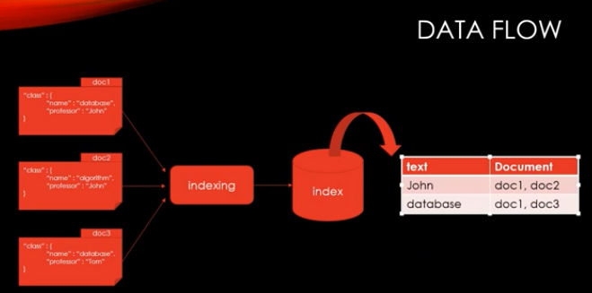
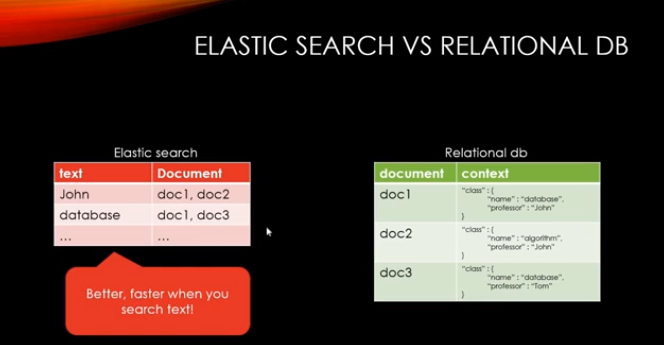
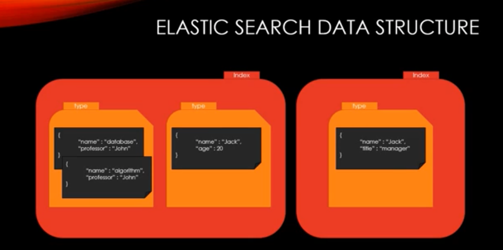
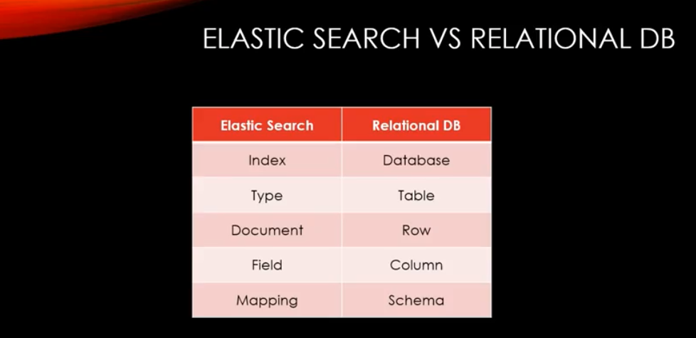
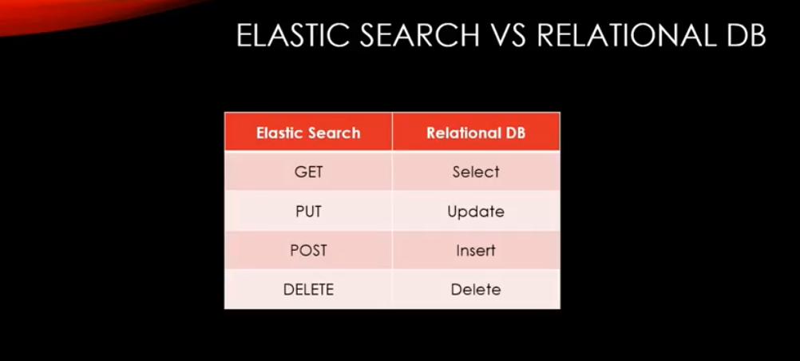
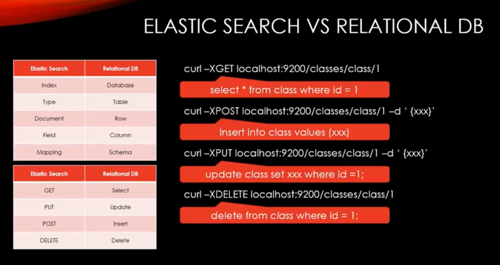

# Elasticsearch 기초 

##### 해당 자료는 Inflearn.com의 ELK 무료 강좌를 기반으로 정리한 자료 입니다.
----------

### ElasticSearch 기본 개념

-----



- 위의 그림은 **ElasticSearch**의 기본 인덱싱 및 검색처리를 위한 저장 방식이다. 일반적인 RDB와 Indexing 방법이 차이가 있는데, 이를 **역인덱싱** 방식이라고 한다.



#### Elasticsearch Structure

---

- 기본 구조는 아래와 같은데 이를 RDB와 비교해서 이해하면 쉽게 이해 할 수 있을 것이다.



#### Elastic Search vs RDB







### CRUD

----

1. curl -XGET http://localhost:9200/classes(클래스명)?pretty 하면 결과가 이쁘게 나온다.
   - 여기서 Pretty 없다면 결과가 보기가 힘들게 나온다.
   - status 가 404가 나온다면 존재 하지 않는 것이다.

2. INDEX 생성
   - curl -XPOST http://localhost:9200/classes 하게 되면 index가 생성 
   - 그리고 위와 같이 확인하게 되면 생성된 것을 알 수 있다.

3. INDEX Delete
   - curl -XDELETE http://localhost:9200/classes 하게 되면 삭제된다.

4. DOCUMENT CREATE
   - curl -XPOST http://localhost:9200/classes/class/1 -d '{"title":"ALgorithm","professor":"john"}'
   - 내용 확인 : curl -XGET http://localhost:9200/classes/class/1?pretty
   - 파일을 통해 Insert 
     - curl -XPOST http://localhost:9200/classes/class/1 -d @jsonfile.json

5. UPDATE DOCUMENT
   - curl -XPOST http://localhost:9200/classes/class/1/_update?pretty -d '{"doc":{"unit":1}}' 라고 쓰면 필드가 추가 된다.
   - curl -XPOST http://localhost:9200/classes/class/1/_update?pretty -d '{"doc":{"unit":2}}' 라고 쓰면 업데이트가 된다.
   - sciprt 를 사용하게 되면 좀 더 프로그램 처럼 값을 바꿀 수 있다.
     - curl -XPOST http://localhost:9200/classes/class/1/_update -d '{"script":"ctx._source.unit +=5"}'
     - 값이 현재 값에 5가 더해진다.

6. 여러개의 Document를 한꺼번에 Insert (Bulk)

   - ch2 의 classes.json

   - curl -XPOST localhost:9200/_bulk/?pretty --date-binary @classes.json

     - 해당 파일의 내용을 입력하는데 안에는 index, type, id 등이 들어있어야 제대로 들어간다. 
     - 로그형태 또는 데이터 형태를 이렇게 만들어서 넣으면 될 것으로 판단 된다. (Python object to json)

7. Mapping 

   - RDB의 Schema라고 생각하면 된다.

   - 날짜, 숫자, 문자 등을 잘 인식하여 저장을 해야 하므로 필요하다.

   - ```json
     {
         "class":{
             "properties":{
                 "title":{
                     "type":"string"
                 },
               	"professor":{
                     "type":"string"
                 }
             }
         }
     }
     ```

   - 와 같은 형태로 Schema를 설정할 수 있다.

   - 이전 데이터 삭제 XDELETE classes 하고 XPUT 을 통해 classes 생성

   - Mapping

     - curl -XPUT localhost:9200/classes/class/_mapping -d @classesRating_mapping.json
     - curl -XGET localhost:9200/classes?pretty 하면 결과를 확인 할 수 있다.

8. SEARCH 조회

   - ch3 의 simple_basketball.json을 입력. 

   - curl -XPOST localhost:9200/_bulk —data-binary @simple_basketball.json

   - curl -XGET localhost:9200/basketball/record/1?pretty 확인

   - 전체 데이터 조회

     - curl -XGET 'localhost:9200/basketball/record/_search?pretty'

   - 개별 데이터 조회

     - 방법1 : curl -XGET 'localhost:9200/basketball/record/_search?q=points:30&pretty'

     - 방법2 : request body를 이용하는 방식 (kibana에서도 동일한 방법을 이용해서 데이터 조회 가능)

       - 아래 쿼리를 직접 치길 바란다. ( 복사해서는 띄어쓰기라던지 다양한 오류로 인해 수행 X)

       - curl -XGET localhost:9200/basketball/record/_search -d ' 
         {

         ​    "query": {
         ​            "term":{"points:30"}
         ​    }
         }'

9. Metric Aggregation (산술연산)

   - 아래와 같은 Metric Aggs를 JSON 형태로 가지고 있고 그를 수행하는 것만으로도 결과를 가지고 올 수 있다.

   - curl -XPOST localhost:9200/_search?pretty --data-binary @avg_points_aggs.json

   - ```json
      # avg_points_aggs.json file
      {
              "size" : 0,
              "aggs" : {
                      "avg_score" : {
                              "avg" : {
                                      "field" : "points"
                              }
                      }
              }
      }
      ```

      ```json
      # max_points_aggs.json file 
      {
              "size" : 0,
              "aggs" : {
                      "max_score" : {
                              "max" : {
                                      "field" : "points"
                              }
                      }
              }
      } 
      ```

   ```json
      # stats_points_aggs.json 을 활용하면 다양한 통계수치가 나온다.
      {
              "size" : 0,
              "aggs" : {
                      "stats_score" : {
                              "stats" : {
                                      "field" : "points"
                              }
                      }
              }
      }

      #curl -XPOST localhost:9200/_search?pretty --data-binary @stats_points_aggs.json
      {
        "took" : 11,
        "timed_out" : false,
        "_shards" : {
          "total" : 16,
          "successful" : 16,
          "failed" : 0
        },
        "hits" : {
          "total" : 31,
          "max_score" : 0.0,
          "hits" : [ ]
        },
        "aggregations" : {
          "stats_score" : {
            "count" : 2,
            "min" : 20.0,
            "max" : 30.0,
            "avg" : 25.0,
            "sum" : 50.0
          }
        }
      }
   ```

10. Bucket Aggregation (버켓 어그리게이션)

  - 위의 Agg는 산술 Agg 이었고, Bucket Agg는 Groupby라고 생각하면 된다.
  - 이전의 데이터를 삭제하고 Groupby를 수행하기 위해 mapping 작업을 수행한다.
  - curl -XDELETE localhost:9200/basketball
  - curl -XPUT localhost:9200/basketball
  - curl -XPUT localhost:9200/basketball/record/_mapping -d @basketball_mapping.json_
  - _curl -XPOST localhost:9200/_bulk --data-binary @twoteam_basketball.json
  - curl -XGET localhost:9200/basketball/record/_search?pretty

  ```json
     # terms_aggs.json
     {
             "size" : 0,
             "aggs" : {
                     "players" : {
                             "terms" : {
                                     "field" : "team"
                             }
                     }
             }
     }

     # Result
     #curl -XGET localhost:9200/_search?pretty --data-binary @terms_aggs.json
     {
       "took" : 51,
       "timed_out" : false,
       "_shards" : {
         "total" : 16,
         "successful" : 16,
         "failed" : 0
       },
       "hits" : {
         "total" : 33,
         "max_score" : 0.0,
         "hits" : [ ]
       },
       "aggregations" : {
         "players" : {
           "doc_count_error_upper_bound" : 0,
           "sum_other_doc_count" : 0,
           "buckets" : [
             {
               "key" : "chicago",
               "doc_count" : 2
             },
             {
               "key" : "la",
               "doc_count" : 2
             }
           ]
         }
       }
     }
  ```

     ```json
     # stats_by_team.json
     {
             "size" : 0,
             "aggs" : {
                     "team_stats" : {
                             "terms" : {
                                     "field" : "team"
                             },
                             "aggs" : {
                                     "stats_score" : {
                                             "stats" : {
                                                     "field" : "points"
                                             }
                                     }
                             }
                     }
             }
     }

     #result
     curl -XGET localhost:9200/_search?pretty --data-binary @stats_by_team.json
     {
       "took" : 12,
       "timed_out" : false,
       "_shards" : {
         "total" : 16,
         "successful" : 16,
         "failed" : 0
       },
       "hits" : {
         "total" : 33,
         "max_score" : 0.0,
         "hits" : [ ]
       },
       "aggregations" : {
         "team_stats" : {
           "doc_count_error_upper_bound" : 0,
           "sum_other_doc_count" : 0,
           "buckets" : [
             {
               "key" : "chicago",
               "doc_count" : 2,
               "stats_score" : {
                 "count" : 2,
                 "min" : 20.0,
                 "max" : 30.0,
                 "avg" : 25.0,
                 "sum" : 50.0
               }
             },
             {
               "key" : "la",
               "doc_count" : 2,
               "stats_score" : {
                 "count" : 2,
                 "min" : 30.0,
                 "max" : 40.0,
                 "avg" : 35.0,
                 "sum" : 70.0
               }
             }
           ]
         }
       }
     }

     ```