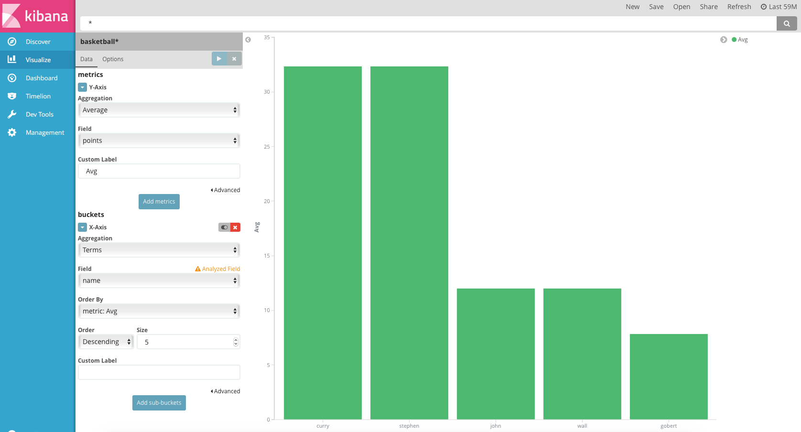
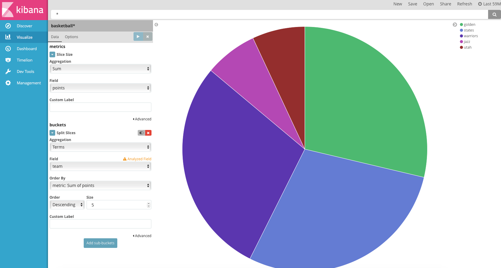
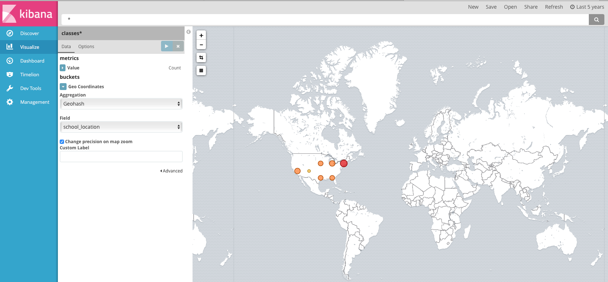
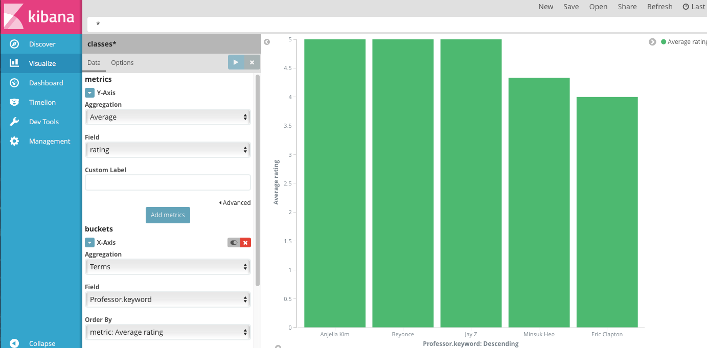
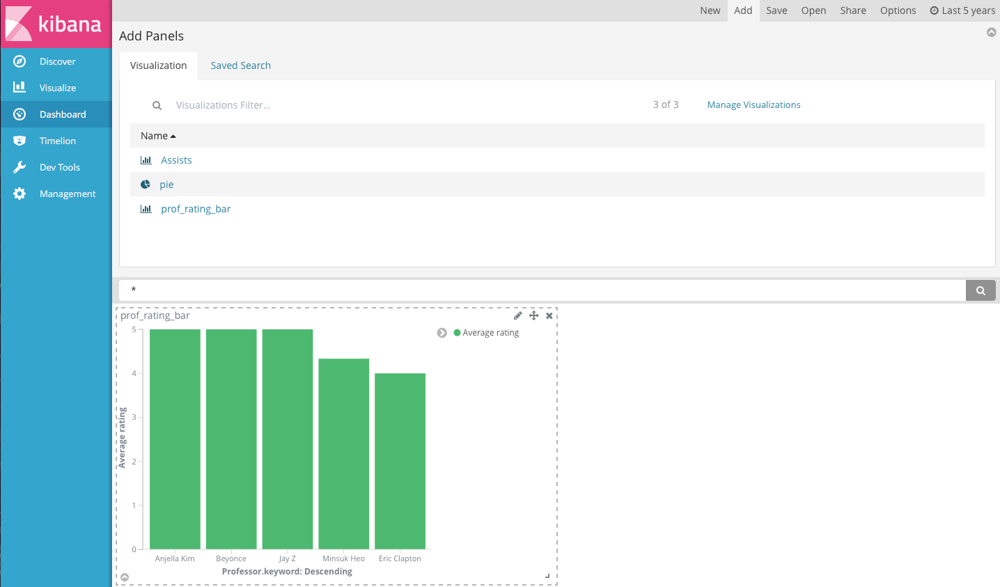
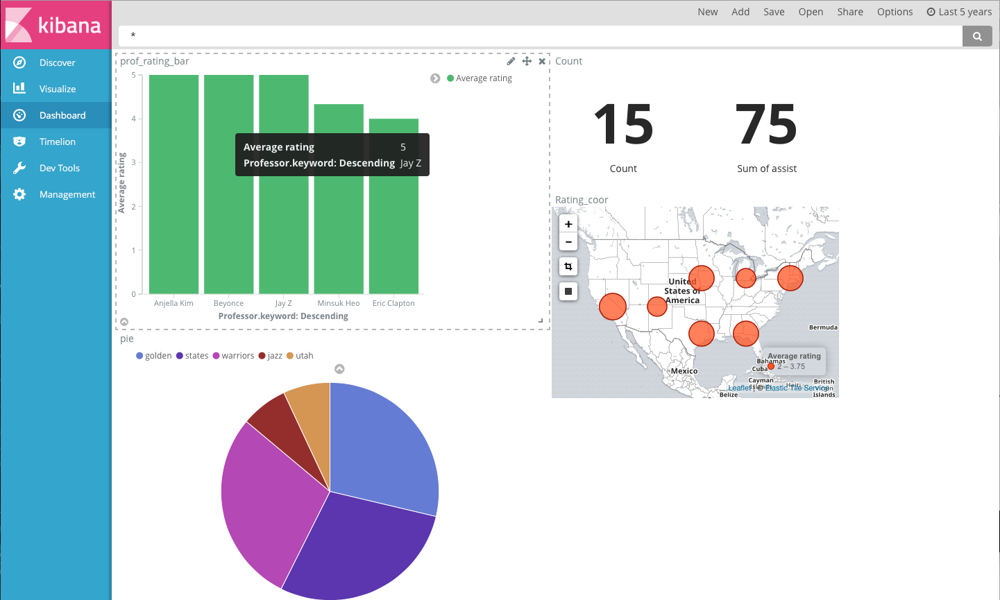

# KIBANA 기초 

##### 해당 자료는 Inflearn.com의 ELK 무료 강좌를 기반으로 정리한 자료 입니다.
----------

### 준비(Management)

----

- Elastic Search에 먼저 Document를 먼저 넣도록 한다.
  - curl -XDELETE localhost:9200/basketball
  - curl -XPUT localhost:9200/basketball (document생성)
  - curl -XPUT 'localhost:9200/basketball/record/_mapping' -d @basketball_mapping.json
  - curl -XPOST 'localhost:9200/_bulk' --data-binary @bulk_basketball.json
- Kibana Start & go to web page (IP:5601)
- Index to basketball 로 변환 시키면 Kibana가 인식하게 된다.

### Discover 메뉴

------

- 각 종 원하는 필터링을 적용하거나 보고싶은 Field만 선택하여 데이터를 EDA할 수 있다.

### Visualize (Bar & Pie)

-------

- 왼쪽 두번째의 Visualize Click 

####Vertical Bar char Click

- 지난번 Basketball data를 통해 시각화
- 각 선수별로 평균 점수가 얼마인지?
- Y축에는 평균점수를 넣기 위해 Count 삭제.
- X축 추가 후 Terms -> Name 선택하여 수행

#### Pie Chart

- 이전과 같이 Pie Chart 클릭하여 Baskter ball
- Metrics -> Agg(sum) -> Field(points) 
- Buckets -> Agg(Terms) -> Field(team) -> Order by (sum of points)
- Action

#### TILE MAP

- 예제 : Classes 데이터를 사용.
- curl -XPUT 'localhost:9200/claasses'
- curl -XPUT 'localhost:9200/classes/class/_mapping' -d @classesRating_mapping.json
- curl -XPOST localhost:9200/_bulk?pretty --data-binary @classes.json
- Kibana에서 Index 생성하는 부분에서 Classes(Management Tab) 선택하여 생성.
- Visualize Click -> TILE MAP -> Geo coordinates 사용.

### DASH BOARD

-------------

- Classes Index를 사용할 것.
- Vertical barchart(교수님 평균 강의 평가 점수)
- 차트를 생성 후 차트를 저장하고 Dashboard 메뉴에서 Add 메뉴를 통해 Visualize에서 저장했던 Chart를 넣을 수 있다. 
- 차트 크기 조절 위치 조정 등 다양한 것을 할 수 있다.

