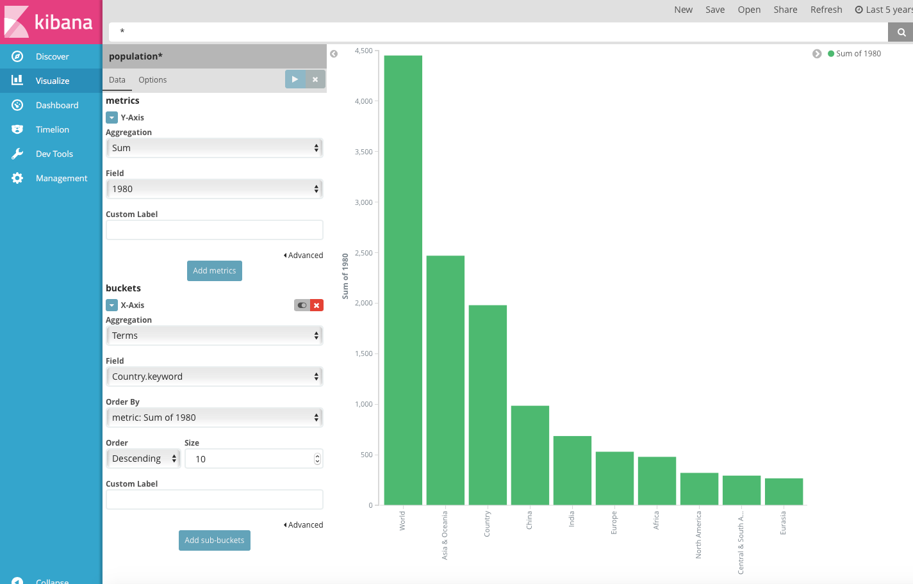
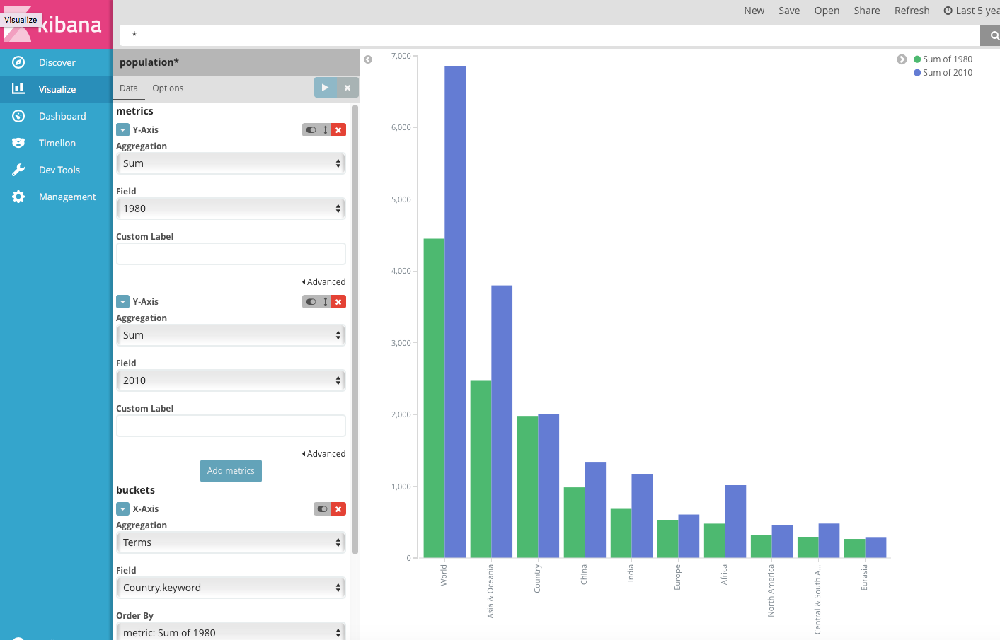
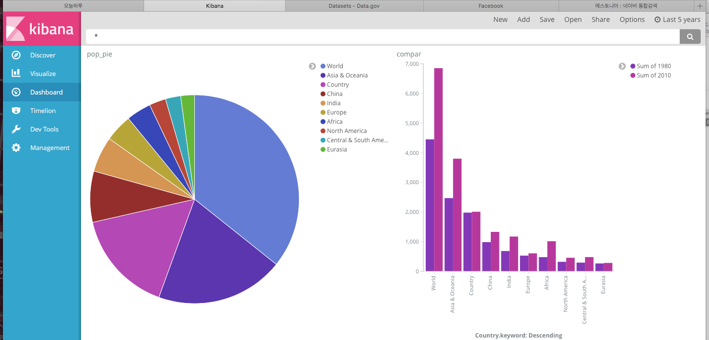

# 실전 인구 분석

- Dataset : http://catalog.data.gov/dataset
- Population by country download (github ch06)
- Kibana & Elasitcsearch 가 돌아가나 확인 ps -ef | grep 
- Logstash (이전에 설치 했어서 설치하지 않았다.)
  - 동일 실습에서 동일 서버에 필요하므로 신규로 설치
  - wget https://artifacts.elastic.co/downloads/logstash/logstash-5.1.2.tar.gz
  - 압축을 풀고 ch06에 있는 logstash.conf 파일 내 PATH를 수정하고 logstash폴더 내 conf 폴더 생성 후 해당 폴더로 복사
- Logstash.conf

```json
input {
  file {
    path => "/home/minsuk/Documents/git-repo/BigData/ch06/populationbycountry19802010millions.csv" ## 절대 경로 
    start_position => "beginning" ## end가 기본설정이다 하지만 파일에서 직접 받을 거기때문에 처음부터 받는다. Streaming data는 END (default)
    sincedb_path => "/dev/null" ## 이걸 넣지 않는다면 한번 데이터는 다시 넣지 않는다.
  }
}
filter {
  csv {
      separator => "," ## 구분자
      columns => ["Country","1980","1981","1982","1983","1984","1985","1986","1987"
     
  }
  mutate {convert => ["1980", "float"]}
  mutate {convert => ["1981", "float"]}
  mutate {convert => ["1982", "float"]}
  mutate {convert => ["1983", "float"]}
  mutate {convert => ["1984", "float"]}
  mutate {convert => ["1985", "float"]}
  mutate {convert => ["1986", "float"]}
  mutate {convert => ["1987", "float"]}
  mutate {convert => ["1988", "float"]}
  mutate {convert => ["1989", "float"]}
  mutate {convert => ["1990", "float"]}
  mutate {convert => ["1991", "float"]}
  mutate {convert => ["1992", "float"]}
  mutate {convert => ["1993", "float"]}
  mutate {convert => ["1994", "float"]}
  mutate {convert => ["1995", "float"]}
  mutate {convert => ["1996", "float"]}
  mutate {convert => ["1997", "float"]}
  mutate {convert => ["1998", "float"]}
  mutate {convert => ["1999", "float"]}
  mutate {convert => ["2000", "float"]}
  mutate {convert => ["2001", "float"]}
  mutate {convert => ["2002", "float"]}
  mutate {convert => ["2003", "float"]}
  mutate {convert => ["2004", "float"]}
  mutate {convert => ["2005", "float"]}
  mutate {convert => ["2006", "float"]}
  mutate {convert => ["2007", "float"]}
  mutate {convert => ["2008", "float"]}
  mutate {convert => ["2009", "float"]}
  mutate {convert => ["2010", "float"]}
}
output {
    elasticsearch {
        hosts => "localhost"
        index => "population" # index
    }
    stdout {} # 로그 확인.
}
```

- ./bin/logstash -f ./conf/logstash.conf 수행
- 뭔가 파파파팍 올라간다 데이터가 들어간다. (stdout{} 을 통해 확인가능.)
- Kibana(Locahost:5601)로 확인.


### Data analysis

----

1. Discovery 에서 원하는 필드를 선택하고 원하는 값들을 다양하게 Filter 를 통해 확인 가능.
2. Visualize 를 통해 시각화






#### Dashboard

-----

- Visualize 를 저장 후 Dashboard에 붙일 수 있다.

