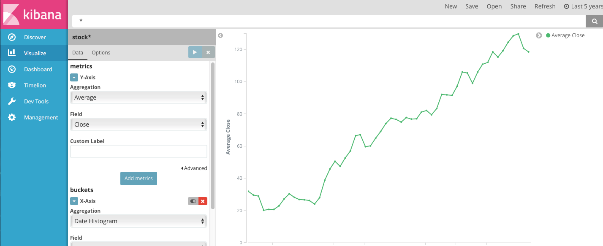
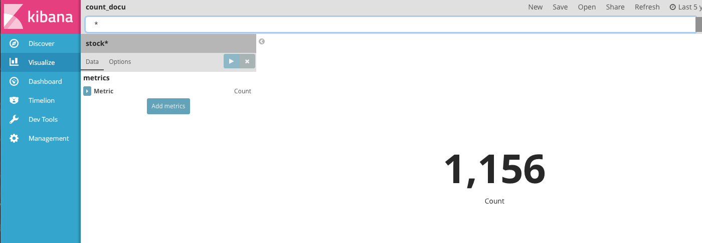
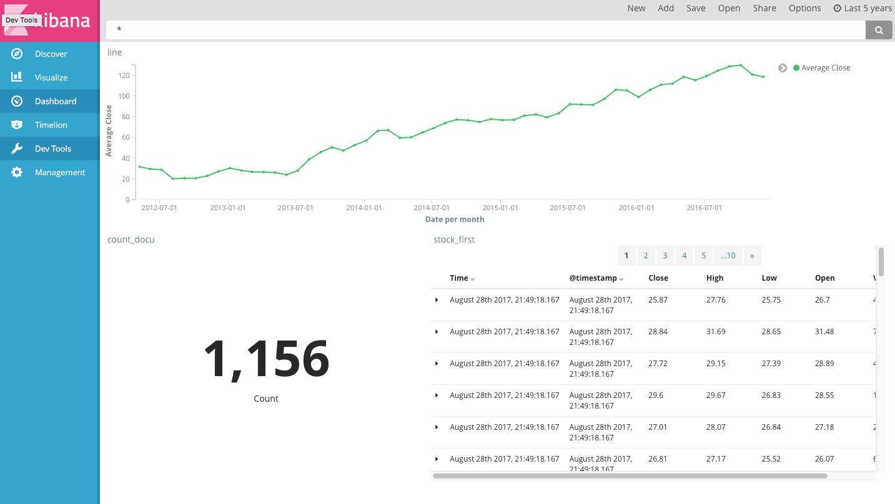

# 실전 주식 분석

- facebook stock : https://finance.yahoo.com/quote/FB?p=FB
- Historical data -> 5years -> apply -> download data 
- ch06 table.csv 이용.

```json
input {
  file {
    path => "/home/ubuntu/workspace/elasticsearch/ch06/table.csv" # file path
    start_position => "beginning" # csv 파일을 처음부터 입력.
    sincedb_path => "/dev/null"
  }
}
filter {
  csv {
      separator => ","
      columns => ["Date","Open","High","Low","Close","Volume","Adj Close"]
  }
  mutate {convert => ["Open", "float"]}
  mutate {convert => ["High", "float"]}
  mutate {convert => ["Low", "float"]}
  mutate {convert => ["Close", "float"]}
}
output {
    elasticsearch {
        hosts => "localhost"
        index => "stock"
    }
    stdout {}
}
```

- ubuntu@ubuntu:~/logstash$ ./bin/logstash -f ./conf/logstash_stock.conf 수행
- Kibana에서 확인(localhost:5601) 
- Index를 통해서 dataset을 만든다.


### Visualize

------

1. Line Chart



2. Metric




### Dashboard

------

- Line, Document Count, Discover (saved)

