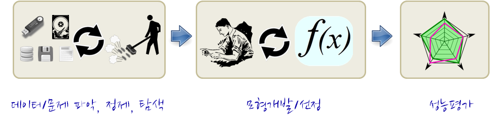

> ## 학습목표 {.objectives}
>
> * 다양한 데이터를 이해한다.

## 기계학습 과정

기계학습은 사전에 문제가 정의되어 있다면 데이터를 찾아 이를 정제하고, 탐색적 데이터 분석과정을 
거쳐 다양한 통계적 모형, 기계학습 모형을 적용하여 최적의 모형을 찾는 과정을 거쳐 모형성능을 
평가하는 연속된 과정이며, 그 과정 내부에서 사람과 데이터, 모형과 데이터 사이에 반복적인
노동집약적 과정을 거치게 된다.

## 통상적인 데이터 과학 추진 과정 [^data-science-taxonomy]

[^data-science-taxonomy]: [A Taxonomy of Data Science](http://www.dataists.com/2010/09/a-taxonomy-of-data-science/)

상기 기계학습 과정을 정형화해서 표현하면, 데이터 과학은 **OSEMN** 이다.

* 데이터 수집(**O**btaining data)
* 데이터 정제(**S**crubbing data)
* 데이터 탐색(**E**xploring data)
* 데이터 모형개발(**M**odeling data)
* 데이터 해석(i**N**terpreting data)

> ### 특성 공학(Feature Engineering)이 중요한 이유. {.callout}
> 
> 다양하고 정교한 기계학습 알고리즘보다 인기가 그만 못하지만, 특성을 뽑는 작업은 기계학습에서 매우 중요한 영역을 차지한다.
> [Feature Engineering](https://en.wikipedia.org/wiki/Feature_engineering)이 중요한 이유는 잘 고른 특성(feature)을 갖는 단순한 알고리즘이 그저그런 특성을 갖는 정교한 알고리즘보다 성능이 훨씬더 좋기 때문이다. 

## 데이터 정제 [^cmd-data-analysis]

데이터를 정제하는 과정은 "DJ Patil"이 언급했듯이, 80% 작업시간이 소요되어 상대적으로 멋진 시각화와 정교한 모형개발에는 적은 시간이 소요된다. 

* 행과 열 뽑아내기
* 새로운 열과 행 생성하기
* 그룹단위로 통계량 계산하기, 축약하기,
* 데이터를 붙이고 결합하기.
* 새로운 값으로 바꾸기
* 단어 추출하기
* 결측값 처리
* A 파일형식에서 B 파일형식으로 변환하기

## 시각화 및 모형 커뮤니케이션

데이터에서 최종 시각화 산출물과 모형이 얻어지면, 성능을 평가하고, 결과물을 시스템에 배포하거나, 별도 보고서로 작성하여 고객에게 전달하는 과정을 끝으로 모든 작업을 마무리하게 된다.

[^cmd-data-analysis]: [Data Science at the Command Line](http://datascienceatthecommandline.com/)

> ### 명령라인 도구 구성요소 {.callout}
>
> * 바이너리 실행파일
> * 쉘 내장함수
> * 셀 함수
> * 쉘 스크립트
> * 별칭(Alias)
