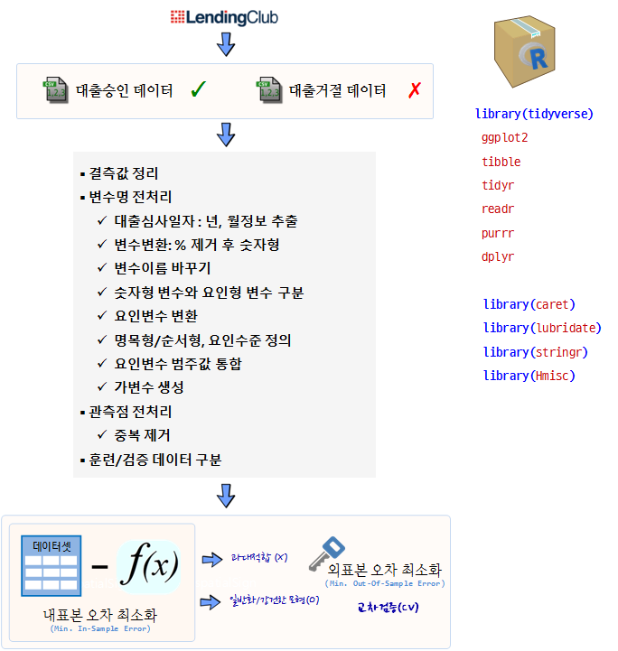

```{r  include = FALSE}
source("tools/chunk-options.R")
````

> ## 학습 목표 [^stat545-data-inout] {.objectives}
>
> * 



### 1. 채무불이행 예측모형 - 랜딩클럽 [^lendingclub-pm-01] [^lendingclub-pm-02] [^caret-feature-selection] [^rf-lc] [^yhat-lc]

[^lendingclub-pm-01]: [Predict LendingClub’s Loan Data](https://rstudio-pubs-static.s3.amazonaws.com/203258_d20c1a34bc094151a0a1e4f4180c5f6f.html)
[^lendingclub-pm-02]: [Lending Club Loan Data - Issued vs Declined](https://rpubs.com/KGFeMan/LCD_ID)
[^caret-feature-selection]: [Feature Selection with the Caret R Package](http://machinelearningmastery.com/feature-selection-with-the-caret-r-package/)
[^rf-lc]: [Random Forest for Loan Performance Prediction](http://www.kimberlycoffey.com/blog/2016/3/19/random-forest)
[^yhat-lc]: [Machine Learning for Predicting Bad Loans](http://blog.yhat.com/posts/machine-learning-for-predicting-bad-loans.html)

실제 렌딩클럽 데이터를 다운로드 받아 신용평가 모형을 개발하는 과정의 시작은 [Lending Club](https://www.lendingclub.com/info/download-data.action) 웹사이트에서 
데이터를 다운로드 받는 과정부터 시작된다.

실제 렌딩클럽 데이터를 다운로드 받아 보면 연도별로 데이터가 쪼개져 있고, 승인데이터와 거절데이터로 나눠져 있다. 
신용평가 예측모형을 개발하고자 할 때, 두 데이터가 모두 필요하기 때문에 이를 결합하는 과정을 거치게 된다.

데이터를 하나로 합치게 된 후에 결측값, 요인변수변환, 가변수 생성, 날짜정보 추출 등 다양한 전처리 과정을 거치게 된다.

#### 1.1. 데이터 가져오기 

렌딩클럽 예측모형 개발에 필요한 팩키지를 가져온다. `do.call` `rbind` 함수를 사용하여 연도별로 
쪼개진 각 승인, 거절 데이터를 하나로 모으고, 나중에 `bind_rows` 함수로 승인, 거절 데이터도 합친다.

``` {r lc-import, eval=FALSE, warning=FALSE}
##==========================================================================================
## 00. 환경설정
##==========================================================================================
suppressMessages(library(tidyverse))
suppressMessages(library(caret))
suppressMessages(library(readxl))
suppressMessages(library(lubridate))
suppressMessages(library(stringr))
suppressMessages(library(Hmisc))
rm(list=ls())
##==========================================================================================
## 01. 데이터 가져오기
##==========================================================================================
# 랜딩클럽 원본데이터 : https://www.lendingclub.com/info/download-data.action

#-------------------------------------------------------------------------------------------
# 01.01. 채무불이행 정보 데이터 가져오기
#-------------------------------------------------------------------------------------------
# spec_csv("data/download_data/RejectStatsA.csv", skip=1, col_names=TRUE)

dep_data1 <- read_csv("data/download_data/RejectStatsA.csv",skip=1, col_names=TRUE) # 2007-2012
dep_data2 <- read_csv("data/download_data/RejectStatsB.csv",skip=1, col_names=TRUE) # 2013-14
dep_data3 <- read_csv("data/download_data/RejectStatsD.csv",skip=1, col_names=TRUE) # 2015
dep_data4 <- read_csv("data/download_data/RejectStats_2016Q1.csv",skip=1, col_names=TRUE) # 2016Q1
dep_data5 <- read_csv("data/download_data/RejectStats_2016Q2.csv",skip=1, col_names=TRUE) # 2016Q2
dim(dep_data1)
dim(dep_data2)
dim(dep_data3)
dim(dep_data4)
dim(dep_data5)

# 데이터 통합
data_reject <- do.call("rbind", list(dep_data1, dep_data2, dep_data3, dep_data4, dep_data5)) 
data_reject$AR <- "Declined" # 거절
data_reject$grade <-"Z" # create grade "z" for rejected loans - Match column of accepted loan
data_reject$id <-10000000 # create a common id for rejected loans - Match column of accepted loan

# 데이터 정리
rm(list=setdiff(ls(), "data_reject"))
save(data_reject,file="./data/data_reject.RData")
gc()
memory.size()
# load("data/data_reject.RData")
#-------------------------------------------------------------------------------------------
# 01.02. 정상 채무이행 데이터 가져오기
#-------------------------------------------------------------------------------------------

ind_data1 <- read_csv("data/download_data/LoanStats3a.csv",skip=1,col_names=TRUE) # 2007-2011
ind_data2 <- read_csv("data/download_data/LoanStats3b.csv",skip=1,col_names=TRUE) # 2012-13
ind_data3 <- read_csv("data/download_data/LoanStats3c.csv",skip=1,col_names=TRUE) # 2014
ind_data4 <- read_csv("data/download_data/LoanStats3d.csv",skip=1,col_names=TRUE) # 2015 
ind_data5 <- read_csv("data/download_data/LoanStats_2016Q1.csv",skip=1,col_names=TRUE) # 2016Q1
ind_data6 <- read_csv("data/download_data/LoanStats_2016Q2.csv",skip=1,col_names=TRUE) # 2016Q2
dim(ind_data1)
dim(ind_data2)
dim(ind_data3)
dim(ind_data4)
dim(ind_data5)
dim(ind_data6)

# 승인 대출 데이터 결합
data_accept <-do.call("rbind", list(ind_data1,ind_data2,ind_data3,ind_data4,ind_data5,ind_data6)) # Consolidate into single file
data_accept$AR<-"Issued" # 승인

rm(list=setdiff(ls(), c("data_reject","data_accept")))
save(data_accept,file="./data/data_accept.RData")
gc()
# load("data/data_accept.RData")
```

#### 1.2. 데이터 결합

원본데이터가 크기 때문에 표본추출하여 전처리 과정을 진행하는 방법과 더불어 `.Rdata` 형태로 데이터를 저장하여 
필요시 꺼내 사용하는 것도 빅데이터를 처리하는 중요한 방법이 된다.

`bind_rows` 함수를 사용하여 거절데이터와 승인데이터를 하나로 묶는다.

``` {r lc-combine, eval=FALSE, warning=FALSE}
##==========================================================================================
## 02. 데이터 전처리
##==========================================================================================

#-------------------------------------------------------------------------------------------
# 02.01. 표본 데이터 추출
#-------------------------------------------------------------------------------------------

accept <- data_accept[sample(1:nrow(data_accept), 1000), ]
reject <- data_reject[sample(1:nrow(data_reject), 1000), ]
# load("data/data_accept.RData")
# load("data/data_reject.RData")
# accept <- data_accept
# reject <- data_reject

#-------------------------------------------------------------------------------------------
# 02.02. 거절 데이터
#-------------------------------------------------------------------------------------------

# 거절 데이터 날짜 정보 추출
reject$`Application Date` <- ymd(reject$`Application Date`)
reject$month <- month(reject$`Application Date`,label=TRUE,abbr=TRUE)
reject$year <- year(reject$`Application Date`)
reject$`Application Date` <-NULL
reject$loan_status<-"Rejected"
reject$`Debt-To-Income Ratio` <- sub("%","", reject$`Debt-To-Income Ratio`)
reject$`Debt-To-Income Ratio` <- as.numeric(reject$`Debt-To-Income Ratio`)

# View(reject)

#-------------------------------------------------------------------------------------------
# 02.03. 승인 데이터
#-------------------------------------------------------------------------------------------

# 승인데이터 날짜
accept$month <- str_split_fixed(accept$issue_d, "-", 2)[,1]
accept$month <- factor(accept$month, order=TRUE, levels=c("Jan", "Feb", "Mar", "Apr", "May", "Jun",
                                              "Jul", "Aug", "Sep", "Oct", "Nov", "Dec"))
accept$year <- str_split_fixed(accept$issue_d, "-", 2)[,2]
accept$year <- as.numeric(accept$year)
# View(accept)

#-------------------------------------------------------------------------------------------
# 02.04. 데이터 결합
#-------------------------------------------------------------------------------------------

accept1 <- accept %>% dplyr::select(id,loan_amnt,month,year, title, dti, zip_code,  addr_state, emp_length, policy_code,AR, grade, loan_status)
names(accept1) <- c("id","Amount Requested","month" , "year", "Loan Title","Debt-To-Income Ratio", "Zip Code" , "State","Employment Length","Policy Code","AR", "grade","loan_status")
reject$Risk_Score <- NULL

loan_df <- bind_rows(accept1,reject)

rm(list=setdiff(ls(), "loan_df"))
save(loan_df,file="./data/loan_df.RData")
rm(list = ls())
load("./data/loan_df.RData")
```

#### 1.3. 데이터 전처리

데이터를 하나로 합치게 된 후에 결측값, 변수 정리 작업, 관측점 처리 작업을 거쳐 전처리 과정을 순차적으로 수행해 나간다.
통계학적인 지식이 필요한 요인변수변환, 가변수 생성 등의 작업도 있는 반면에,
날짜정보에서 연도, 월 정보를 추출하는 기본 데이터 처리 기술도 필요하다.

``` {r lc-preprocessing, eval=FALSE, warning=FALSE}
##==========================================================================================
## 03. 피쳐공학(Feature Engineering): 데이터 전처리
##==========================================================================================

#-------------------------------------------------------------------------------------------
# 03.01. 결측값 처리
#-------------------------------------------------------------------------------------------

ncol <- rep(nrow(loan_df), each=ncol(loan_df))
missingdata <- as.data.frame(cbind(colnames=names(loan_df), 
                                   ncol, 
                                   nmsg=as.integer(as.character(as.vector(apply(loan_df, 2, function(x) length(which(is.na(x)))))))))
missingdata$nmsg <- as.numeric(levels(missingdata$nmsg))[missingdata$nmsg]

missingdata <- cbind(missingdata,percmissing=as.integer(missingdata$nmsg/ncol*100))
drops <- as.character(subset(missingdata,missingdata$percmissing>0)[,1])
length(drops)

#-------------------------------------------------------------------------------------------
# 03.02. 변수 정리 작업
#-------------------------------------------------------------------------------------------

# 변수 변환
loan_df$`Zip Code` <- strtrim(loan_df$`Zip Code`, 3)
loan_df$`Debt-To-Income Ratio` <- sub("%","", loan_df$`Debt-To-Income Ratio`)
loan_df$`Debt-To-Income Ratio` <- as.numeric(loan_df$`Debt-To-Income Ratio`)

# 변수명 변환
loan_df <- loan_df %>% dplyr::rename(Emp.Len=`Employment Length`, Debt_to_Inc = `Debt-To-Income Ratio`)

# 변수값 변환
table(loan_df$loan_status)
loan_df$loan_status[loan_df$loan_status=="Does not meet the credit policy. Status:Charged Off"] <- "Charged Off"
loan_df$loan_status[loan_df$loan_status=="Does not meet the credit policy. Status:Fully Paid"] <- "Fully Paid"
table(loan_df$loan_status)

#-------------------------------------------------------------------------------------------
# 03.03. 관측점 변환작업
#-------------------------------------------------------------------------------------------
# 중복 확인
nrow(loan_df) - nrow(unique(loan_df))
loan_df <- loan_df[!duplicated(loan_df), ]

#-------------------------------------------------------------------------------------------
# 03.04. ZV, NZV 변수 제거
#-------------------------------------------------------------------------------------------

col_uv  <-  sapply(loan_df, function(x) length(unique(x)))
cat("ZV, NZV Variables :", length(col_uv[col_uv==1]))

names(col_uv[col_uv==1])
loan_df <-  loan_df[, !names(loan_df) %in% names(col_uv[col_uv==1])]

loan_df$`Policy Code` <- NULL

#-------------------------------------------------------------------------------------------
# 03.05. 요인변수 전처리
#-------------------------------------------------------------------------------------------
# 명목형 범주형 변수를 순서형 범주형 변수
loan_df$loan_status_F <- factor(loan_df$loan_status, order=TRUE, 
                                levels = c("Fully Paid",  "Current", "In Grace Period", 
                                           "Late (31-120 days)", "Late (16-30 days)", "Charged Off", "Rejected"))
table(loan_df$loan_status_F)

loan_df$Emp.Len_F <- factor(loan_df$Emp.Len)
table(loan_df$Emp.Len)

loan_df$Emp.Len_F  <-  factor(loan_df$Emp.Len_F,
                              levels(loan_df$Emp.Len_F)[c(1,2,4,5,6,7,8,9,10,11,3,12)])
table(loan_df$Emp.Len_F)

#-------------------------------------------------------------------------------------------
# 03.06. 범주형 변수는 변수명에 표기
#-------------------------------------------------------------------------------------------

col_names<-names(subset(loan_df, select = c(month, year, Emp.Len, State, `Zip Code` )))
col_names_new <- paste(col_names, "F",sep = "_")

loan_df[,col_names_new] <- lapply(loan_df[,col_names] , factor)

#-------------------------------------------------------------------------------------------
# 03.07. 범주값 통합
#-------------------------------------------------------------------------------------------
names(loan_df)
loan_df$`Zip Code_F` <- combine.levels(loan_df$`Zip Code_F`, minlev=0.005)

glimpse(loan_df)

#-------------------------------------------------------------------------------------------
# 03.08. 가변수(Dummy Variable) 생성
#-------------------------------------------------------------------------------------------
library(caret) 
col_names_F <- names(subset(loan_df, select = c(year_F,Emp.Len_F, State_F)))
dummy <- dummyVars(" ~ .", data = loan_df[, c(col_names_F)])
dummy_data <- data.frame(predict(dummy, newdata = loan_df[, c(col_names_F)]))


#-------------------------------------------------------------------------------------------
# 03.09. 데이터 결합
#-------------------------------------------------------------------------------------------

loan_df <- bind_cols(loan_df, dummy_data)


#### 1.4. 자료분석

데이터 전처리 과정을 통해 데이터가 준비되면 다음 단계로 종속변수와 독립변수간에 다양한 자료분석을 
수행하게 된다.

``` {r lc-data-analysis, eval=FALSE, warning=FALSE}
##==========================================================================================
## 04. 자료분석
##==========================================================================================

as.matrix(prop.table(table(loan_df$AR, loan_df$year),2))
barplot(as.matrix(prop.table(table(loan_df$AR,loan_df$year),2)),
        main = "Barplot of Cases Issued / Declined ", 
        xlab= "Year", ylab= "No of Cases", 
        col = c("Red","darkgreen"),
        legend = rownames(as.matrix(table(loan_df$AR, loan_df$year))))

as.matrix(prop.table(table(loan_df$AR,loan_df$Emp.Len_F),1)*100)
barplot(as.matrix(prop.table(table(loan_df$AR,loan_df$Emp.Len_F),1)*100),
        main = "Barplot of Cases Issued / Declined ", 
        xlab= "Emp_Len", ylab= "No of Cases", 
        col = c("Red","darkgreen"),
        legend = rownames(as.matrix(prop.table(table(loan_df$AR,loan_df$Emp.Len_F),1)*100)))

##==========================================================================================
## 05. 예측모형 개발
##==========================================================================================

#-------------------------------------------------------------------------------------------
# 05.01. 훈련/검증 데이터
#-------------------------------------------------------------------------------------------

train <-　subset(loan_df, loan_df$year=="2015" )
test <-  subset(loan_df, loan_df$year=="2016" )
```