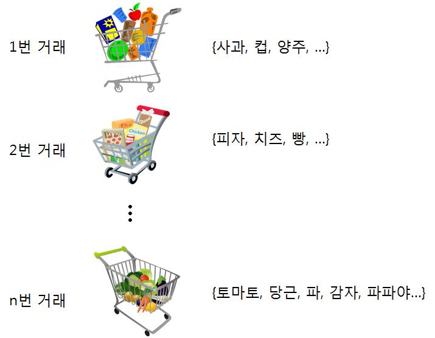

 
``` {r, include=FALSE}
source("tools/chunk-options.R")
```

> ### 신용평가모형 목표 {.getready}
>
> * 카드에 담는 장바구니(Market Basket) 데이터를 이해한다.
> * 기초적인 장바구니 데이터 분석방법을 학습한다.

> ### R - Association Rules - Market Basket Analysis  {.prereq}
> | 장바구니 분석 1부 | 장바구니분석 2부 |
> |:------------------------------------------------------------------:|:------------------------------------------------------------------:|
> | <iframe width="350" height="260" src="https://www.youtube.com/embed/b5hgDPa7a2k" frameborder="0" allowfullscreen></iframe> | <iframe width="350" height="260" src="https://www.youtube.com/embed/Gy_nqzJMNrI" frameborder="0" allowfullscreen></iframe> |


### 1. 장바구니 데이터 [^arules]

[^arules]: [Market Basket Analysis with R](http://www.salemmarafi.com/code/market-basket-analysis-with-r/)

장바구니 분석용 데이터로 가장 유명한 것 중 하나가 [`Groceries`](http://www.salemmarafi.com/wp-content/uploads/2014/03/groceries.csv) 데이터다. [^Michael-Hahsler-Kurt-Hornik]

[^Michael-Hahsler-Kurt-Hornik]: Michael Hahsler, Kurt Hornik, and Thomas Reutterer (2006) Implications of probabilistic data modeling for mining association rules. In M. Spiliopoulou, R. Kruse, C. Borgelt, A. Nuernberger, and W. Gaul, editors, From Data and Information Analysis to Knowledge Engineering, Studies in Classification, Data Analysis, and Knowledge Organization, pages 598–605. Springer-Verlag.


#### 1.1. 장바구니 데이터 분석 환경설정

가장 먼저 장바구니 데이터 분석을 위한 환경을 설정한다. 연관규칙 추출을 위한 `arules`, 추출된 연관규칙 시각화를 위한 `arulesViz` 팩키지가 기본적으로 필요하다. 여기에 `wordcloud` 팩키지를 사용해서
사용된 장바구니에 가장 많이 든 물품이 무엇인지 텍스트 마이닝에 많이 사용되는 시각화도구도 활용한다.


``` {r ml-market-basket-packages, warning=FALSE}
##======================================================================================
## 00. 장바구니 분석 환경 설정
##======================================================================================
# arules, arulesViz, wordcloud 팩키지 설치
# install.packages("arules")
# install.packages("arulesViz")
# install.packages("wordcloud")

suppressWarnings(suppressMessages(library(arules)))
suppressWarnings(suppressMessages(library(arulesViz)))
suppressWarnings(suppressMessages(library(wordcloud)))
```

#### 1.2. 장바구니 데이터 불러오기

장바구니 데이터는 마트에서 카드에 담긴 물품을 생각하면 쉽다. 각 고객마다 마트에서 장바구니 카드를 밀게 되거나,
인터넷에서 주문을 할 때 가상의 장바구니에 담게 된다. 담겨진 물건은 물품마다 고유 제품번호가 부여되어 있고, 해당 제품에 대한 
라벨이 함께 붙어 있다. 고유 제품번호는 컴퓨터 전산처리를 위해 부여된 것이고, 해당 제품에 대한 라벨은 사람이 제품을 이해하기 위해 부여된 것이다.



`arules` 팩키지에 소속된 `read.transactions` 함수를 사용해서 장바구니 데이터를 연관분석을 위한 자료형으로 불러 읽어온다.

``` {r ml-groceries-dataset, warning=FALSE}
##======================================================================================
## 01. 장바구니 분석 데이터 가져오기
##======================================================================================

cart  <- read.transactions("data/groceries.csv", format = "basket", sep=",")
head(cart)

library(datasets)
data(Groceries)

# 데이터가 동일한지 확인

# G <- inspect(Groceries)
# C <- inspect(cart)
# identical(G, C)
```

`library(datasets)` 팩키지에 `Groceries` 데이터가 기본으로 포함되어 있어, 이를 바로 활용해도 좋다.

> ### 왜 연관분석인가? {.callout}
>
> 연관분석은 "Association Rules"을 번역한 것으로 결국 "**If..., then ...** 만약 ... 라면, ... 가 될 것이다" 라는 연관성이 결과로 도출된다.
> 연관분석은 다음과 같이 실행에 옮길 수 있는 규칙이 도출된다는 면에서 실무자의 많은 관심을 끌고 있다. 
>
> * 제품추천: A,B,C 제품을 구매한 다음에 다음에 구매 가능성이 높은 제품 추천.  
> * 콘텐츠 최적화: 잡지 웹사이트, 블로그 콘텐츠 추천, 웹페이지 개인화  
> * 의료진단: 자세한 사항 논문 참조, [Implementation of Apriori Algorithm in Health Care Sector: A Survey](http://static.ijcsce.org/wp-content/uploads/2013/12/IJCSCE110513.pdf)  
> * 교차마케팅, 우편-주문 캠페인 프로모션에 적용


### 2. 연관분석에 사용되는 핵심 개념

연관분석결과 산출물에 인용되는 주요 용어에 대해 이해하고 넘어가야 된다.

* 지지도(Support) : 확률 $Support(A) = P(A)$, 하나이상의 빈발 제품 집합 식별에 활용됨
* 신뢰도(Confidence) : 조건부 확률 $Confidence(A \rightarrow B) = \frac{P(A,B)}{P(A)}$, 제품 집합 간의 연관성 강도를 측정하는데 활용됨
* 향상도(Lift) : $lift(A \rightarrow B) = \frac{P(A,B)}{P(A) \dot P(B)}$ 도출된 연관규칙의 효용성을 측정하는데 활용됨


생성 가능한 모든 규칙을 생성하고, 지지도, 신뢰도, 향상도를 판단기준으로 놓고 가장 최선의 규칙을 선택하면 되지만,
현실적으로 제품개수가 증가하게 되면 컴퓨터 연산시간이 이를 감당하지 못한다. 대안으로 가장 빈발하는 제품집합만을 기준으로 삼아 연관규칙을 생성해 나간다.

"Support of an item set never exceeds the support of its subsets, which is known as anti-monotoneproperty of support." 즉, 
지지도 특성 중에 제품 집합 지지도는 절대로 하위집합 지지도를 넘어서지 못하는 특징이 있다. 이를 활용하여 빈발집합을 우선 고려하고, 지지도와 최소지지도를 
모수로 적당한 값 예를 들어, 기준 지지도 30%, 기준 신뢰도 70%로 설정하여 연관규칙 도출에 필요한 연산시간을 급격히 줄인다. 
Apriori 알고리즘이 대표적인 연관규칙 도출 알고리즘이다.


### 3. 장바구니 기술통계 분석

장바구니 데이터를 R 로 불러왔고, 이에 대해 본격적으로 연관규칙 도출을 위한 Apriori 알고리즘을 적용하기 위한 기술통계 분석을 수행한다.

`summary(cart)`를 통해 itemMatrix에 대한 정보가 제일 처음 나오고, 가장 빈발하는 제품(most frequent items), 제품집합에 대한 정보가 순차적으로 출력된다.

**itemMatrix** 에서 장바구니 분석에 행렬이 성긴 행렬(Sparse Matrix)로 $9835 \times 169$ 크기를 갖는데 밀도가 `0.02609146`에 불과하다.
즉, $9835 * 169 * 0.02609146 = 43,367$ 개 제품만이 장바구니 분석에 포함되어 있다.

``` {r ml-groceries-eda, warning=FALSE}
##======================================================================================
## 02. 장바구니 기술통계 분석
##======================================================================================

summary(cart)

itemFrequencyPlot(cart,topN=20,type="absolute")
```

### 4. 연관규칙 도출

`apriori` 함수에 지지도 0.001, 신뢰도 0.8 값을 설정하고 연관규칙을 도출한다. 410개 규칙 중 도출된 연관규칙 중 상위 5개만 뽑아 출력한다.

``` {r ml-groceries-apriori, warning=FALSE}
##======================================================================================
## 03. Apriori 알고리즘: 연관규칙 도출
##======================================================================================
# 연관규칙 도출
rules <- apriori(cart, parameter = list(supp = 0.001, conf = 0.8))
rules

# 상위 5개 규칙만 출력
options(digits=2)
inspect(rules[1:5])
```

#### 4.1. 유의미한 연관규칙 탐색

연관규칙이 너무 많이 도출되기 때문에 이중에서 가장 유의미한 규칙을 뽑아낼 필요가 있다.
이런 경우 **신뢰도(Confidence)** 혹은 **향상도(Lift)** 를 기준으로 내림차순 정렬하면 유의미한 연관규칙을 빠르게 탐색할 수 있다.

특히 연관규칙집합의 길이가 긴 경우 `maxlen=3` 인자를 조정하여 설정한다.

``` {r ml-groceries-rules-sorting, warning=FALSE}
#--------------------------------------------------------------------------------------
# 01. 정렬
#--------------------------------------------------------------------------------------
# 최대 길이 3인 집합으로 한정
rules <- apriori(Groceries, parameter = list(supp = 0.001, conf = 0.8, maxlen=3))
rules <- sort(rules, by="confidence", decreasing=TRUE)
inspect(rules[1:10])
```

#### 4.2. 중복 연관집합 제거

흔히, 연관규칙이 반복된다. 특정 제품이 거의 모든 연관규칙에 포함된 경우 해당 제품을
데이터에서 제거하고 연관규칙을 찾아내는 것도 방법이고, 대안으로 생성된 중복규칙을 
제거하는 것도 바람직하다.

``` {r ml-groceries-rules-redundancy, warning=FALSE}
#--------------------------------------------------------------------------------------
# 02. 중복 집합 제거
#--------------------------------------------------------------------------------------

subset.matrix <- is.subset(rules, rules)
subset.matrix[lower.tri(subset.matrix, diag=T)] <- NA
redundant <- colSums(subset.matrix, na.rm=T) >= 1
rules.pruned <- rules[!redundant]

rules.pruned <- sort(rules.pruned, by="confidence", decreasing=TRUE)
inspect(rules.pruned[1:10])
```

#### 4.3. 목표 제품 집중 분석

지금까지 연관규칙을 생성하는 방법을 학습했고, 생성된 규칙이 통상적으로 많기 때문에 
이를 제거하거나 축약하는 방식을 살펴봤다. 이제 특정 제품에 집중해서 연관규칙을 활용하는 
방법을 살펴보자.

* 특정 제품(`whole milk`)을 장바구니에 넣기 전에, 고객이 구매할 가능성이 많은 제품은 무엇인가?
* 특정 제품(`whole milk`)을 장바구니에 넣어 구매했다면, 고객이 추가로 구매할 가능성이 높은 제품은 무엇인가?

위와 같은 질문이 특정 제품을 기준으로 제기되는 상황이 전개된는데, 이를 R 코드로 구현하는 것은 
어렵지 않다. 즉, `lhs`, `rhs` 인자를 제어하면서 풀 수 있다.

``` {r ml-groceries-rules-target-before, warning=FALSE}
rules_before <-apriori(data=Groceries, parameter=list(supp=0.001,conf = 0.08), 
               appearance = list(default="lhs",rhs="whole milk"),
               control = list(verbose=F))
rules_before <-sort(rules_before , decreasing=TRUE,by="confidence")
inspect(rules_before [1:5])
```

`supp`, `conf` 인자를 조정하여 연관규칙이 적절히 도출되도록 제어한다.


``` {r ml-groceries-rules-target-after, warning=FALSE}
rules_after <-apriori(data=Groceries, parameter=list(supp=0.001,conf = 0.15,minlen=2), 
               appearance = list(default="rhs",lhs="whole milk"),
               control = list(verbose=F))
rules_after <-sort(rules_after , decreasing=TRUE,by="confidence")
inspect(rules_after [1:5])
```

### 5. 시각화

#### 5.1. 단어구름

연관규칙을 시각화하는데 네트워크 도표와 더불어 가장 빈발하는 제품을 `wordcloud`를 통해 
살펴보는 것도 시각화의 한 좋은 사례다.


``` {r ml-groceries-rules-wordcloud, warning=FALSE}
#--------------------------------------------------------------------------------------
# 01. 단어 구름
#--------------------------------------------------------------------------------------
product_name <- itemLabels(cart)
product_cnt <- itemFrequency(cart)*9835

col.pal <- brewer.pal(9, "Blues")

wordcloud(words = product_name, freq = product_cnt, min.freq = 1, scale = c(3, 0.2), col = col.pal , random.order = FALSE)
```

#### 5.2. 연관규칙 시각화

연관규칙을 시각화하는데 `arulesViz` 팩키지를 활용한다.

``` {r ml-groceries-rules-arulesViz, warning=FALSE}
#--------------------------------------------------------------------------------------
# 02. 연관규칙 시각화
#--------------------------------------------------------------------------------------
library(arulesViz)
plot(rules, method="graph", interactive=TRUE, shading=NA)

par(mfrow=c(1,2))
plot(rules, method="grouped")
plot(rules, method="paracoord", control=list(reorder=TRUE))
```
