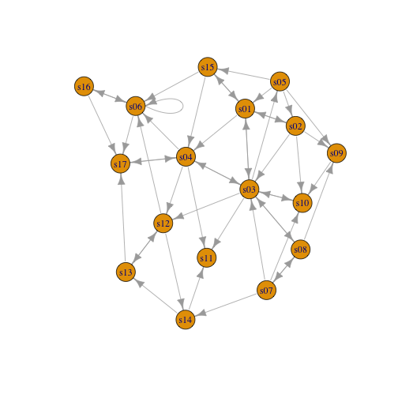
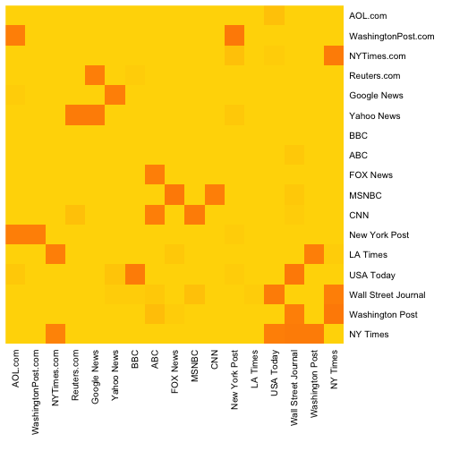
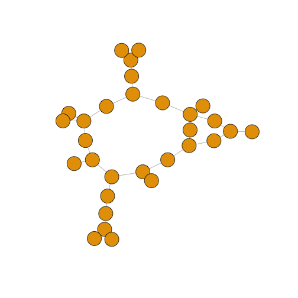
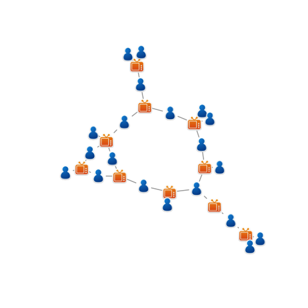
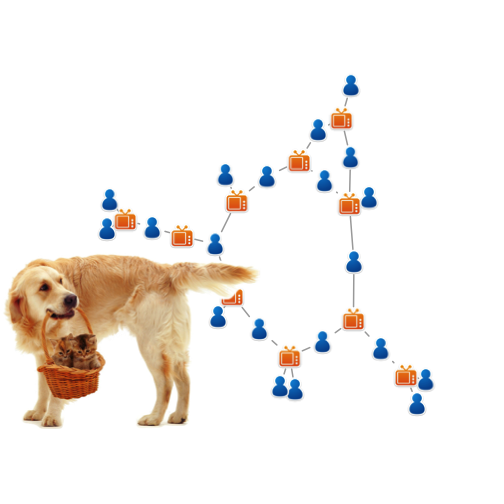

 

### 1. `tkplot`을 활용한 인터랙티브 네트워크 시각화

R과 `igraph` 팩키지를 활용해서 인터랙티브한 방식으로 네트워크 시각화가 가능하다.
규모가 그렇게 크지 않은 네트워크 시각화에 `tkplot`을 활용하여 수작업으로 미세 
조정을 한 후에 노드를 적절한 좌표에 배치하고 나서 후속작업에 활용하는 작업흐름을 
만들어 낸다.

~~~{.r}
tkid <- tkplot(net) 
l <- tkplot.getcoords(tkid) 
plot(net, layout=l)
~~~

### 2. 적외선 열지도(Heatmap)

네트워크 데이터를 머리에 털이 난 모양(hairball) 말고, 적외선 열지도(Heatmap)로
표현하는 것도 가능한 방법이다.

~~~{.r}
netm <- get.adjacency(net, attr="weight", sparse=F)
colnames(netm) <- V(net)$media
rownames(netm) <- V(net)$media

palf <- colorRampPalette(c("gold", "dark orange")) 
heatmap(netm[,17:1], Rowv = NA, Colv = NA, col = palf(100), 
        scale="none", margins=c(10,10) )
~~~

### 3. 연결 분포(Degree Distribution)

네트워크 노드와 엣지링크에 따라 차이가 나지만, 단순한 그래프가 복잡한 네트워크 시각화 
산출물보다 더 의미가 있을 때가 있다.

~~~{.r}
dd <- degree.distribution(net, cumulative=T, mode="all")
plot(dd, pch=19, cex=1, col="orange", xlab="Degree", ylab="Cumulative Frequency")
~~~

### 4. 이분할 그래프(Bipartite Graph)

**이분할 그래프(Bipartite Graph)** 는 서로 다른 두 객체를 모형화할 때 자주 나타난다. 예를 들어, 뉴스기사를 
생산하는 언론사와 이를 소비하는 독자로 나누는 것이 한 사례가 된다.
네트워크 엣지링크는 행렬형태로 표현된다. 행렬형태 데이터를 `graph.incidence` 함수로
그래프 객체로 불러온다. `igraph` 팩키지에서 이분할 그래프는 
`type`이 0이면 노드 한집단을 `type`이 `이면 또다른 집단을 표현한다.

~~~{.r}
head(nodes2)
~~~

~~~{.output}
# A tibble: 6 x 5
     id   media media.type media.name audience.size
  <chr>   <chr>      <int>      <chr>         <int>
1   s01     NYT          1  Newspaper            20
2   s02    WaPo          1  Newspaper            25
3   s03     WSJ          1  Newspaper            30
4   s04    USAT          1  Newspaper            32
5   s05 LATimes          1  Newspaper            20
6   s06     CNN          2         TV            56

~~~

~~~{.r}
head(links2)
~~~

~~~{.output}
    U01 U02 U03 U04 U05 U06 U07 U08 U09 U10 U11 U12 U13 U14 U15 U16 U17
s01   1   1   1   0   0   0   0   0   0   0   0   0   0   0   0   0   0
s02   0   0   0   1   1   0   0   0   0   0   0   0   0   0   0   0   0
s03   0   0   0   0   0   1   1   1   1   0   0   0   0   0   0   0   0
s04   0   0   0   0   0   0   0   0   1   1   1   0   0   0   0   0   0
s05   0   0   0   0   0   0   0   0   0   0   1   1   1   0   0   0   0
s06   0   0   0   0   0   0   0   0   0   0   0   0   1   1   0   0   1
    U18 U19 U20
s01   0   0   0
s02   0   0   1
s03   0   0   0
s04   0   0   0
s05   0   0   0
s06   0   0   0

~~~

~~~{.r}
net2 <- graph.incidence(links2)
table(E(net2)$type)
~~~

~~~{.output}
< table of extent 0 >

~~~

~~~{.r}
plot(net2, vertex.label=NA)
~~~

이분할 그래프도 마찬가지로 네트워크 노드와 엣지링크의 속성을 변경시킬 수 있다.
이번에는 언론사는 정사각형, 독자는 원으로 노드 형태를 바꾼다.

~~~{.r}
V(net2)$color <- c("steel blue", "orange")[V(net2)$type+1]
V(net2)$shape <- c("square", "circle")[V(net2)$type+1]
V(net2)$label <- ""
V(net2)$label[V(net2)$type==F] <- nodes2$media[V(net2)$type==F] 
V(net2)$label.cex=.7
V(net2)$label.font=2

plot(net2, vertex.label.color="white", vertex.size=(2-V(net2)$type)*8) 
~~~

`layout.bipartite` 네트워크 배치가 있어 이를 활용한다.

~~~{.r}
# layout.bipartite 배치
plot(net2, vertex.label=NA, vertex.size=7, layout=layout.bipartite) 
~~~

노드를 텍스트로 표현하는 것이 때로는 도움이 많이 된다.

~~~{.r}
plot(net2, vertex.shape="none", vertex.label=nodes2$media,
     vertex.label.color=V(net2)$color, vertex.label.font=2, 
     vertex.label.cex=.6, edge.color="gray70",  edge.width=2)
~~~

노드에 이미지를 넣어 시각적인 이해를 돕는 것도 가능하다. 단, 이 작업을 위해서
`png` 팩키지가 필요하다.

~~~{.r}
# install.packages("png")
library(png)
 
img.1 <- readPNG("~/Dropbox/network/network/03.data/Images/news.png")
img.2 <- readPNG("~/Dropbox/network/network/03.data/Images/user.png")

V(net2)$raster <- list(img.1, img.2)[V(net2)$type+1]

plot(net2, vertex.shape="raster", vertex.label=NA,
     vertex.size=16, vertex.size2=16, edge.width=2)
~~~

필요하면 어떤 이미지도 네트워크 시각화 산출물에 넣어 표현하는 것도 가능하다.

~~~{.r}
# l <- layout.auto(net2, ymin=-1.5, ymax=1.5, xmin=-1.5, xmax=1.5)
l <- layout.auto(net2)

plot(net2, vertex.shape="raster", vertex.label=NA,
     vertex.size=16, vertex.size2=16, edge.width=2, layout=l)

img.3 <- readPNG("~/Dropbox/network/network/03.data/Images/puppy.png")
rasterImage(img.3,  xleft=-1.7, xright=0, ybottom=-1.2, ytop=0)
~~~

