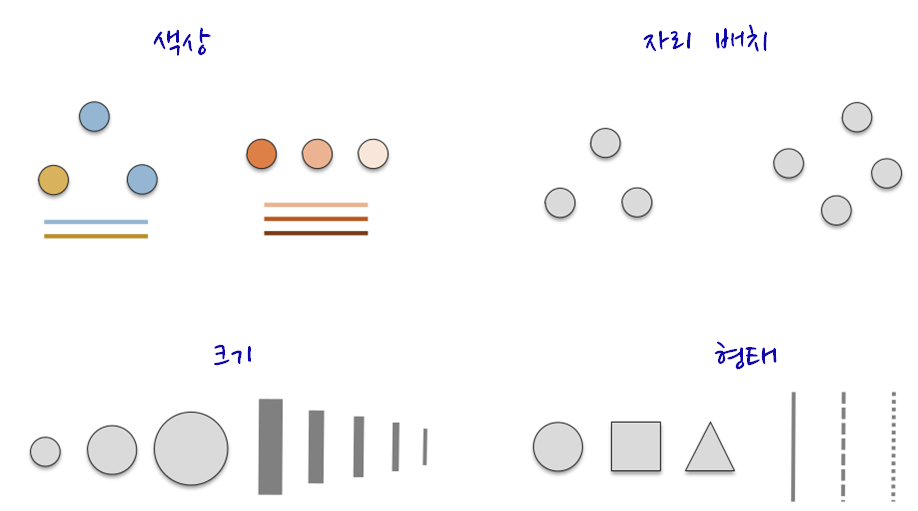
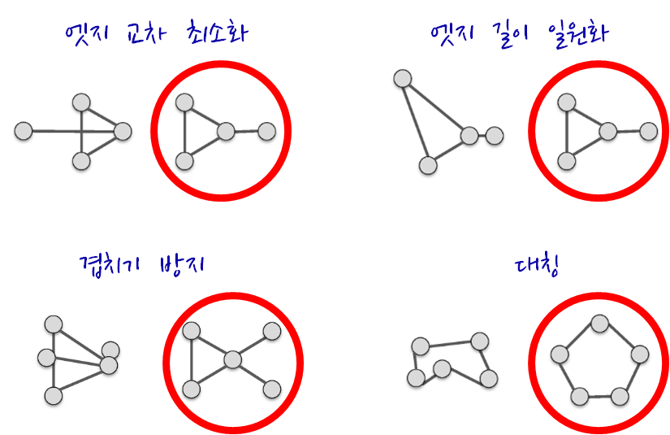

 
``` {r, include=FALSE}
source("tools/chunk-options.R")
```

### 1. 네트워크 시각화 [^Katherine-Ognyanova]

네트워크 시각화는 다양한 목표를 갖고 있다.

* 주요 행위자를 식별하고 관계를 찾아냄
* 구조적 특성(Structural Properties)
* 관계 강도(Relationship Strength)
* 커뮤니티 식별
* 지도로 역할하는 네트워크
* 확산 패턴(Diffusion Patterns)


네트워크 시각화 목표를 구현한 일부 사례가 다음에 나타나 있다. 목표를 구현하는데 있어
결과를 제어하는데 사용되는 핵심 요소에는 다음이 포함된다.

* 색상
* 위치
* 크기
* 형태

색상, 위치, 크기, 형태 외에도 화살표를 통해 방향을 나타내고 라벨을 달아 표식을 한다.



최근에 개발된 그래프 배치는 속도와 심미적인 면을 고려하여 최적화 된다. 
특히, 겹치는 것과 엣지 교차(Edge Crossing)을 최소화하고 그래프에 전반에
엣지 길이가 비슷하도록 조정한다.




> #### 네트워크 시각화 핵심 팩키지 {.callout}
>
> * [igraph - The network analysis package](http://igraph.org/)
> * [sna - Tools for Social Network Analysis](https://cran.r-project.org/web/packages/sna/)
> * [network - Classes for Relational Data](https://cran.r-project.org/web/packages/network/)
> * [ndtv - Network Dynamic Temporal Visualizations](https://cran.r-project.org/web/packages/ndtv/)

[^Katherine-Ognyanova]: [Katherine Ognyanova, Network Analysis and Visualization with R and igraph, Sunbelt 2016 Workshop, Newport Beach, CA
](http://kateto.net/networks-r-igraph) 


### 2. 기본 색상

Base R에 포함된 시각화를 할 경우 시각화 요소를 제어하는데 사용되는 기본요소는 
다음과 같다. 자세한 사항은 `? par` 도움말을 참조한다.

* `x`, `y` : 점 좌표
* `pch` : 점 기호모양
* `cex` : 점 크기
* `col` : 점 색상

``` {r network-viz-basic, warning=FALSE}
plot(x=1:10, y=rep(5,10), pch=19, cex=3, col="dark red")
points(x=1:10, y=rep(6, 10), pch=19, cex=3, col="557799")
points(x=1:10, y=rep(4, 10), pch=19, cex=3, col=rgb(.25, .5, .3))
```

Base R에 포함된 그래프 기능에는 RGB 값이 0 -- 1 사이 값을 갖게 된다. 만약 0 -- 255
값으로 변환하고자 할 경우 `rgb(10, 100, 100, maxColorValue=255)` 처럼 `maxColorValue=255`로 
설정한다.

0 -- 1 범위를 갖는 `alpha` 값을 조정하여 불투명도/투명도를 제어한다.

``` {r network-viz-alpha, warning=FALSE}
plot(x=1:5, y=rep(5,5), pch=19, cex=12, col=rgb(.25, .5, .3, alpha=.5), xlim=c(0,6))
```

[http://www.color-hex.com/](http://www.color-hex.com/) 웹사이트에서 16진수
색상체계를 사용해서도 R에서 색상을 표현할 수 있다. 앞에서 투명도 알파값을 사용하고,
`grDevices` 팩키지에 포함된 `adjustcolor` 함수도 사용한다.


``` {r network-viz-hex, warning=FALSE}
par(bg="gray40")
col.tr <- grDevices::adjustcolor("#e14150", alpha=0.7)
plot(x=1:5, y=rep(5,5), pch=19, cex=12, col=col.tr, xlim=c(0,6))
```

`rainbow()`, `heat.colors()`, `terrain.colors()`, `topo.colors()`, 
`cm.colors()` 팔레트가 `grDevices` 팩키지에 포함되어 있다.
예를 들어, `heat.colors(5, alpha=1)` 명령어는 heat 팔레트에서 불투명한 색상 5개를
갖는 팔레트를 생성한다는 의미가 된다.

``` {r network-viz-palette, warning=FALSE}
# heat 팔레트에서 불투명한 색상 5개 생성
pal1 <- heat.colors(5, alpha=1)
plot(x=1:10, y=1:10, pch=19, cex=5, col=pal1)
# 무지개 팔레트에서 투명한 색상 7개 생성
pal2 <- rainbow(7, alpha=.5)
plot(x=1:10, y=1:10, pch=19, cex=5, col=pal2)
```

`colorRampPalette`를 통해 계조도(Gradient) 색상을 설정하는 것도 가능하다.
즉, 회색에서 어두운 붉은색으로 계조를 두어 색상을 점차적으로 변화해 나가는
팔레트를 통해 색상을 만들어낸다.

``` {r network-viz-gradient, warning=FALSE}
# 계조도(gradient) 적용
palf <- colorRampPalette(c("gray80", "dark red"))
plot(x=10:1, y=1:10, pch=19, cex=5, col=palf(10))
```

``` {r network-viz-gradient-alpha, warning=FALSE}
# 투명도를 가미한 계조도 적용
palf <- colorRampPalette(c(rgb(1,1,1, .2),rgb(.8,0,0, .7)), alpha=TRUE)
plot(x=10:1, y=1:10, pch=19, cex=5, col=palf(10))
```

#### 2.1. `RColorBrewer` 팔레트

적절한 색상 조합을 비전문가가 찾아내는 것은 쉬운 일이 아니다.
내장된 R 색상 팔레트는 다소 제한된 감이 없지 않다. 다행스럽게도 
`RColorBrewer` 팔레트를 사용하는 것이 가능하다.

``` {r network-viz-rColorBrewer, warning=FALSE}
library(RColorBrewer)
display.brewer.all()
display.brewer.pal(8, "Set3")
display.brewer.pal(8, "Spectral")
display.brewer.pal(8, "Blues")
```

`brewer.pal` 색상 팔레트를 활용하여 시각화가 가능하다.

`rev()` 함수를 조합해서 역순으로도 가능하다.

``` {r network-viz-rColorBrewer-ex, warning=FALSE}
pal_set3 <- brewer.pal(10, "Set3")
plot(x=10:1, y=10:1, pch=19, cex=6, col=pal_set3)
plot(x=10:1, y=10:1, pch=19, cex=6, col=rev(pal_set3))
```

### 3. 글꼴 폰트  [^pdf-hangul] [^pdf-hangul-freesearch]

R에서 다양한 폰트를 사용하려면 사전 정지작업이 필요하다.
`extrafont` 팩키지가 다양한 폰트를 사용하는데 도움이 된다.
특히, 윈도우 사용자가 많은 한국에서 다소 번거로운 과정이 필요한데, 맥이나 리눅스
사용자는 이를 건너 뛰어도 된다.

``` {r network-viz-font, warning=FALSE}
library(extrafont)
# 시간이 많이 소요
# font_import()
# 가져온 글꼴 폰트 확인
# fonts()
grep("Nanum", fonts(), value=T)
# windowsFonts(NanumGothicCoding=windowsFont("NanumGothicCoding"))
# windowsFonts(NanumPenScript=windowsFont("`Nanum Pen Script`"))
# windowsFonts(NanumBrushScript=windowsFont("`Nanum Brush Script`"))
# windowsFonts(NanumMyeongjo=windowsFont("NanumMyeongjo"))

# PDF 플롯을 찍을 경우 device="pdf" 를 사용
# loadfonts(device = "win")
```

원하는 글꼴 폰트를 활용하여 시각화한다.

``` {r network-viz-font-hangul, warning=FALSE}
#--------------------------------------------------------------------------------
# 한글 그래프
plot(x=10:1, y=10:1, pch=19, cex=3,
     main="한글 그래프: 글꼴 폰트", col="orange",
     family="MGungHeulim" )
```

pdf 파일에 글꼴폰트를 내장하는 과정은 다음과 같다.
먼저, [Ghostscript, GhostPCL, GhostXPS and MuPDF Downloads](http://ghostscript.com/download/)
다운로드 사이트에서 고스트스크립트를 다운로드하여 설치한다.

R에서 고스트스크립트 존재를 인식하도록 환경을 설정한다.

``` {r network-viz-font-pdf, warning=FALSE, eval=FALSE}
# 고스트스크립트를 R에 연결하는 환경설정
Sys.setenv(R_GSCMD = "C:/Program Files/gs/gs9.19/bin/gswin64c.exe")

# cairo_pdf()함수는 dev.off()가 발생되기 전까지 모든 출력결과를 pdf 파일로 전송
cairo_pdf("NanumMyeongjo.pdf", family = "NanumMyeongjo", width = 10, height = 5, antialias = "subpixel")

plot(x=10:1, y=10:1, pch=19, cex=3, main="한글 그래프 - 나눔 고딕 글꼴", col="orange")
dev.off()
embed_fonts("NanumMyeongjo.pdf", outfile="NanumMyeongjo_embed.pdf")
```


[^pdf-hangul]: [R PDF생성 시 한글폰트 깨짐 문제](http://using.tistory.com/66)
[^pdf-hangul-freesearch]: [R로 그래프 플로팅을 하기 위한 몇 가지 팁](http://freesearch.pe.kr/archives/3275)

