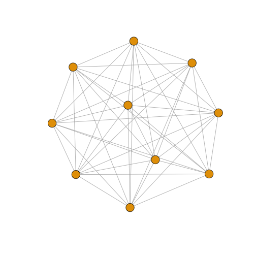
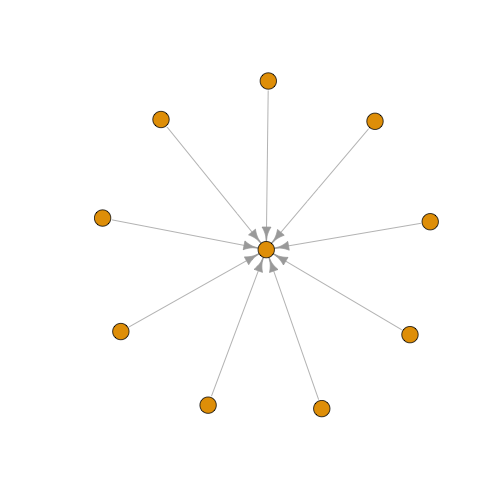
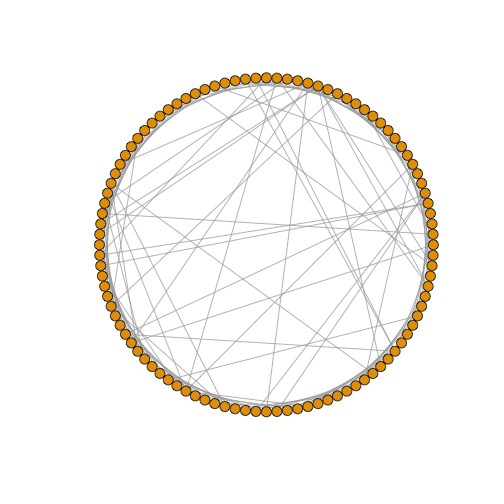
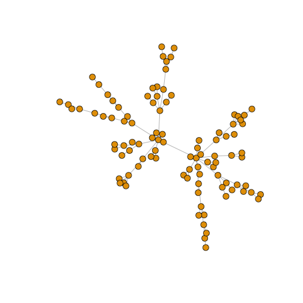

 

### 1. 기본 네트워크 유형

기본 네트워크 유형을 먼저 살펴보자. 

* 연결없는 그래프
* 전체 연결 그래프
* 단순 별그래프 
* 나무 그래프
* 원 그래프 

~~~{.r}
suppressWarnings(suppressMessages(library(igraph)))
##================================================================================
## 01. 기본 네트워크 유형
##================================================================================
library(igraph)

#---------------------------------------------------------------------------------
# 01. 연결없는 그래프
#---------------------------------------------------------------------------------
eg <- make_empty_graph(10)
plot(eg, vertex.size=3, vertex.label=NA)
~~~

~~~{.r}
#---------------------------------------------------------------------------------
# 02. 전체 연결 그래프
#---------------------------------------------------------------------------------
fg <- make_full_graph(10)
plot(fg, vertex.size=10, vertex.label=NA)
~~~

~~~{.r}
#---------------------------------------------------------------------------------
# 03. 단순 별그래프(Star Graph)
#---------------------------------------------------------------------------------
st <- make_star(10)
plot(st, vertex.size=10, vertex.label=NA) 
~~~

~~~{.r}
#---------------------------------------------------------------------------------
# 04. 나무 그래프(Tree Graph)
#---------------------------------------------------------------------------------
tr <- make_tree(20, children = 3, mode = "undirected")
plot(tr, vertex.size=10, vertex.label=NA) 
~~~

~~~{.r}
#---------------------------------------------------------------------------------
# 05. 원 그래프(Ring Graph)
#---------------------------------------------------------------------------------
rn <- make_ring(10)
plot(rn, vertex.size=10, vertex.label=NA)
~~~

### 2. 네트워크 모형

1. Erdos-Renyi 확률 그래프 모형
1. Watts-Strogatz 작은세상 모형
1. Barabasi-Albert 선호적 연결 모형 (무척도 그래프)
1. 역사적인 의미가 있는 그래프
    * Krackhardt, D. Assessing the Political Landscape: Structure, Cognition, and Power in Organizations. Admin. Sci. Quart. 35, 342-369, 1990.
    * W. W. Zachary, An information flow model for conflict and fission in small groups, Journal of Anthropological Research 33, 452-473 (1977).

~~~{.r}
##================================================================================
## 02. 네트워크 모형
##================================================================================

#---------------------------------------------------------------------------------
# 01. Erdos-Renyi 확률 그래프 모형 (n: 노드갯수, m: 엣지갯수)
#---------------------------------------------------------------------------------
er <- sample_gnm(n=100, m=40) 
plot(er, vertex.size=6, vertex.label=NA)  
~~~

~~~{.r}
#---------------------------------------------------------------------------------
# 02. Watts-Strogatz 작은세상 모형: 
#---------------------------------------------------------------------------------
sw <- sample_smallworld(dim=2, size=10, nei=1, p=0.1)
plot(sw, vertex.size=6, vertex.label=NA, layout=layout_in_circle)
~~~

~~~{.r}
#---------------------------------------------------------------------------------
# 03. Barabasi-Albert 선호적 연결 모형 (무척도 그래프)
#---------------------------------------------------------------------------------
ba <-  sample_pa(n=100, power=1, m=1,  directed=F)
plot(ba, vertex.size=6, vertex.label=NA)
~~~

~~~{.r}
#---------------------------------------------------------------------------------
# 04. 역사적인 의미가 있는 그래프
#---------------------------------------------------------------------------------
# Krackhardt, D. Assessing the Political Landscape: Structure, Cognition, and Power in Organizations. Admin. Sci. Quart. 35, 342-369, 1990.
zach <- graph("Zachary") # Zachary Karate Club
plot(zach, vertex.size=10, vertex.label=NA)
~~~

~~~{.r}
# W.W.Zachary, An information flow model for conflict and fission in small groups, Journal of Anthropological Research 33, 452-473 (1977).
kite <- graph("Krackhardt kite")
plot(kite, vertex.size=10, vertex.label=NA)
~~~

