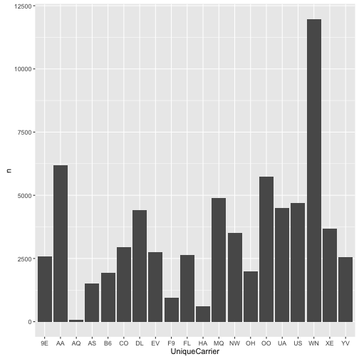
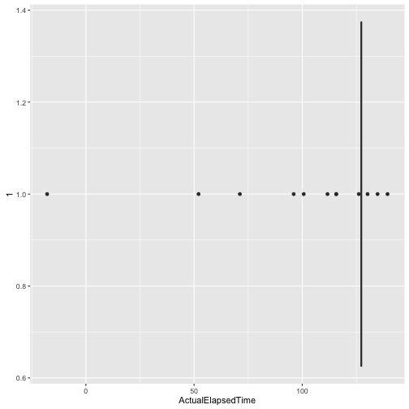

 
> ## 학습목표 {.objectives}
>
> * 

## 1. 이상점 탐지 방법론

- 모형기반 (Model-based) 
    - 통계검증 (Statistical Tests)
    - 깊이 기반 접근법(Depth-based Approaches)
    - 편차 기반 접근법(Deviation-based Approaches)
- 근접기반 (Proximity-based)
    - 거리 기반(Distance-based Approaches)
    - 밀도 기반(Density-based Approaches)
- 고차원 접근법 (High dimensional Approaches)

## 2. 이상점 추출 및 처리 연습문제 [^r-exercise-outlier] [^outlier-detection-techniques]

[^r-exercise-outlier]: [Descriptive Analytics-Part 3 : Outlier treatment](http://r-exercises.com/2016/11/10/descriptive-analytics-part-3-outlier-treatment/)
[^outlier-detection-techniques]: [Outlier Detection Techniques](http://www.dbs.ifi.lmu.de/~zimek/publications/KDD2010/kdd10-outlier-tutorial.pdf)

~~~{.r}
# 1. 환경설정-------------------------------------------
#install.packages('rapportools')
#library(rapportools)
#install.packages('outliers')
#library(outliers)

# 2. 데이터 가져오기-------------------------------------------
#install.packages("nycflights13")
#library(nycflights13)
flights <- read_csv("~/Dropbox/02_data_family/01-outlier/data/flights_1_pcnt.csv")
~~~

~~~{.output}
Parsed with column specification:
cols(
  .default = col_integer(),
  DepTime = col_time(format = ""),
  CRSDepTime = col_time(format = ""),
  ArrTime = col_time(format = ""),
  CRSArrTime = col_time(format = ""),
  UniqueCarrier = col_character(),
  TailNum = col_character(),
  ActualElapsedTime = col_double(),
  AirTime = col_double(),
  ArrDelay = col_double(),
  DepDelay = col_double(),
  Origin = col_character(),
  Dest = col_character(),
  TaxiIn = col_double(),
  TaxiOut = col_double(),
  CancellationCode = col_character()
)

~~~

~~~{.output}
See spec(...) for full column specifications.

~~~

1. 연습문제 : 분석할 데이터(`flights`)에 대한 자료구조와 요약통계량을 확인한다.

~~~{.r}
glimpse(flights)
~~~

~~~{.output}
Observations: 70,097
Variables: 29
$ Year              <int> 2008, 2008, 2008, 2008, 2008, 2008, 2008, 20...
$ Month             <int> 4, 8, 2, 6, 9, 2, 2, 8, 12, 10, 7, 2, 5, 5, ...
$ DayofMonth        <int> 12, 26, 8, 12, 1, 8, 13, 4, 16, 8, 5, 22, 14...
$ DayOfWeek         <int> 6, 2, 5, 4, 1, 5, 3, 1, 2, 3, 6, 5, 3, 5, 5,...
$ DepTime           <time> 78780 secs, 78780 secs, 78780 secs, 78780 s...
$ CRSDepTime        <time> NA secs, NA secs, NA secs, NA secs, NA secs...
$ ArrTime           <time> 57659 secs, 57659 secs, 57659 secs, 57659 s...
$ CRSArrTime        <time> 69600 secs, 69600 secs, 69600 secs, 69600 s...
$ UniqueCarrier     <chr> "AA", "OO", "YV", "AA", "B6", "US", "FL", "B...
$ FlightNum         <int> 343, 3622, 7221, 2395, 133, 1264, 372, 295, ...
$ TailNum           <chr> "N497AA", "N232SW", "N570ML", "N547AA", "N62...
$ ActualElapsedTime <dbl> 107, 81, 84, 162, 170, 163, 132, 163, 137, 6...
$ CRSElapsedTime    <int> 100, 84, 89, 160, 187, 170, 136, 165, 143, 7...
$ AirTime           <dbl> 84, 64, 65, 129, 145, 132, 95, 144, 116, 56,...
$ ArrDelay          <dbl> 10, -5, -7, 0, -23, 0, 52, -1, -11, -2, -17,...
$ DepDelay          <dbl> 3, -2, -2, -2, -6, 7, 56, 1, -5, -1, -4, -7,...
$ Origin            <chr> "DFW", "SLC", "IAD", "CLT", "JFK", "MIA", "A...
$ Dest              <chr> "ELP", "SGU", "GSP", "DFW", "RSW", "PHL", "L...
$ Distance          <int> 551, 269, 383, 936, 1074, 1013, 761, 965, 75...
$ TaxiIn            <dbl> 3, 6, 3, 19, 6, 4, 12, 5, 4, 5, 6, 7, 6, 3, ...
$ TaxiOut           <dbl> 20, 11, 16, 14, 19, 27, 25, 14, 17, 8, 8, 9,...
$ Cancelled         <int> 0, 0, 0, 0, 0, 0, 0, 0, 0, 0, 0, 0, 0, 0, 0,...
$ CancellationCode  <chr> NA, NA, NA, NA, NA, NA, NA, NA, NA, NA, NA, ...
$ Diverted          <int> 0, 0, 0, 0, 0, 0, 0, 0, 0, 0, 0, 0, 0, 0, 0,...
$ CarrierDelay      <int> NA, NA, NA, NA, NA, NA, 0, NA, NA, NA, NA, N...
$ WeatherDelay      <int> NA, NA, NA, NA, NA, NA, 0, NA, NA, NA, NA, N...
$ NASDelay          <int> NA, NA, NA, NA, NA, NA, 52, NA, NA, NA, NA, ...
$ SecurityDelay     <int> NA, NA, NA, NA, NA, NA, 0, NA, NA, NA, NA, N...
$ LateAircraftDelay <int> NA, NA, NA, NA, NA, NA, 0, NA, NA, NA, NA, N...

~~~

~~~{.r}
summary(flights)
~~~

~~~{.output}
      Year          Month          DayofMonth      DayOfWeek    
 Min.   :2008   Min.   : 1.000   Min.   : 1.00   Min.   :1.000  
 1st Qu.:2008   1st Qu.: 3.000   1st Qu.: 8.00   1st Qu.:2.000  
 Median :2008   Median : 6.000   Median :16.00   Median :4.000  
 Mean   :2008   Mean   : 6.389   Mean   :15.73   Mean   :3.921  
 3rd Qu.:2008   3rd Qu.: 9.000   3rd Qu.:23.00   3rd Qu.:6.000  
 Max.   :2008   Max.   :12.000   Max.   :31.00   Max.   :7.000  
                                                                
   DepTime          CRSDepTime         ArrTime          CRSArrTime      
 Length:70097      Length:70097      Length:70097      Length:70097     
 Class1:hms        Class1:hms        Class1:hms        Class1:hms       
 Class2:difftime   Class2:difftime   Class2:difftime   Class2:difftime  
 Mode  :numeric    Mode  :numeric    Mode  :numeric    Mode  :numeric   
                                                                        
                                                                        
                                                                        
 UniqueCarrier        FlightNum      TailNum          ActualElapsedTime
 Length:70097       Min.   :   1   Length:70097       Min.   :-113.4   
 Class :character   1st Qu.: 621   Class :character   1st Qu.:  77.0   
 Mode  :character   Median :1564   Mode  :character   Median : 111.0   
                    Mean   :2218                      Mean   : 127.5   
                    3rd Qu.:3501                      3rd Qu.: 156.0   
                    Max.   :7829                      Max.   : 669.0   
                                                                       
 CRSElapsedTime     AirTime         ArrDelay           DepDelay       
 Min.   : 15.0   Min.   :  2.0   Min.   : -62.000   Min.   : -38.000  
 1st Qu.: 80.0   1st Qu.: 56.0   1st Qu.: -10.000   1st Qu.:  -4.000  
 Median :110.0   Median : 87.0   Median :  -2.000   Median :  -1.000  
 Mean   :129.1   Mean   :104.3   Mean   :   7.967   Mean   :   9.771  
 3rd Qu.:160.0   3rd Qu.:131.0   3rd Qu.:  11.000   3rd Qu.:   9.000  
 Max.   :660.0   Max.   :642.0   Max.   :1114.000   Max.   :1114.000  
                                                                      
    Origin              Dest              Distance          TaxiIn       
 Length:70097       Length:70097       Min.   :  31.0   Min.   :-30.623  
 Class :character   Class :character   1st Qu.: 324.0   1st Qu.:  4.000  
 Mode  :character   Mode  :character   Median : 580.0   Median :  6.000  
                                       Mean   : 728.4   Mean   :  6.856  
                                       3rd Qu.: 957.0   3rd Qu.:  8.000  
                                       Max.   :4962.0   Max.   :120.000  
                                                                         
    TaxiOut         Cancelled       CancellationCode      Diverted       
 Min.   :-98.23   Min.   :0.00000   Length:70097       Min.   :0.000000  
 1st Qu.: 10.00   1st Qu.:0.00000   Class :character   1st Qu.:0.000000  
 Median : 14.00   Median :0.00000   Mode  :character   Median :0.000000  
 Mean   : 16.41   Mean   :0.01962                      Mean   :0.002539  
 3rd Qu.: 19.00   3rd Qu.:0.00000                      3rd Qu.:0.000000  
 Max.   :274.00   Max.   :1.00000                      Max.   :1.000000  
                                                                         
  CarrierDelay      WeatherDelay       NASDelay      SecurityDelay  
 Min.   :   0.00   Min.   :  0.00   Min.   :  0.00   Min.   :0e+00  
 1st Qu.:   0.00   1st Qu.:  0.00   1st Qu.:  0.00   1st Qu.:0e+00  
 Median :   0.00   Median :  0.00   Median :  6.00   Median :0e+00  
 Mean   :  15.71   Mean   :  2.95   Mean   : 17.16   Mean   :6e-02  
 3rd Qu.:  16.00   3rd Qu.:  0.00   3rd Qu.: 21.00   3rd Qu.:0e+00  
 Max.   :1001.00   Max.   :915.00   Max.   :599.00   Max.   :1e+02  
 NA's   :54983     NA's   :54983    NA's   :54983    NA's   :54983  
 LateAircraftDelay
 Min.   :  0.00   
 1st Qu.:  0.00   
 Median :  0.00   
 Mean   : 20.68   
 3rd Qu.: 26.00   
 Max.   :429.00   
 NA's   :54983    

~~~

2. 연습문제 : 범주형 변수의 경우 이상점은 10% 보다 빈도가 적은 경우 해당된다. 
`flights$UniqueCarrier`, `flights$CancellationCode` 변수에 대한 막대그래프를 도식화한다.

~~~{.r}
# UniqueCarrier
carrier_tbl <- flights %>% count(UniqueCarrier)
ggplot(carrier_tbl, aes(x=UniqueCarrier, y=n)) + 
  geom_bar(stat="identity")
~~~

~~~{.r}
# CancellationCode
cancel_tbl <- flights %>% count(CancellationCode)
ggplot(cancel_tbl, aes(x=CancellationCode, y=n)) + 
  geom_bar(stat="identity")
~~~

~~~{.output}
Warning: Removed 1 rows containing missing values (position_stack).

~~~

3. 연습문제 : 2번 연습문제에서 맞닥드린 이상점을 제거하라. `subset` 혹은 `filter` 함수를 사용한다.

~~~{.r}
flights <- flights %>% 
  dplyr::filter(UniqueCarrier != 'AQ')

flights <- flights %>% 
  dplyr::filter(CancellationCode != 'D')
~~~

4. 연습문제 : 숫자형 변수의 경우 이상점을 탐지하는데 권장되는 방식은 `boxplot`을 활용하는 것이다.
`flights$ActualElapsedTime` 변수에 대해서 상자그림을 도식화하시오.

~~~{.r}
ggplot(flights, aes(x=1, y=ActualElapsedTime)) +
  geom_boxplot() + coord_flip()
~~~

5. 연습문제 : `boxplot()` 함수를 사용한 경우 `boxplot.stats`을 사용해서 `flights$ActualElapsedTime` 변수 이상점을 제거한다.

~~~{.r}
flights <- flights %>% 
  dplyr::filter(!(ActualElapsedTime %in% boxplot.stats(flights$ActualElapsedTime)$out))

ggplot(flights, aes(x=1, y=ActualElapsedTime)) +
  geom_boxplot() + coord_flip()
~~~

6. 연습문제 : `subset` 혹은 `filter` 함수를 사용해서 `TaxiIn` 변수가 0보다 크고 120보다 적은 범위를 벗어난 이상점을 제거하시오.

~~~{.r}
flights_exp <- flights %>% 
  dplyr::filter(TaxiIn > 0 & TaxiIn < 120)
~~~

7. 연습문제 : `subset` 혹은 `filter` 함수를 사용해서 `TaxiOut` 변수가 0보다 크고 50보다 적은 범위를 벗어난 이상점을 제거하시오.

~~~{.r}
flights <- flights %>% 
  dplyr::filter(TaxiOut > 0 & TaxiIn < 50)
~~~

8. 연습문제 : `flights_exp$ArrDelay` 변수에 `ifelse` 함수를 사용해서 이상점으로 판정되면 `NA` 값을 대입하시오.

~~~{.r}
summary(flights$ArrDelay)
~~~

~~~{.output}
   Min. 1st Qu.  Median    Mean 3rd Qu.    Max. 
  8.179   8.179   8.179   8.179   8.179   8.179 

~~~

~~~{.r}
flights <- flights %>% mutate(ArrDelay = ifelse(ArrDelay == outlier(ArrDelay), NA, ArrDelay))
summary(flights$ArrDelay)
~~~

~~~{.output}
   Mode    NA's 
logical    1363 

~~~

9. 연습문제 : `flights_exp$Distance` 변수에서 이상점을 제거하는데 `Lund Test` 통계적 방법을 `rp.outlier` 함수를 사용해서 실행하시오.
이번에는 `rapportools` 팩키지를 사용한다.

~~~{.r}
dim(flights)
~~~

~~~{.output}
[1] 1363   29

~~~

~~~{.r}
flights <- flights %>% 
  dplyr::filter(!(Distance %in% rp.outlier(Distance)))
dim(flights)
~~~

~~~{.output}
[1] 1348   29

~~~

10. 연습문제 : `flights$CRSElapsedTime` 변수에 대해 2% 극단치를 찾아내는데 카이제곱 방법, `scores`를 사용하시오.

~~~{.r}
outliers <- outliers::scores(flights$CRSElapsedTime, type="chisq", prob=0.98)
table(outliers)
~~~

~~~{.output}
outliers
FALSE  TRUE 
 1303    45 

~~~

