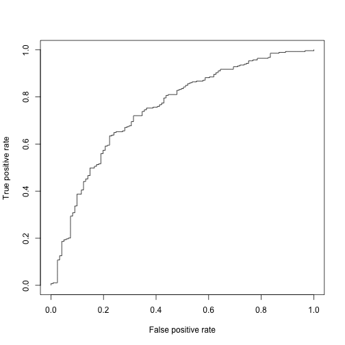
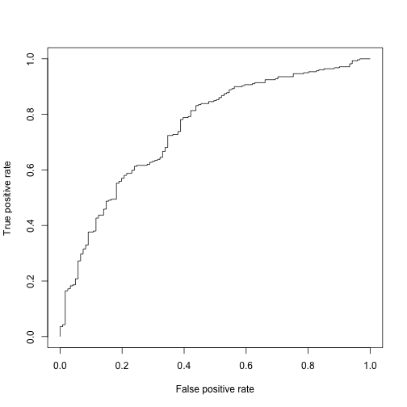
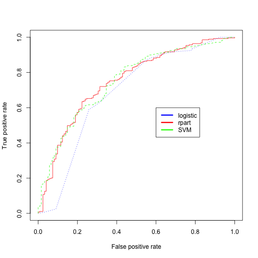

 

## 기계학습 맛보기 [^credit-scoring]

[^credit-scoring]: [Guide to Credit Scoring in R](https://cran.r-project.org/doc/contrib/Sharma-CreditScoring.pdf)

기계학습 맛보기는 전처리가 완료된 데이터를 가져와서 기계학습 모형을 선정하고, 모형이 갖는 성능을 평가하는 것으로 한정한다.

### 1. 목표설정

은행입장에서 보면 저신용자에게 신용카드를 발급하게 되면 빌린 돈을 갚지 못해 손실이 되고, 신용이 높은 사람에게 신용카드를 발급하게 되면 이자를 받아 수익성이 개선된다. 따라서, 은행입장에서는 다음과 같은 최적화문제를 푸는 것으로 정리된다.

### 2. 데이터 준비

독일 신용데이터는 [Statlog (German Credit Data) Data Set ](http://archive.ics.uci.edu/ml/datasets/Statlog+(German+Credit+Data) [UCI Machine Learning 저장소](http://archive.ics.uci.edu/ml/index.html)에서 다운로드 받을 수 있다. 신용카드를 발급해야 하는지, 발급하지 말아야하는지에 대해 일상과 밀접한 데이터로 [신용평가점수](https://en.wikipedia.org/wiki/Credit_score)와 연관되어 있다.

#### 2.1. 독일신용데이터 살펴보기

1,000 명이 신용카드발급을 신청했는데 변수 20개로 신용카드발급을 평가하는 기계학습 알고리즘을 개발한다.

각 변수에 대한 자세한 사항은 [Statlog (German Credit Data) Data Set ](http://archive.ics.uci.edu/ml/datasets/Statlog+(German+Credit+Data))를 참조한다.

[참고: Analysis of German Credit Data](https://onlinecourses.science.psu.edu/stat857/node/215)

### 3. 기계학습 알고리듬 개발과정

#### 3.1. 훈련데이터 준비 및 전처리

독일신용데이터를 인터넷에서 바로 불러와서, 범주형 변수를 요인변수(Factor)로 변환하고, 이를 훈련데이터(60%)와 검증데이터(40%)로 분리한다.

~~~{.r}
##================================================================
## 01. 데이터 준비
##================================================================
# https://raw.githubusercontent.com/stedy/Machine-Learning-with-R-datasets/master/credit.csv
suppressMessages(library(readr));suppressMessages(library(dplyr))
data <- read_csv('http://freakonometrics.free.fr/german_credit.csv', col_names = TRUE)

##================================================================
## 02. 데이터 전처리
##================================================================

#-----------------------------------------------------------------
# 요인변환
F <- c(1,2,4,5,7,8,9,10,11,12,13,15,16,17,18,19,20)

data.F <- data[,F]; data.NF <- data[,-F]

data.F <- sapply(data.F, as.factor)

data <- cbind(data.F, data.NF)

data <- data %>% rename(default = Creditability)

#-----------------------------------------------------------------
# 훈련데이터과 검증데이터 분리 (60% 훈련, 40% 검증)
d <-  sort(sample(nrow(data), nrow(data)*.6))

train <- data[d,] # 60%
test <- data[-d,] # 40%
~~~

#### 3.2. 훈련데이터 준비 및 전처리

독일 신용데이터를 이항회귀모형, 나무모형, SVM 3개 모형에 적합시킨다. 

~~~{.r}
##================================================================
## 03. 모형적합
##================================================================

#-----------------------------------------------------------------
# 3.1. 이항 회귀분석
logit.m <- glm(default~., data=train, family=binomial("logit"), control = list(maxit = 50))

#-----------------------------------------------------------------
# 3.2. 나무모형
library(rpart); library(rpart.plot)
rpart.fit <- rpart(default~., data=train)
#plot(rpart.fit);text(rpart.fit);
#prp(rpart.fit, type=1, extra=1)

#-----------------------------------------------------------------
# 3.3. SVM
library(e1071)
svm.fit <- svm(default ~ ., train,  probability = TRUE)
~~~

#### 3.3. 알고리즘 성능 평가

독일 신용데이터에 적합시킨 이항회귀모형, 나무모형, SVM 3개 모형에 대한 각 모형별 성능평가 작업을 수행한다.

~~~{.r}
##================================================================
## 04. 모형 성능평가
##================================================================
suppressMessages(library(ROCR))
#-----------------------------------------------------------------
# 4.1. 이항 회귀분석

test$probs <- predict(logit.m, test, type='response')
logit.pred <- prediction(test$probs, test$default)
logit.perf <- performance(logit.pred,"tpr","fpr")
plot(logit.perf)
~~~

~~~{.r}
## KS 통계량 (면적)
max(attr(logit.perf,'y.values')[[1]]-attr(logit.perf,'x.values')[[1]])
~~~

~~~{.output}
[1] 0.4112681

~~~

~~~{.r}
## 신용점수함수에 가장 영향을 주는 변수 3개 추출
logit.pick.3 <- predict(logit.m, type='terms', test)

ftopk<- function(x,top=3){
  res <- names(x)[order(x, decreasing = TRUE)][1:top]
  paste(res, collapse=";", sep="")
}
# 신용카드 발급 신청자별로 가장 영향력있는 변수 3개 추출
logit.pick.3 <- apply(logit.pick.3, 1, ftopk, top=3)
# 추출한 3개 변수를 신용카드 발급 신청자별로 결합
test <- cbind(test, logit.pick.3)

#-----------------------------------------------------------------
# 4.2. 나무모형

test$rpart_class <- predict(rpart.fit, type='class', test)
rpart_score <- predict(rpart.fit, type='prob', test)
rpart.pred <- prediction(rpart_score[,2],test$default)
rpart.perf <- performance(rpart.pred,"tpr","fpr")
plot(rpart.perf)
~~~

~~~{.r}
#-----------------------------------------------------------------
# 4.3. SVM

test$svm_class <- predict(svm.fit, type='class', test)
svm.score <- predict(svm.fit, type='prob', test, probability = TRUE)
svm.pred <- prediction(attr(svm.score, "probabilities")[,1], test$default)
svm.perf <- performance(svm.pred,"tpr","fpr")
plot(svm.perf)
~~~

#### 3.4. 종합 알고리즘 성능평가

ROC 곡선을 그려봐서 가장 면적이 넓은 기계학습 알고리듬을 눈으로 확인하고, KS 통계량 및 AUC 면적으로 가장 성능이 좋게 나오는 모형을 찾아본다.

~~~{.r}
##================================================================
## 04. 종합성능 평가
##================================================================
# ROC 

plot(logit.perf, col='red',lty=1, main='');
plot(rpart.perf, col='blue',lty=3, add=TRUE);
plot(svm.perf, col='green',add=TRUE,lty=2);
legend(0.6,0.6,c('logistic', 'rpart','SVM'), col=c('blue', 'red','green'),lwd=3)
~~~

~~~{.r}
## KS 통계량 (면적)
cat("KS 통계량 (Logistic):", max(attr(logit.perf,'y.values')[[1]]-attr(logit.perf,'x.values')[[1]]))
~~~

~~~{.output}
KS 통계량 (Logistic): 0.4112681

~~~

~~~{.r}
cat("KS 통계량 (Tree):", max(attr(rpart.perf,'y.values')[[1]]-attr(rpart.perf,'x.values')[[1]]))
~~~

~~~{.output}
KS 통계량 (Tree): 0.3316153

~~~

~~~{.r}
cat("KS 통계량 (SVM):", max(attr(svm.perf,'y.values')[[1]]-attr(svm.perf,'x.values')[[1]]))
~~~

~~~{.output}
KS 통계량 (SVM): 0.3935247

~~~

~~~{.r}
## AUC (Area Under the ROC Curve)
cat("AUC 면적 (Logistic):", attr(performance(logit.pred,"auc"), "y.values")[[1]])
~~~

~~~{.output}
AUC 면적 (Logistic): 0.7498445

~~~

~~~{.r}
cat("AUC 면적 (Tree):", attr(performance(rpart.pred,"auc"), "y.values")[[1]])
~~~

~~~{.output}
AUC 면적 (Tree): 0.6873871

~~~

~~~{.r}
cat("AUC 면적 (SVM):", attr(performance(svm.pred,"auc"), "y.values")[[1]])
~~~

~~~{.output}
AUC 면적 (SVM): 0.7502296

~~~
