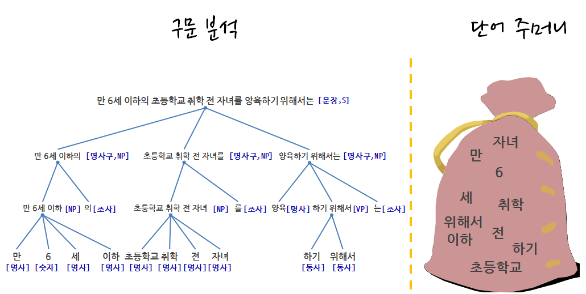

> ## 학습목표 {.objectives}
>
> * 텍스트 데이터 분석에 대해 이해한다.
> * 전통적인 텍스트 분석방법에 대응되는 단어 주머니(bag of words)에 대해 살펴본다.

### 1. 언어기술 로드맵

스탠포드 [Dan Jurfsky](http://web.stanford.edu/~jurafsky/) 교수가 정의한 언어기술(Language Technology)에 
따라 거의 해결된 기술과 상당한 진전을 이루는 기술, 그리고 여전히 어려운 문제로 구분했다.

* **상당부분 해결 문제**
    * Spam Detection
    * Part-of-speech (POS) tagging
    * Named entity recognition (NER)
* **성과를 내고 있는 문제**
    * Sentiment analysis
    * Coreference resolution
    * Word sense disambiguation (WSD)
    * Parsing
    * Machine translation (MT)
    * Information extraction (IE)
* **여전히 어려운 문제**    
    * Question answering (QA)
    * Paraphrase
    * Summarization
    * Dialog

### 2. 단어주머니 접근법

[**단어 주머니(bag of words)**](https://en.wikipedia.org/wiki/Bag-of-words_model) 모형은 전통적인 자연어 처리(Natural Language Processing) 혹은 
정보 검색(Information Retrieval)에서 사용되는 간략화한 표현으로 볼 수 있다. 문법 무시, 어순 무시 등 전통적인 텍스트 분석에 사용되는 것과 
달리, 각 단어가 출현된 회수를 Feature로 추출하여 문서 분류, 감정분석 등에 활용한다.

### 3. 텍스트 데이터 분석 작업 흐름

텍스트 문자 데이터 분석 작업 흐름도 일반적인 데이터 분석 과정과 크게 차이가 나지는 않는다.

1. 문제 정의 및 목표설정: 적용분야 전문지식 습득 필요
1. 수집 텍스트 데이터 식별: 목표달성을 위한 정보가 담긴 데이터 발굴
1. 데이터 분석 및 모형 개발 과정
    * 텍스트 데이터 전처리 및 구조화
    * 데이터 정제 및 Feature 공학을 통한 Feature 추출 
    * 데이터 분석 및 모형 개발 : 탐색적 데이터 분석 포함
1. 분석결과 정리: 보고서, 추천, 통찰 도출

#### 3.1. 텍스트 데이터 전처리 [^text-mining-in-r]

1. 토큰화(Tokenization)
1. 정제(Cleaning): 소문자, 공백(Whitespace) 제거, 구두점 소거 등
1. 어간 추출(Stemming), Lemmatization, Collocation
1. 필터(Filtering): 불용어 제거

|        만화가 김충원                    |    개발하는 데이터 분석가 박은정                  |
|-----------------------------------------|---------------------------------------------------|
|**사람의 생김새** 를 결정짓는 것은 **골격과 피부의 미묘한 변화에서 비롯되는 차이** 점이고, 그 차이점을 없애 버린다면 모든 사람의 생김새는 똑같을 것입니다. | **데이터**를 결정짓는 것은 **행과 열의 미묘한 변화에서 비롯되는 차이** 점이고, 그 차이점을 없애 버린다면 모든 데이터는 똑같을 것입니다. |

[^text-mining-in-r]: [Ryan Wesslen, Text Mining with R for Social Science Research](http://www.slideshare.net/RyanWesslen/text-mining-with-r-for-social-science-research)

#### 3.2. 문서단어행렬(DTM), 단어문서행렬(TDM) 

단어문서행렬(Term Document Matrix)을 전치(Transpose)하게 되면 문서단어행렬(DTM)이 된다.
단어문서행렬은 다음과 같은 형태를 갖는다.

|        | $문서_1$ | $문서_1$ | $문서_1$ | $\cdots$ | $문서_n$ |
|--------|----------|----------|----------|----------|----------|
|$단어_1$|     0    |     0    |    0     |     0    |     0    |
|$단어_2$|     1    |     1    |    0     |     0    |     0    |
|$단어_3$|     1    |     0    |    0     |     0    |     0    |
|$\cdots$|     0    |     0    |    2     |     1    |     1    |
|$단어_m$|     0    |     0    |    0     |     1    |     0    |

문서단어행렬은 단서문서행렬을 전치하여 다음과 같은 형태를 갖는다.

|        | $단어_1$ | $단어_1$ | $단어_1$ | $\cdots$ | $단어_n$ |
|--------|----------|----------|----------|----------|----------|
|$문서_1$|     0    |     1    |    1     |     0    |     0    |
|$문서_2$|     0    |     1    |    0     |     0    |     0    |
|$문서_3$|     0    |     0    |    0     |     2    |     0    |
|$\cdots$|     0    |     0    |    0     |     1    |     1    |
|$문서_m$|     0    |     0    |    0     |     1    |     0    |

`qdap` 팩키지 `wfm()` 함수를 사용해서 말뭉치(Corpus) 대신 텍스트에서 바로 단어 빈도수를 산출하는 것도 가능하다.

|        | $문서_1$ |
|--------|----------|
|$단어_1$|     0    |
|$단어_2$|     1    |
|$단어_3$|     1    |
|$\cdots$|     0    |
|$단어_m$|     0    |
