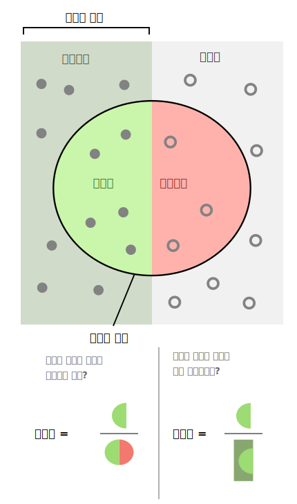
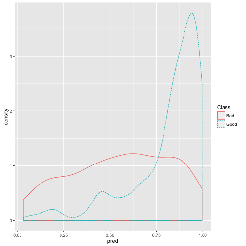
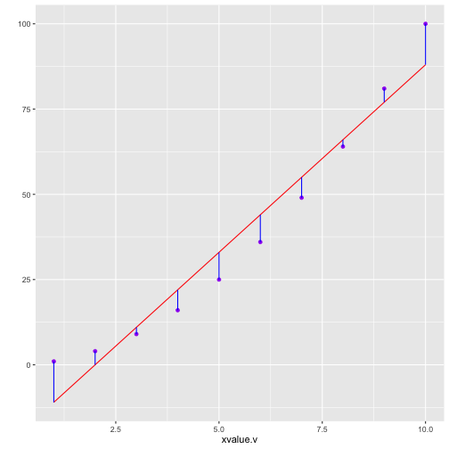

 
> ## 학습목표 {.objectives}
>
> * 기계학습 알고리듬 성능평가를 이해한다.
> * 범주형, 연속형, 지도학습/비지도학습 알고리듬 성능평가를 이해한다.

## 기계학습 알고리즘 성능평가

기계학습 알고리즘 성능평가는 데이터를 이용해서 풀려는 문제에 따라 다르다.

* 분류 
* 예측

### 1. 범주형 성능평가 

전자우편을 스팸(spam)이냐 정상햄(ham)이냐를 분류한 기계학습 알고리즘의 성능을 평가할 때 정량화된 측도가 필요하다. 
일견 스팸전자우편을 스팸이라고 분류하고, 정상 전자우편을 정상으로 분류하면 되는 간단한 문제로 보이지만 사실 그렇게 간단한 것은 아니다.
기업부도예측이나, 신용분량, 사기탐지 등을 보면, 정상적인 사례가 99% 이상이고, 사기나 해킹, 신용분량, 부도 등의 사례는 
채 1%가 되지 않는 경우가 허다하다. 통계학 이항 회귀분석 및 검색엔진, 의학정보학 등 다양한 분야에서 이 문제에 관심을 가지고 다뤄왔다.

먼저, 용어정의를 정의하자.

* TP(True Positive) : **참양성**, 통계상 실제 양성인데 검사 결과 양성.
* FP(False Positive) : **거짓양성(1종 오류)**,  통계상 실제로는 음성인데 검사 결과는 양성. 위양성, 거짓 경보(False Alarm).
* FN(False Negative) : **거짓음성(2종 오류)**, 통계상 실제로는 양성인데 검사 결과는 음성
* TN(True Negative) : **참음성**, 통계상 실제 음성인데 검사 결과 음성.

기계학습을 통해 나온 결과를 상기 옹어로 정리한 것이 **오차행렬(confusion matrix)** 이 된다. 2가지 이상되는 분류문제에도 적용될 수 있다. 

|                |                |     **실제 정답**  |              | 
|----------------|----------------|---------------|---------------|
|                |                |     참(True)  |  거짓(False)   | 
| **실험 결과**    |  양성(Positive)  | TP(True Positive)| FP(False Positive) | 
|                |  음성(Negative) | FN(False Negative)| TN(True Negative) |

 [^wiki-walber]

[^wiki-walber]: [Precision and recall SVG 파일](https://commons.wikimedia.org/wiki/File:Precisionrecall.svg)

범주형 자료를 목적으로 분류하는 기계학습 알고리즘의 경우 정밀도, 재현율, 정확도를 통상적인 추적 모니터링 대상 측도가 된다.

* 정밀도(Precision): 선택된 항목이 얼마나 연관성이 있나를 측정. $$정밀도 = \frac{TP}{TP+FP}$$
* 재현율(Recall) 혹은 민감도(Sensitivity): 예를 들어, 환자가 실제 암이 있는데, 양성으로 검진될 확률. 연관된 항목이 얼마나 많이 선택되었는지 측정. $$재현율 = \frac{TP}{TP+FN}$$
* 정확도(Accuracy): 1 에서 빼면 오분류율이 된다. $$정확도 = \frac{TP+TN}{TP+TN+FP+FN}$$
* 특이성(Specificity): 예를 들어, 환자가 정상인데, 음성으로 검질될 확률. $$특이성 = \frac{TN} {TN+FP}$$

이를 하나의 숫자로 바꾼것이 $F_1$ 점수($F_1$ Score, $F$-Score, $F$-Measure)로 불리는 것으로 정밀도와 재현율을 조화평균한 것이다.

$$F_1 = \frac{2}{\frac{1}{정밀도}+\frac{1}{재현율}} = 2 \times \frac{정밀도 \times 재현율}{정밀도 + 재현율}$$

#### 1.1. 범주형 예측 모형 평가

범주형 예측모형의 성능평가를 위해 도입되는 척도는 다음과 같다.

* 정확도
* 카파($\kappa$) 통계량
* 범주가 두가지인 경우 수신자 조작 특성(ROC, Receiver Operating Characteristic) 곡선

카파($\kappa$) 통계량은 최초 두평가자가 일치하는지에 대한 척도로 개발되었으나, 예측모형에서는 예측모형의 일치여부를 판정하는 통계량으로 사용한다. 

$$\kappa = \frac {O - E}{1- E}$$

#### 1.2. ROC 곡선, PR 그래프 

[ROC 곡선](https://en.wikipedia.org/wiki/Receiver_operating_characteristic)은 오인식률(1종오류)과 
오거부률(2종오류) 간의 상충관계를 시각적으로 나타낸 그래프로, 정밀도(Precision)와 재현율(Recall)을 유사하게 표현한 것이 PR 그래프로 시각화를 하고, 
아래 면적을 측정하여 성능을 평가하기도 한다.

#### 1.2. 독일신용평가 데이터 사례

`caret` 팩키지에 포함된 `data("GermanCredit")` 신용평가 데이터를 통해 좀더 직접적인 사례를 확인해 보자.

1. 데이터 준비 단계
    * 훈련데이터와 검증데이터 분리: 70% 훈련데이터, 30% 검증데이터
1. 이항회귀모형 적합
    * 이항회귀모형 변수 설정: 종속변수 Class, 독립변수 그외.
    * 이항회귀모형 적합
1. 신용불량확률 예측
    * 훈련데이터 신용불량확률예측, 검증데이터 신용불량확률예측
1. 모형 성능평가
    * `ggplot` 통한 신용불량고객과 정상고객 확률분포 도식화
    * 컷오프 75% 설정 시 모형이 갖는 함의 파악

~~~{.r}
# 팩키지 및 데이터 준비
suppressMessages(library(caret))
data("GermanCredit")

# 훈련데이터와 검증데이터 분리: 70% 훈련데이터, 30% 검증데이터
d <- sort(sample(nrow(GermanCredit), nrow(GermanCredit)*.7))
train.df <- GermanCredit[d,]
test.df <- GermanCredit[-d,]

# 이항회귀모형 변수 설정: 종속변수 Class, 독립변수 그외.
credit.var <- setdiff(colnames(train.df), list('Class'))
credit.formula <- as.formula(paste('Class', paste(credit.var,collapse=' + '), sep=' ~ '))

# 이항회귀모형 적합
credit.m <- glm(credit.formula, family=binomial(link='logit'),data=train.df)

# 훈련데이터 신용불량확률예측, 검증데이터 신용불량확률예측
train.df$pred <- predict(credit.m, newdata=train.df, type='response')
~~~

~~~{.output}
Warning in predict.lm(object, newdata, se.fit, scale = 1, type =
ifelse(type == : prediction from a rank-deficient fit may be misleading

~~~

~~~{.r}
test.df$pred <- predict(credit.m, newdata=test.df, type='response')
~~~

~~~{.output}
Warning in predict.lm(object, newdata, se.fit, scale = 1, type =
ifelse(type == : prediction from a rank-deficient fit may be misleading

~~~

~~~{.r}
# 검증데이터 속 신용고객 확률밀도분포 도식화
ggplot(data=test.df) +
  geom_density(aes(x=pred, color=Class, linetype=Class))
~~~

~~~{.r}
# 컷오프를 75%로 설정했을 경우, 오차행렬
test.df$results75 <- ifelse(test.df$pred > 0.75, "Good", "Bad")

confusionMatrix(data=test.df$results75, reference=test.df$Class, positive = "Good")
~~~

~~~{.output}
Confusion Matrix and Statistics

          Reference
Prediction Bad Good
      Bad   69   50
      Good  25  156
                                        
               Accuracy : 0.75          
                 95% CI : (0.697, 0.798)
    No Information Rate : 0.6867        
    P-Value [Acc > NIR] : 0.009618      
                                        
                  Kappa : 0.4582        
 Mcnemar's Test P-Value : 0.005584      
                                        
            Sensitivity : 0.7573        
            Specificity : 0.7340        
         Pos Pred Value : 0.8619        
         Neg Pred Value : 0.5798        
             Prevalence : 0.6867        
         Detection Rate : 0.5200        
   Detection Prevalence : 0.6033        
      Balanced Accuracy : 0.7457        
                                        
       'Positive' Class : Good          
                                        

~~~

### 2. 연속형 성능평가 

#### 2.1. 연속형 성능평가 측정 &rarr; RMSE

평균 제곱근 오차(Root Mean Squared Error, RMSE)가 가장 일반적인 연속형 성능평가 측도가 된다.
특히, RMSE는 측정 종속변수와 동일한 단위라서 설명하기 쉽고, 표준편차처럼 예측이 얼마나 벗어났는지 정보를 제공한다.
따라서, 고객당 오차가 10,000원 아래가 되는 고객평생가치(Lifetime value) 모형을 개발하시오... 이런 주문이 가능하다.

$$\operatorname{RMSE}=\sqrt{\frac{\sum_{t=1}^n (\hat y_t - y_t)^2}{n}}$$

$y = x^2$ 모형에서 나온 데이터를 $y=\alpha + \beta \times x$ 모형으로 학습시킬 때 오차를 확인하면 다음과 같다.

~~~{.r}
# 데이터프레임 데이터 생성
yvalue.v <- (1:10)**2
xvalue.v <- 1:10

dat.df <- data.frame(xvalue.v, yvalue.v)

# 선형모형 적합
reg.m <- lm(yvalue.v ~ xvalue.v, data=dat.df)

# 데이터 프레임에 선형모형 적합값을 부착
dat.df$pred <- predict(reg.m, newdata=dat.df)

# ggplot2 팩키지로 선형모형 적합에 따른 오차를 시각화
library('ggplot2')

ggplot(data=dat.df) + geom_point(aes(x=xvalue.v, y=yvalue.v), color='purple') +
  geom_line(aes(x=xvalue.v, y=pred), color='red') +
  geom_segment(aes(x=xvalue.v, y=pred, yend=yvalue.v, xend=xvalue.v), color='blue') +
  scale_y_continuous('')
~~~

~~~{.r}
# 평균제곱근 오차
sqrt(mean((dat.df$pred-dat.df$yvalue.v)^2))
~~~

~~~{.output}
[1] 7.266361

~~~

#### 2.2. 연속형 성능평가 모니터링

회귀분석 등을 통해서 연속형 변수 성능을 평가하고 모니터링할 경우, 평균제곱오차(Mean Squared Error)를 사용한다. 
그렇다고 평균제곱오차가 가장 좋다는 의미는 아니다. 다만, 기본적인 성능평가 추정 모니터링 방법은 다음과 같다.

$(\hat{y} -y)^2 = \epsilon$으로 오차가 되고, 오차 평균은 $\bar{\epsilon}_n = \frac{\epsilon_1 + \epsilon_2 + \dots + \epsilon_n}{n}$ 와 같이 되고, 
새로 추가되는 오차는 $\overline{\epsilon_{n+1}} = \frac{\epsilon_1 + \epsilon_2 + \dots + \epsilon_n + \epsilon_{n+1}}{n+1}$와 같이 되고, 정리하면, 

$$\overline{\epsilon_{n+1}} = \frac{n\times\bar{\epsilon_n} + \epsilon_{n+1}}{n+1}$$

기계학습 알고리즘이 새로운 데이터에서 산출해내는 평균제곱오차를 상기 공식에 맞춰 추적 모니터링한다.

### 3. 오분류 비용 혹은 수익 고려 

과학기술분야에서 정확도, 재현율, 정밀도, $F_1$ 점수가 중요한 측도가 되지만, **1종 오류**, **2종 오류** 함의도 중요하다.

#### 3.1. 1종 오류가 중요한 기계학습 알고리즘 설계

보안이 중요한 경우 1종 오류가 매우 중요할 수 있다. 왜냐하면, 1종오류를 범하게 되면,
들어오지 말아야 되는 사람이 기계학습 모형이 잘못되어 들어오게 되면 큰 문제가 될 수 있기 때문이다. 
이런 경우, 1종오류에 대한 비용을 매우 높게 잡는 반면에, 2종오류는 낮게 잡는다.
이유는 들어와야 하는 사람인데 기계학습 알고리즘이 거절신호를 보내는 것으로 추후 적절한 조치를 취하면 된다.

|                |                |     **실제 결과**  |              | 
|----------------|----------------|---------------|---------------|
|                |                |     참(True)  |  거짓(False)   | 
| **모형 예측**    |  양성            |     0        |   100 (1종오류)   | 
|                |  음성           |  1 (2종오류)  |       0       |

#### 3.2. 2종 오류가 중요한 기계학습 알고리즘 설계

반대의 경우로 2종 오류가 더 중요할 수도 있다. 왜냐하면, 전형적인 마케팅 사례가 여기에 해당된다.
1종오류를 범하게 되면, 캠페인에 포함되지 않는 사람이 기계학습 모형이 잘못되어 들어오게 되면 큰 문제가 되지 않는다.
캠페인 비용만큼만 손해가 발생되고, 혹시나 나중에 충성심 높은 고객이 될 수도 있다.
반면에, 이런 경우 2종오류는 큰 문제가 될 수 있다.
당연히 캠페인에 포함되어 초대를 받은 고객이 지속적으로 기계학습 알고리즘에 의해서 
거절되면, 화를 내고 고객센터에 연락을 취하거나, 다른 회사로 고객이 도망가게 된다.

|                |                |     **실제 결과**  |              | 
|----------------|----------------|---------------|---------------|
|                |                |     참(True)  |  거짓(False)   | 
| **모형 예측**    |  양성            |     0        |   1 (1종오류)   | 
|                |  음성           |  10 (2종오류)  |       0       |
