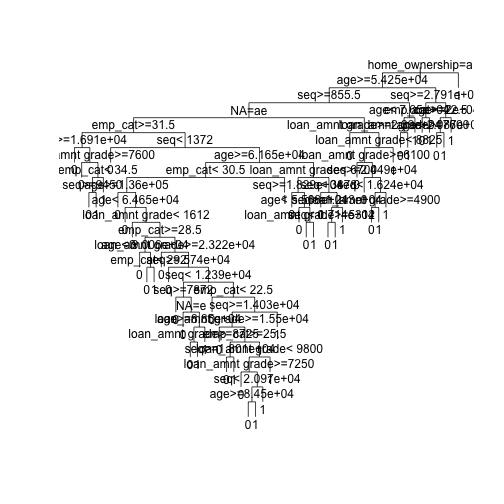
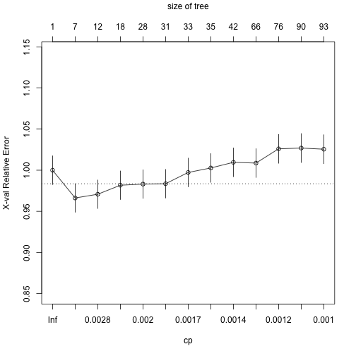
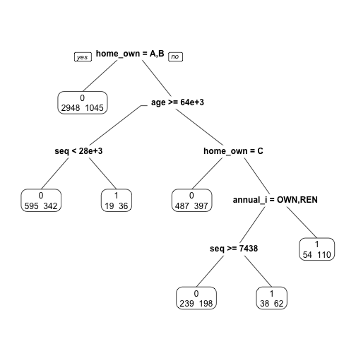

 

> ### 학습목표 {.getready}
>
> * 신용평점모형을 위해 사용되는 로지스틱 회귀모형과 의사결정나무를 이해한다.
> * 렌딩클럽 대출 데이터에 로지스틱 회귀모형을 적합시키고 계수 및 모형성능에 대해 살펴본다.

### 1. 로지스틱 회귀 [^lendingclub-nyc-data-science] [^lendingclub-yhat]

[^lendingclub-nyc-data-science]: [LendingClub Loan Data Analysis and Visualization using Lending Club Data](http://blog.nycdatascience.com/r/p2p-loan-data-analysis-using-lending-club-data/)
[^lendingclub-yhat]: [Machine Learning for Predicting Bad Loans](http://blog.yhat.com/posts/machine-learning-for-predicting-bad-loans.html)

앞선 탐색적 데이터 분석과정과 피쳐 공학 등을 통해 모형적합을 시킬 준비는 사전에 맞춰졌다고 가정한다. 
따라서, 종속변수 채무 불이행에 대한 정의가 완료되었고, 기계학습 모형론을 적합시킬 준비 즉, 훈련데이터와 테스트 데이터 구분도 마무리했다. 이제
로지스틱 회귀분석을 실행하여 모형적합결과를 해석하는 과정을 거쳐본다.

~~~{.r}
##=====================================================================
## 01. 렌딩클럽 데이터 가져오기
##=====================================================================

suppressMessages(library(readr))
suppressMessages(library(dplyr))
setwd("~")
loan.dat <- read_csv("lending-club-loan-data/loan.csv", col_names = TRUE)
~~~

~~~{.output}
Parsed with column specification:
cols(
  .default = col_character(),
  id = col_integer(),
  member_id = col_integer(),
  loan_amnt = col_double(),
  funded_amnt = col_double(),
  funded_amnt_inv = col_double(),
  int_rate = col_double(),
  installment = col_double(),
  annual_inc = col_double(),
  dti = col_double(),
  delinq_2yrs = col_double(),
  inq_last_6mths = col_double(),
  mths_since_last_delinq = col_double(),
  mths_since_last_record = col_double(),
  open_acc = col_double(),
  pub_rec = col_double(),
  revol_bal = col_double(),
  revol_util = col_double(),
  total_acc = col_double(),
  out_prncp = col_double(),
  out_prncp_inv = col_double()
  # ... with 11 more columns
)

~~~

~~~{.output}
See spec(...) for full column specifications.

~~~

~~~{.r}
##=====================================================================
## 02. 렌딩클럽 데이터 변환
##=====================================================================
library(gmodels)

# 종속변수 설정
bad_indicators <- c("Charged Off",
                    "Default",
                    "Does not meet the credit policy. Status:Charged Off",
                    "In Grace Period", 
                    "Default Receiver", 
                    "Late (16-30 days)",
                    "Late (31-120 days)")

loan.dat$loan_status_yn <- ifelse(loan.dat$loan_status %in% bad_indicators, 1, 0)

##=====================================================================
## 03. 렌딩클럽 데이터 기계학습
##=====================================================================

# 0. 훈련과 테스트 데이터셋 분리
index_train <- sample(1:nrow(loan.dat), 2/3*nrow(loan.dat))
training_set <- loan.dat[index_train, ]
test_set <- loan.dat[-index_train,]

#---------------------------------------------------------------------
# 01. 이항 로지스틱 회귀 모형
#---------------------------------------------------------------------

logit_mod <- glm(loan_status_yn ~ int_rate, family="binomial", data=training_set)
summary(logit_mod)
~~~

~~~{.output}

Call:
glm(formula = loan_status_yn ~ int_rate, family = "binomial", 
    data = training_set)

Deviance Residuals: 
    Min       1Q   Median       3Q      Max  
-1.0001  -0.4305  -0.3454  -0.2669   2.7623  

Coefficients:
             Estimate Std. Error z value Pr(>|z|)    
(Intercept) -4.548111   0.017655  -257.6   <2e-16 ***
int_rate     0.141963   0.001086   130.7   <2e-16 ***
---
Signif. codes:  0 '***' 0.001 '**' 0.01 '*' 0.05 '.' 0.1 ' ' 1

(Dispersion parameter for binomial family taken to be 1)

    Null deviance: 317760  on 591585  degrees of freedom
Residual deviance: 300522  on 591584  degrees of freedom
AIC: 300526

Number of Fisher Scoring iterations: 5

~~~

이항 로지스틱 회귀분석은 종속변수가 `0`과 `1`, 즉 정상(`0`) 혹은 채무불이행(`1`)이 되고
이를 다수의 설명변수 혹은 예측변수로 적합시키는 모형이다.

$$P(\text{loan_status_yn} = 1 | x_1 , x_2 , \cdots , x_m ) = \frac{1}{1+e^{-(\beta_0 + \beta_1 x_1 + \cdots + \beta_m x_m)}}$$

회귀분석의 결과는 확률값로 표현되고, $x_1 , x_2 , \cdots , x_m$은 설명변수, 즉 데이터가 되고, 
$\beta_0 , \beta_1 , \cdots , \beta_m$은 추정해야 되는 회귀 계수가 되고 이를 결합한
$\beta_0 + \beta_1 x_1 + \cdots + \beta_m x_m$은 선형 예측변수가 된다.

#### 1.1. 로지스틱 회귀 적합과 예측

로지스틱 회귀분석에 데이터를 넣어 적합시킬 경우 `glm` 함수를 사용하고 `family=binomial`을 인자로 넣고 종속변수와 설명변수는 R 모형식에 맞춰 집어넣는다. 그리고 결과를 `logit_mod` 모형에 저장하면 로지스틱 회귀모형에 대한 모든 
정보가 담기게 된다.

`summary(logit_mod)` 명령어로 이자율로 채무 불이행을 예측한 모형을 살펴본다.
$\beta_0$ `(Intercept)` 절편은 -4.498306, $\beta_1$ `int_rate` 이자율은 0.139891 으로 추정되고 이를 수식으로 표현하면 다음과 같다.

$$P(\text{loan_status_yn} = 1 | \text{이자율(int_rate)} ) 
= \frac{1}{1+e^{-(-4.498306+0.139891 \times 
  \text{이자율(int_rate)} )}}$$

로지스틱 모형이 완성되어 이자율에 따른 채무 불이행 확률을 계산해본다.

~~~{.r}
check.obs <- as.data.frame(training_set[1,]) # 이자율 19.99
predict(logit_mod, check.obs)
~~~

~~~{.output}
        1 
-3.426602 

~~~

~~~{.r}
predict(logit_mod, check.obs, type="response")
~~~

~~~{.output}
         1 
0.03147436 

~~~

~~~{.r}
summary(logit_mod)
~~~

~~~{.output}

Call:
glm(formula = loan_status_yn ~ int_rate, family = "binomial", 
    data = training_set)

Deviance Residuals: 
    Min       1Q   Median       3Q      Max  
-1.0001  -0.4305  -0.3454  -0.2669   2.7623  

Coefficients:
             Estimate Std. Error z value Pr(>|z|)    
(Intercept) -4.548111   0.017655  -257.6   <2e-16 ***
int_rate     0.141963   0.001086   130.7   <2e-16 ***
---
Signif. codes:  0 '***' 0.001 '**' 0.01 '*' 0.05 '.' 0.1 ' ' 1

(Dispersion parameter for binomial family taken to be 1)

    Null deviance: 317760  on 591585  degrees of freedom
Residual deviance: 300522  on 591584  degrees of freedom
AIC: 300526

Number of Fisher Scoring iterations: 5

~~~

~~~{.r}
1/(1+exp(-(-4.498306+0.139891*19.99)))
~~~

~~~{.output}
[1] 0.1542192

~~~

이자율을 설명변수로 넣어 채무불이행을 예측하는데 `predict` 함수를 사용한다.
먼저 예측에 사용될 데이터를 준비한다. `check.obs`로 `training_set`에서 첫번째 관측점을 뽑아낸다.
그리고 나서 `predict(logit_mod, check.obs)` 명령어를 실행시키면 `-1.701879` 값이 나온다. 
이는 선형 예측변수 값과 일치(소수점 아래 4자리 까지)한다.

$\beta_0 + \beta_1 \times \text{이자율(int_rate)  = -4.498306+0.139891*19.99 = -1.701885 $

원하는 확률을 계산하기 위해서는 `predict(logit_mod, check.obs, type="response")` 처럼 `type="response"`
인자를 전달하면 확률값이 계산된다.

R로 계산된 이자율 19.99에 대한 채무 불이행 확률은 `0.15422`으로 확인된다.
수식으로 확인하면 거의 동일한 결과를 얻게 된다.

$$P(\text{loan_status_yn} = 1 | \text{이자율(int_rate)} ) = 
\frac{1}{1+e^{-(-4.498306+0.139891 \times \text{이자율(int_rate)} )}} = \frac{1}{1+e^{-(-4.498306+0.139891 \times 19.99 )}} = 0.1542192$$

#### 1.2. $\beta$ 회귀계수 해석

통계모형이 다른 기계학습 모형 혹은 알고리즘과 비교해서 많이 사랑받는 이유 중의 하나가 설명이 가능하다는 점이다.
즉, $\beta$가 갖는 의미를 이해하고 이를 기반으로 설명이 가능하다.

$$P(\text{loan_status_yn} = 1 | x_1 , x_2 , \cdots , x_m ) = \frac{1}{1+e^{-(\beta_0 + \beta_1 x_1 + \cdots + \beta_m x_m)}} = \frac{e^{\beta_0 + \beta_1 x_1 + \cdots + \beta_m x_m}}{1+e^{\beta_0 + \beta_1 x_1 + \cdots + \beta_m x_m}}$$

$$P(\text{loan_status_yn} = 0 | x_1 , x_2 , \cdots , x_m ) = 1- \frac{1}{1+e^{-(\beta_0 + \beta_1 x_1 + \cdots + \beta_m x_m)}} = \frac{1}{1+e^{\beta_0 + \beta_1 x_1 + \cdots + \beta_m x_m}}$$

`loan_status_yn` 이 `0`에 대한 `1`의 비율을 오즈비(Odds Ratio)라고 정의하고, 채무불이행이 없는 것과 비교하여 채무불이행이 얼마나 높은지 혹은 낮은지를 정량화한다.

$$\frac {P(\text{loan_status_yn} = 1 | x_1 , x_2 , \cdots , x_m )} {P(\text{loan_status_yn} = 0 | x_1 , x_2 , \cdots , x_m )} = e^{\beta_0 + \beta_1 x_1 + \cdots + \beta_m x_m}$$

* 만약 $x_i$ 가 1 단위 증가하게 되면, $e^{\beta_i}$을 오즈값에 곱하게 된다.
    * $\beta_i < 0$ 작게 되면, $e^{\beta_i}<1$ 이 되어, 오즈값은 $x_i$ 가 증가하면 오즈값은 감소한다. 
    * $\beta_i > 0$ 크게 되면, $e^{\beta_i}>1$ 이 되어, 오즈값은 $x_i$ 가 증가하면 오즈값은 증가한다.
* 이자율 모형에 적용하면, 다음과 같은 결과가 도출된다.
    * 이자율이 1만큼 증가하게 되면 (1% 증가하게 되면), 회귀계수 `0.139891`을 곱해야 되고 양수이기 때문에 채무불이행은 확률은 높아진다.
    * 오즈에 $e^{0.139891}$ 을 곱하게 되면, `1.150148` 값이 도출되고, 동일한 조건에 정상인과 비교하여 약 15% 높게 채무 불이행 확률이 예측된다.

#### 1.3. 로지스틱 회귀 모형 성능평가

로지스틱 회귀모형에 대한 성능을 평가하기 위해서 채무불이행은 채무불이행으로, 정상고객은 정상고객으로 예측하는가를 갖고 성능을 평가한다. 이를 위해서 예측된 확률값(0에서 1사이)을 정상(`0`)과 채무불이행(`1`)으로 구분하는 것이 필요하다. 이를 위해서 도입되는 것이 **컷오프(cutoff)** 혹은 **임계값(threshold value)**을 설정하게 된다. 0.5를 임계값으로 설정하여 채무불이행 확률값이 이보다 작으면 채무불이행 위험 없음 `0`으로 0.5 보다 크면 `1` 채무불이행으로 각기 설정한다.

하지만, 채무불이행은 흔하지 않은 사건으로 0.5 보다 훨씬 적은 값을 설정하여 채무불이행 여부를 판단하고 이를 기준으로 **오차행렬(Confusion Matrix)** 을 생성하여 성능을 평가하는 것이 일반적이다.

~~~{.r}
logit_mod_two_var <- glm(loan_status_yn ~ revol_util + int_rate, family="binomial", data=training_set)
pred_two_var <- predict(logit_mod_two_var, newdata = test_set, type = "response")

pred_cutoff_15 <- ifelse(pred_two_var > 0.15, 1, 0)
table(test_set$loan_status_yn, pred_cutoff_15)
~~~

~~~{.output}
   pred_cutoff_15
         0      1
  0 255146  17958
  1  18430   4085

~~~

~~~{.r}
data.frame(training_set[1:10, c("loan_status_yn", "revol_util", "int_rate")], 
           pred_two_var[1:10], pred_cutoff_15[1:10])
~~~

~~~{.output}
   loan_status_yn revol_util int_rate pred_two_var.1.10.
1               0       45.6     7.90         0.07341028
2               1       58.5    21.00         0.06147135
3               0       58.5     7.89         0.04597804
4               0       49.8    18.55         0.02294905
5               0       41.6    14.72         0.04450622
6               0       43.6    10.99         0.07435555
7               0       33.3    11.99         0.10266189
8               0       32.1    19.99         0.09329706
9               1       69.3    20.99         0.04611335
10              0       56.8    10.99         0.10944559
   pred_cutoff_15.1.10.
1                     0
2                     0
3                     0
4                     0
5                     0
6                     0
7                     0
8                     0
9                     0
10                    0

~~~

`loan_status_yn` 채무불이행 종속변수와 `revol_util`, `int_rate` 설명변수가 함께 나와 있다.
두 설명변수를 통해 예측한 채무불이행 확률과 컷오프로 15%를 적용한 결과 채무불이행 모형예측 결과가 
`0`과 `1`로 나타나 있고 실제 채무불이행 데이터와 비교도 가능하다.

~~~{.r}
cutoff <- 0.15
pred_cutoff_logit <- ifelse(pred_two_var > cutoff, 1, 0)

tab_class_logit <- table(test_set$loan_status_yn, pred_cutoff_15)
sum(diag(tab_class_logit))/nrow(test_set)
~~~

~~~{.output}
[1] 0.8763933

~~~

### 2. 의사결정나무(Decision Tree)

R에서 의사결정나무 모형을 적합시키는데 `rpart`를 사용하고 분기를 하는데 기본 기준으로 지니(Gini)를 사용한다.
가장 지니 이득(Gini Gain)을 최대화하는 방식으로 나무모형을 적합시켜 나간다.

기본 개념은 다음과 같고, 지니 이득은 다음과 계산된다.

~~~ {.output}
지니 이득 = 뿌리 지니값 - 좌측 잎 비율 * 좌측 지니값 -  우측 잎 비율 * 우측 지니값   
          = 0.292632 – 446/500 * 0.1814334 – 54/500 * 0.3017833   
          = 0.09820084   
~~~

~~~{.r}
##=====================================================================
## 01. 렌딩클럽 데이터 가져오기
##=====================================================================
# http://rstudio-pubs-static.s3.amazonaws.com/3588_81e2ebd4de1b41bc9ac2f29f5f7dab2e.html
suppressMessages(library(readr))
suppressMessages(library(dplyr))

loan.dat <- read_fwf("data/lendingclub_loan_sample.txt", fwf_widths(c(6,11,10,6,15,11,4,8,8)), skip=1)
~~~

~~~{.output}
Parsed with column specification:
cols(
  X1 = col_integer(),
  X2 = col_integer(),
  X3 = col_integer(),
  X4 = col_character(),
  X5 = col_character(),
  X6 = col_double(),
  X7 = col_integer(),
  X8 = col_character(),
  X9 = col_character()
)

~~~

~~~{.r}
names(loan.dat) <- c("seq","loan_status", "loan_amnt grade", "home_ownership", "annual_inc", "age", "emp_cat", "ir_cat")

##=====================================================================
## 02. 의사결정나무
##=====================================================================
suppressMessages(library(rpart))

# 02-01. cp값 0.001 설정
loan_dt <- rpart(loan_status ~ ., method = "class", data =  loan.dat, 
                 control = rpart.control(cp = 0.001))

plot(loan_dt, uniform = TRUE)
text(loan_dt)
~~~

~~~{.r}
# 02-02.사전 확률 설정
loan_prior_dt <- rpart(loan_status ~ ., method = "class", data =  loan.dat, 
                       control = rpart.control(cp = 0.001),
                       parms = list(prior=c(0.7, 0.3)))

plot(loan_prior_dt, uniform = TRUE)
text(loan_prior_dt)
~~~

~~~{.r}
# 02-03.손실함수 설정
loan_loss_dt <- rpart(loan_status ~ ., method = "class", data =  loan.dat, 
                      control = rpart.control(cp = 0.001),
                      parms = list(loss = matrix(c(0, 10, 1, 0), ncol=2)))

plot(loan_loss_dt, uniform = TRUE)
text(loan_loss_dt)
~~~

~~~{.r}
# 02-04. CP, 사전확률, 손실함수 모두 설정
loan_prior_loss_dt <- rpart(loan_status ~ ., method = "class", data =  loan.dat, 
                            control = rpart.control(cp = 0.001),
                            parms = list(prior=c(0.7, 0.3),
                                         loss = matrix(c(0, 10, 1, 0), ncol=2)))

plot(loan_prior_loss_dt, uniform = TRUE)
text(loan_prior_loss_dt)
~~~

`rpart` 모형을 적합시킬 때, CP, 사전확률, 손실함수 등 다양한 모수를 사전에 설정해야 한다.
특히, 채무불이행, 사기탐지 등 정상사례와 비교하여 예측하고자 하는 사례가 극도로 균형이 맞지 않는 경우에는
이런 세세한 부분에 신경을 많이 써서 모형을 적합시켜야 된다.

~~~{.r}
#---------------------------------------------------------------------
# 02-1. 의사결정나무: 가지치기(Prune)
#---------------------------------------------------------------------

# 01. 가지치기 사례
plotcp(loan_dt)
~~~

~~~{.r}
printcp(loan_dt)
~~~

~~~{.output}

Classification tree:
rpart(formula = loan_status ~ ., data = loan.dat, method = "class", 
    control = rpart.control(cp = 0.001))

Variables actually used in tree construction:
[1] age             annual_inc      emp_cat         home_ownership 
[5] ir_cat          loan_amnt grade NA              seq            

Root node error: 2190/6570 = 0.33333

n= 6570 

          CP nsplit rel error  xerror     xstd
1  0.0059361      0   1.00000 1.00000 0.017447
2  0.0035388      6   0.95571 0.96621 0.017294
3  0.0022831     11   0.93653 0.97078 0.017316
4  0.0020548     17   0.92283 0.98174 0.017366
5  0.0019787     27   0.90183 0.98311 0.017372
6  0.0018265     30   0.89589 0.98356 0.017374
7  0.0015982     32   0.89224 0.99726 0.017435
8  0.0015221     34   0.88904 1.00274 0.017459
9  0.0013699     41   0.87717 1.00959 0.017489
10 0.0012177     65   0.84064 1.00868 0.017485
11 0.0011416     75   0.82603 1.02603 0.017558
12 0.0010654     89   0.80365 1.02694 0.017561
13 0.0010000     92   0.80046 1.02557 0.017556

~~~

~~~{.r}
index <- which.min(loan_dt$cptable[ , "xerror"])
tree_min <- loan_dt$cptable[index, "CP"]

ptree_prior <- prune(loan_dt, cp = tree_min)

library(rpart.plot)
prp(ptree_prior, extra=1)
~~~

~~~{.r}
# 02. 손실함수 가지치기 사례

suppressMessages(library(rattle))
suppressMessages(library(rpart.plot))
suppressMessages(library(RColorBrewer))

loan_loss_dt <- rpart(loan_status ~ ., method = "class", data =  loan.dat, 
                      control = rpart.control(cp = 0.001),
                      parms = list(prior=c(0.90, 0.10),
                                   loss = matrix(c(0, 10, 1, 0), ncol=2)))

printcp(loan_loss_dt) # 0.0020928
~~~

~~~{.output}

Classification tree:
rpart(formula = loan_status ~ ., data = loan.dat, method = "class", 
    parms = list(prior = c(0.9, 0.1), loss = matrix(c(0, 10, 
        1, 0), ncol = 2)), control = rpart.control(cp = 0.001))

Variables actually used in tree construction:
[1] age             annual_inc      emp_cat         home_ownership 
[5] ir_cat          loan_amnt grade NA              seq            

Root node error: 5913/6570 = 0.9

n= 6570 

          CP nsplit rel error  xerror     xstd
1  0.1428716      0   1.00000 10.0000 0.087237
2  0.0351598      1   0.85713  3.6637 0.078810
3  0.0076357      2   0.82197  5.0784 0.087155
4  0.0056317      4   0.80670  5.0013 0.086817
5  0.0040081      7   0.78980  5.0613 0.087097
6  0.0031963      9   0.78179  4.9591 0.086644
7  0.0025114     10   0.77859  5.0884 0.087215
8  0.0022324     15   0.76390  5.1135 0.087321
9  0.0021436     16   0.76167  5.2063 0.087708
10 0.0018180     18   0.75738  5.2157 0.087742
11 0.0016235     21   0.75193  5.1752 0.087572
12 0.0016235     22   0.75030  5.1619 0.087514
13 0.0014764     23   0.74868  5.0374 0.086979
14 0.0014460     32   0.73387  5.0733 0.087140
15 0.0014375     35   0.72953  5.0355 0.086966
16 0.0014278     38   0.72522  5.0355 0.086966
17 0.0014079     46   0.71314  5.0378 0.086975
18 0.0013572     48   0.71032  5.0064 0.086832
19 0.0013191     51   0.70594  4.9841 0.086727
20 0.0012938     54   0.70198  4.9796 0.086707
21 0.0012684     55   0.70068  4.9637 0.086635
22 0.0012684     56   0.69942  4.9637 0.086634
23 0.0012430     58   0.69688  4.9637 0.086634
24 0.0012303     63   0.69036  4.9798 0.086705
25 0.0012303     65   0.68790  4.9798 0.086705
26 0.0011923     67   0.68544  4.9685 0.086653
27 0.0011796     68   0.68425  4.9461 0.086548
28 0.0011796     70   0.68189  4.9053 0.086358
29 0.0011162     78   0.66908  4.9370 0.086506
30 0.0010401     79   0.66796  4.9418 0.086525
31 0.0010232     80   0.66692  4.9878 0.086725
32 0.0010147     83   0.66385  4.9561 0.086581
33 0.0010000     86   0.66060  4.9361 0.086484

~~~

~~~{.r}
ptree_loss_dt <- prune(loan_loss_dt, cp = 0.0020928)

fancyRpartPlot(ptree_loss_dt)
~~~

~~~{.r}
# 03. 자주 사용되는 추가 선택옵션

case_weights <- ifelse(loan.dat$loan_status==1, 3, 1)

loan_loss_wgt_dt <- rpart(loan_status ~ ., method = "class", data =  loan.dat, 
                          control = rpart.control(minsplit = 5, minbucket = 2, cp = 0.0001), 
                          weights=case_weights,
                          parms = list(prior=c(0.90, 0.10),
                                       loss = matrix(c(0, 10, 1, 0), ncol=2)))

plotcp(loan_loss_wgt_dt)
~~~

~~~{.r}
printcp(loan_loss_wgt_dt) # 0.00400812
~~~

~~~{.output}

Classification tree:
rpart(formula = loan_status ~ ., data = loan.dat, weights = case_weights, 
    method = "class", parms = list(prior = c(0.9, 0.1), loss = matrix(c(0, 
        10, 1, 0), ncol = 2)), control = rpart.control(minsplit = 5, 
        minbucket = 2, cp = 1e-04))

Variables actually used in tree construction:
[1] age             annual_inc      emp_cat         home_ownership 
[5] ir_cat          loan_amnt grade NA              seq            

Root node error: 9855/6570 = 1.5

n= 6570 

            CP nsplit rel error  xerror     xstd
1   0.14287164      0   1.00000 10.0000 0.117041
2   0.03515982      1   0.85713  4.0271 0.087208
3   0.00763572      2   0.82197  5.5052 0.098653
4   0.00563166      4   0.80670  5.0429 0.095470
5   0.00400812      7   0.78980  5.1868 0.096507
6   0.00319635      9   0.78179  5.2773 0.097137
7   0.00251142     10   0.77859  5.3041 0.097326
8   0.00223237     15   0.76390  5.2865 0.097199
9   0.00214358     16   0.76167  5.2411 0.096887
10  0.00181803     18   0.75738  5.2303 0.096805
11  0.00162354     21   0.75193  5.2053 0.096632
12  0.00147641     23   0.74868  5.2230 0.096760
13  0.00144597     30   0.73754  5.1805 0.096457
14  0.00143751     36   0.72887  5.2122 0.096679
15  0.00140791     39   0.72456  5.1941 0.096552
16  0.00131913     41   0.72174  5.2100 0.096663
17  0.00129376     45   0.71646  5.1790 0.096437
18  0.00126839     46   0.71517  5.1430 0.096181
19  0.00123034     48   0.71263  5.0641 0.095613
20  0.00119229     50   0.71017  5.0234 0.095318
21  0.00117960     51   0.70898  5.0438 0.095465
22  0.00114155     62   0.69252  4.9761 0.094970
23  0.00112253     63   0.69137  4.9806 0.095003
24  0.00111618     68   0.68425  4.9965 0.095119
25  0.00109716     69   0.68313  4.9896 0.095070
26  0.00109082     77   0.67387  4.9760 0.094971
27  0.00102317     78   0.67278  4.8977 0.094380
28  0.00101471     95   0.65112  4.8231 0.093818
29  0.00101471     96   0.65010  4.8140 0.093750
30  0.00097666    101   0.64498  4.7890 0.093560
31  0.00095129    103   0.64302  4.8006 0.093645
32  0.00091324    111   0.63498  4.7917 0.093575
33  0.00089633    120   0.62633  4.7275 0.093065
34  0.00088787    126   0.62073  4.6777 0.092678
35  0.00085743    138   0.60723  4.7118 0.092941
36  0.00083714    145   0.60041  4.6899 0.092762
37  0.00083714    146   0.59957  4.6945 0.092797
38  0.00079909    147   0.59873  4.7062 0.092883
39  0.00076104    149   0.59713  4.7067 0.092881
40  0.00074835    151   0.59561  4.6600 0.092506
41  0.00074412    167   0.58105  4.6782 0.092647
42  0.00072298    170   0.57882  4.6988 0.092805
43  0.00071030    172   0.57737  4.7189 0.092965
44  0.00069762    190   0.56164  4.6811 0.092662
45  0.00069339    192   0.56025  4.6880 0.092715
46  0.00068493    197   0.55614  4.6971 0.092785
47  0.00067859    214   0.54427  4.7083 0.092874
48  0.00067225    234   0.52775  4.7015 0.092821
49  0.00067225    236   0.52641  4.7038 0.092839
50  0.00065956    240   0.52372  4.7082 0.092874
51  0.00063420    242   0.52240  4.6523 0.092429
52  0.00063420    249   0.51773  4.6190 0.092158
53  0.00061728    252   0.51583  4.5390 0.091501
54  0.00060883    257   0.51268  4.5639 0.091701
55  0.00060037    260   0.51086  4.5031 0.091207
56  0.00059192    264   0.50822  4.4829 0.091040
57  0.00058346    270   0.50467  4.4536 0.090799
58  0.00057078    273   0.50282  4.4742 0.090965
59  0.00055809    277   0.50053  4.4514 0.090780
60  0.00055809    279   0.49942  4.5421 0.091515
61  0.00055809    286   0.49551  4.5421 0.091515
62  0.00054541    290   0.49328  4.5376 0.091479
63  0.00053780    299   0.48772  4.5423 0.091515
64  0.00053272    334   0.46012  4.5423 0.091515
65  0.00053272    336   0.45906  4.5424 0.091514
66  0.00053272    338   0.45799  4.5424 0.091514
67  0.00052427    374   0.43343  4.5424 0.091514
68  0.00051581    377   0.43186  4.5446 0.091533
69  0.00050736    383   0.42877  4.5311 0.091423
70  0.00050736    389   0.42519  4.4702 0.090926
71  0.00050736    393   0.42311  4.4702 0.090926
72  0.00050736    397   0.42108  4.4408 0.090684
73  0.00050228    404   0.41748  4.3013 0.089509
74  0.00050101    409   0.41497  4.2923 0.089432
75  0.00049890    415   0.41182  4.2946 0.089451
76  0.00045662    419   0.40931  4.2660 0.089197
77  0.00044647    510   0.36314  4.2549 0.089099
78  0.00043125    517   0.35982  4.1922 0.088550
79  0.00043125    521   0.35751  4.2667 0.089194
80  0.00042280    531   0.35292  4.2444 0.088999
81  0.00041857    534   0.35165  4.1588 0.088252
82  0.00041857    537   0.35036  4.1588 0.088252
83  0.00040589    540   0.34883  4.1544 0.088212
84  0.00040589    544   0.34693  4.1544 0.088212
85  0.00040589    549   0.34490  4.1544 0.088212
86  0.00039320    555   0.34247  4.1319 0.088013
87  0.00039320    557   0.34168  4.1432 0.088112
88  0.00039320    577   0.33382  4.1432 0.088112
89  0.00038686    583   0.33146  4.1364 0.088053
90  0.00038334    587   0.32991  4.1364 0.088053
91  0.00038052    629   0.30436  4.0914 0.087652
92  0.00037206    632   0.30322  3.9389 0.086257
93  0.00036361    635   0.30211  3.9638 0.086485
94  0.00035877    641   0.29992  3.9731 0.086566
95  0.00035515    655   0.29381  3.9731 0.086566
96  0.00034247    663   0.29039  3.9216 0.086087
97  0.00033824    739   0.26332  3.9172 0.086045
98  0.00032344    742   0.26230  3.9060 0.085940
99  0.00031963    748   0.26022  3.8995 0.085876
100 0.00031710    753   0.25863  3.8881 0.085771
101 0.00031710    757   0.25736  3.8745 0.085645
102 0.00030441    761   0.25609  3.9198 0.086065
103 0.00030441    772   0.25238  4.1775 0.088378
104 0.00029173    787   0.24736  4.1618 0.088239
105 0.00028750    794   0.24485  4.1777 0.088377
106 0.00027905    800   0.24313  4.1914 0.088495
107 0.00027905    897   0.21606  4.1870 0.088455
108 0.00027397    901   0.21476  4.1870 0.088455
109 0.00026213    913   0.20928  4.1914 0.088495
110 0.00026213    926   0.20586  4.1914 0.088495
111 0.00026002    934   0.20373  4.1914 0.088495
112 0.00022831    938   0.20269  3.9816 0.086621
113 0.00021140   1053   0.16507  3.9206 0.086061
114 0.00020294   1057   0.16416  3.9343 0.086186
115 0.00020294   1071   0.15959  3.9456 0.086290
116 0.00018603   1074   0.15890  3.8874 0.085744
117 0.00017757   1077   0.15835  3.8941 0.085808
118 0.00017757   1081   0.15764  3.8941 0.085808
119 0.00017123   1093   0.15550  3.8872 0.085745
120 0.00016489   1097   0.15482  3.8668 0.085555
121 0.00015221   1099   0.15449  3.8691 0.085576
122 0.00013952   1105   0.15358  3.9283 0.086120
123 0.00013530   1121   0.15134  3.9283 0.086120
124 0.00011416   1125   0.15066  3.9238 0.086078
125 0.00010993   1129   0.15020  3.9284 0.086120
126 0.00010000   1135   0.14954  3.9284 0.086120

~~~

~~~{.r}
ptree_weights <- prune(loan_loss_wgt_dt, cp=0.00400812)

prp(ptree_weights, extra = 1)
~~~

### 3. 비용함수(행렬)/수익함수(행렬)

저신용자에게 신용카드를 발급할 경우는 그 반대의 경우에 비해 5배 비용이 많이 소요된다. 이를 비용함수 혹은 비용행렬이라고 부른다.
아래 **비용함수(Cost Function)** 를 마케팅 캠페인등에 사용하면 **수익함수(Profit Function)** 라고 부르기도 한다. 1종, 2종 오류를 범할 경우 수익/비용에서 차이가 나기 때문이다. 

|    |  1  |  2  |
|----|-----|-----|
| 1  |  0  |  1  |
| 2  |  5  |  0  |

기계학습을 활용한 은행이나 카드사는 수익성을 전제로하여 기계학습 알고리듬을 도입한다. 예를 들어, 
향후 5년간 신용카드발급에서 이자수익이 40% 예상되고, 신용불량으로 인해 대손이 발생된다면 다음과 같이 수익행렬을 작성할 수 있다.

|                 | 정상(예측) | 신용불량(예측) |
|-----------------|:----------:|:--------------:|
| 정상(실제)      |    0.4     |      0         |
| 신용불량(실제)  |     -1     |      0         |

#### 3.1. 독일신용 데이터를 통한 사례분석 [^profit-analysis-sas]

독일신용 데이터에는 1,000명의 고객이 있다. 700명이 정상이고, 300명이 신용불량자로 등록되어 있다. 이럴 경우 신용불량으로 인한 대손이 발생하지 않을 경우 35% 수익이 예상되고, 신용불량으로 확정될 경우 100% 손실이 불가피하다. 신용불량이 전혀 없다고 가정하고 대출을 진행할 경우 모의시험을 수행하면 다음과 같다.

|                 | 정상(예측) | 신용불량(예측) |
|-----------------|:----------:|:--------------:|
| 정상(실제)      |   0.35     |     0          |
| 신용불량(실제)  |    -1      |     0          |

1,000명에게 모두 1원씩 한단위 제공한다면, $\frac{700 \times 0.35 - 300 \times 1}{1000} = \frac{-55}{1000} = -0.055$ 만큼 손실이 불가피하다.

좀더 현실적으로 고객당 천만원을 신용카드를 통해 대출을 준다면, $-0.055 \times 10,000,000 * 1000 = -5.5$ 억원 손실이 난다.

#### 3.2. 신용평가 알고리듬을 구축한 경우

|                 | 정상(예측) | 신용불량(예측) |
|-----------------|:----------:|:--------------:|
| 정상(실제)      |   608      |    46          |
| 신용불량(실제)  |    192     |   154          |

신용평가 알고리듬을 개발하여 다음과 같이 구축했다고 가정하면, 다음과 같은 결과가 예상된다.
신용불량이라고 예측한 경우 신용카드발급을 통한 대출을 주지 않아 정상적인 고객이 신용카드를 활용하지 못해 손실(+35% 이자수익)이 발생하고, 정상이라고 예측했지만, 신용카드를 발급해서 생기는 손실(-100%)도 있다. 하지만, 정상이라고 예측해서 정상으로 사용되는 경우 생기는 수익이 608명으로부터 나오고, 신용불량으로 예측해서 실제 신용불량을 맞춤으로써 생기는 이익도 함께 존재한다.

이를 정리하여 합치게 되면 다음과 같은 수익이 예상된다.

$$ 608 \times 10,000,000 \times 0.35 - 192 \times 10,000 = 2.08억$$

신용평가 모형을 갖는 것과 갖지않는 전체적인 효과는 $2.08억 - (-5.5억) = 7.58억$ 으로 추산할 수 있다.

[^profit-analysis-sas]: [Profit Analysis of the German Credit Data Using SAS® Enterprise MinerTM 5.3](http://www.sas.com/technologies/analytics/datamining/miner/trial/german-credit-data.pdf)

~~~{.r}
##================================================================
## 04. 비용함수/행렬
##================================================================
matrix_dimensions <- list(c("good", "bad"), c("good", "bad"))
names(matrix_dimensions) <- c("acutual", "predicted")

error_cost <- matrix(c(0.35, -1, 0, 0), nrow = 2,
                     dimnames = matrix_dimensions)
#       predicted
#acutual  good bad
#   good  0.35   0
#   bad  -1.00   0

##================================================================
## 05. 모형 개발
##================================================================
library(c50)
c50.cost.m <- C5.0(train[,-1], train$Creditability, costs = error_cost)

##================================================================
## 05. 모형 성능평가
##================================================================
credit_cost_pred <- predict(c50.cost.m, test)
CrossTable(test$Creditability, credit_cost_pred,
             prop.chisq = FALSE, prop.c = FALSE, prop.r = FALSE,
             dnn = c('actual default', 'predicted default'))
~~~

