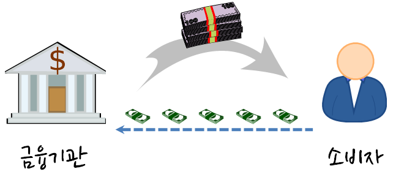

 
``` {r, include=FALSE}
source("tools/chunk-options.R")
```

> ### 신용평가모형 목표 {.getready}
>
> * **수익을 극대화** 하고, **신용위험을 최소화** 하는 신용평점모형을 개발한다.
> * 로지스틱 회귀모형과 의사결정나무 모형에 대해 살펴본다.
> * 랜딩클럽 데이터를 분석하여 실제 데이터를 가지고 신용평점모형을 개발한다.

### 1. 신용평점모형 [^ml-credit-scoring-sharma]

[^ml-credit-scoring-sharma]: [Guide to Credit Scoring in R](https://cran.r-project.org/doc/contrib/Sharma-CreditScoring.pdf)

대한민국에서 이영애 누님께서 IMF를 극복하고 2000년대 초반에 신용카드로 행복한 삶을 사는 모습을 러닝머신을 타면서 
보여주면서 신용카드의 전성기가 도래했지만, 
소수의 사람을 빼고 신용카드가 결국 미래 소비를 현재로 앞당겨서 돈을 쓰는 것에 불과하다는 것은 
그로부터 몇년 뒤에 명확해졌고, 이를 신용대란이라고 불렀다. 
이후 기업금융과 마찬가지로 소매금융도 위험관리가 중요해졌으며, 
소매금융에 있어 위험관리 기법으로 신용평점에 따라 엄격하게 관리하는 것이 필요해졌고, 
이에 [신용평점모형(Credit Scoring Model)](https://ko.wikipedia.org/wiki/신용_위험)과 더불어 이를 자동화한 금융시스템이 각광을 받기 시작했다. 

파이썬은 과학컴퓨팅에 많은 경험과 라이브러리가 구축되어 있는 반면, 
R은 상대적으로 통계학기반이라 통계학이 많이 사용되는 금융위험관리 분야에 구축된 
블로그, 논문, 기고문, 라이브러리가 많다. 
현실과 밀접한 신용할당문제를 기계학습에서 대규모 적용할 경우 풀어가는 방식을 R로 살펴보고, 
추후 파이썬으로 확장도 고려해 본다. [^credit-scoring-101] [^credit-scoring-woe] [^credit-scoring-binning]

[^credit-scoring-101]: [Credit Scoring in R 101](http://www.r-bloggers.com/credit-scoring-in-r-101/)
[^credit-scoring-woe]: [R Credit Scoring – WoE & Information Value in woe Package](http://www.r-bloggers.com/r-credit-scoring-woe-information-value-in-woe-package/)
[^credit-scoring-binning]: [R Package 'smbinning': Optimal Binning for Scoring Modeling](http://www.r-bloggers.com/r-package-smbinning-optimal-binning-for-scoring-modeling/)

#### 1.1. 신용평점 개요

기본적으로 금융기관에서는 한국은행을 비롯한 다양한 곳에서 자금을 조달하여 이를 관리하고 있다가 자금을 필요로 하는 곳에 
자금을 빌려주고 이에 상응하는 이자를 받아 수익을 얻는 것으로 볼 수 있다. 근본적으로 많은 금액을 빌려주고 
이를 나누어서 자금을 사용한 곳에서 갚아 나가는 구조다.



물론 다수의 고객에게 자금을 빌려주다보니 제때 돈을 갚지 못하거나, 불의의 사고, 실직 등 다양한 이유로 인해서 돈을 갖지 못하는 
위험이 발생된다.
이때 기대손실(Expected Loss)을 다음 구성요소를 가지고 정량화한다.

* 채무 불이행 위험 : Probability of default
* 채무 불이행 노출 : Exposure at default
* 채무 불이행에 대한 손실 : Loss given default

$\text{기대손실} = \text{채무 불이행 위험} \times \text{채무 불이행 노출} \times \text{채무 불이행에 대한 손실}$

따라서 금융기관에서 자금을 빌려주기 전에 다양한 정보를 활용하여 채무 불이행 위험이 적은 고객을 선별하여 가능한 많은 
금액을 빌려주어 매출과 수익을 극대화한다.

* Application 정보: 나이, 결혼여부, 소득, 자가/전세 등
* Behaviour 정보: 현재 은행잔고, 연체금액 등

### 2. 랜딩클럽 데이터 [^kaggle-lendingclub]

[^kaggle-lendingclub]: [Eryk Walczak, Initial loan book analysis](https://www.kaggle.com/erykwalczak/d/wendykan/lending-club-loan-data/initial-loan-book-analysis/)

[LendingClub](https://www.lendingclub.com/info/download-data.action) 사이트에서 데이터를 다운로드해도 되고,
[캐글 대출 데이터(Kaggle Loan Data)](https://www.kaggle.com/wendykan/lending-club-loan-data)를 통해서 데이터를 구해도 좋다.

2007-2015까지 [LendingClub](https://www.lendingclub.com/) 대출자료가 파일에 담겨있다. 다운로드 받아 
압축을 풀면, 다음 파일 세개가 담겨있다.

* database.sqlite (134.64 MB) : sqlite 데이터베이스 파일 형식 대출 데이터 전체
* LCDataDictionary.xlsx (20.5 KB) : 데이터 사전 (변수 설명)
* loan.csv (105.01 MB) : csv 파일 형식 대출 데이터 전체

``` {r lendingclub-import, tidy=FALSE, warning=FALSE}

##=====================================================================
## 01. 렌딩클럽 데이터 가져오기
##=====================================================================

suppressMessages(library(readr))
suppressMessages(library(dplyr))
setwd("~")
loan.dat <- read_csv("lending-club-loan-data/loan.csv", col_names = TRUE)
dim(loan.dat)
names(loan.dat)

#glimpse(loan.dat)
#summary(loan.dat)
``` 

``` {r lendingclub-recon, tidy=FALSE, warning=FALSE}

##=====================================================================
## 02. 렌딩클럽 데이터와 문서 대조작업
##=====================================================================

suppressMessages(library(readxl))
setwd("~")
dataDictionary <- read_excel("lending-club-loan-data/LCDataDictionary.xlsx")

dd.names <- as.character(na.omit(dataDictionary$LoanStatNew))
loandata.names <- names(loan.dat)

setdiff(dd.names, loandata.names)
```

렌딩클럽 데이터(csv 혹은 sqlite)와 데이터 사전에 문서화된 것 사이에 차이가 남을 알 수 있다.
즉, "fico_range_high", "fico_range_low", "is_inc_v", "last_fico_range_high", "last_fico_range_low", "verified_status_joint", "total_rev_hi_lim"
변수는 데이터 사전에 등재되어 있지만, 실제 렌딩클럽 데이터에는 없다.
사실 이런 경우는 흔하게 발생되고 있는 문제로 나중에 심각한 문제가 될 수 있다. 즉, 이런 유산 비용이 쌓이게 되면
정말 되돌이킬 수 없는 시스템이 되어 재앙이 될 수 있다. 
   

#### 2.1. 탐색적 데이터 분석

[캐글]() 데이터를 분석하게 되면, 많은 캐글러들이 [DescTools](https://cran.r-project.org/web/packages/DescTools/index.html) 팩키지를 사용해서 
탐색적 데이터 분석을 진행한다. 범주형 데이터와 연속형 데이터, 변수간의 관계에 따라 [DescTools](https://cran.r-project.org/web/packages/DescTools/index.html)
팩키지가 많은 부분 자동으로 처리하여 적절한 정보를 제공한다는 점에서 사용할 가치가 충분히 있다.

``` {r lendingclub-eda-continuous, tidy=FALSE, warning=FALSE}
##=====================================================================
## 03. 렌딩클럽 데이터 탐색적 데이터 분석
##=====================================================================
# 02.01. 대출금액 분포
suppressMessages(library(DescTools))
Desc(loan.dat$loan_amnt, main = "대출금액 분포", plotit = TRUE)

# 02.02. 대출금액 증가 현황
suppressMessages(library(ggplot2))
suppressMessages(library(lubridate))

loan.dat$issue_d <- parse_date_time(gsub("^", "01-", loan.dat$issue_d), orders = c("d-m-y", "d-B-Y", "m/d/y"))

amnt_df <- loan.dat %>% 
  select(issue_d, loan_amnt) %>% 
  group_by(issue_d) %>% 
  summarise(Amount = sum(loan_amnt))

ts_amnt <- ggplot(amnt_df, aes(x = issue_d, y = Amount))
ts_amnt + geom_line() + xlab("대출금 발생일") + ylab("대출금")
```

``` {r lendingclub-eda-loan-status, tidy=FALSE, warning=FALSE}
# 03.03. 대출 상태

Desc(loan.dat$loan_status, plotit = T)

# 03.04. 대출 상태별 대출금

box_status <- ggplot(loan.dat, aes(loan_status, loan_amnt))
box_status + geom_boxplot(aes(fill = loan_status)) +
  theme(axis.text.x = element_blank()) +
  labs(list(
    title = "대출 상태별 대출금",
    x = "대출상태",
    y = "대출금"))  

# 03.05. 대출 등급별 대출금 추이

amnt_df_grade <- loan.dat %>% 
  select(issue_d, loan_amnt, grade) %>% 
  group_by(issue_d, grade) %>% 
  summarise(Amount = sum(loan_amnt))

ts_amnt_grade <- ggplot(amnt_df_grade, 
                        aes(x = issue_d, y = Amount))
ts_amnt_grade + geom_area(aes(fill=grade)) + xlab("대출일")  
```

#### 2.2. 지리정보 분석

상대적으로 미국이 데이터 과학에 선진국이 된 이유는 여러가지가 있을 수 있지만, 
인프라가 참 잘 갖춰져있다는 점이다. 우편번호 `zipcode` 팩키지가 있어 R에서 대한민국은 아니지만,
미국에서는 편리하게 우편번호를 지리정보와 붙여 데이터를 분석하는데 장점을 갖고 있다.

주별 대출금과 대출횟수를 정량화하는데 `state_choropleth` 함수를 사용해야 한다.
지리정보가 잘 매칭이 되려면 `choroplethr` 팩키지에 `region` 즉, 주명칭을 일치시켜야 한다.
이를 위해 2자리 주명칭 축약어를 `choroplethr` 팩키지에 `region`에 매칭하는데 있어,
`state.regions` 데이터셋의 정보를 활용한다. 

``` {r lendingclub-geo, tidy=FALSE, warning=FALSE}
# install.packages("RCurl")
# install.packages("choroplethrMaps")
# install.packages("choroplethr")
# install.packages("acepack")
# install.packages("latticeExtra")
# install.packages("gridExtra")
suppressMessages(library(choroplethr))
suppressMessages(library(zipcode))
data(zipcode.civicspace)
zipcode.civicspace$zip_code <- substr(zipcode.civicspace$zip,1,3)
zipcode.dic <- zipcode.civicspace  %>%  group_by(zip_code)  %>% 
  dplyr::select(zip_code, region=state) %>% unique 

loan.dat$zip_code <- substr(loan.dat$zip_code,1,3)
loan.dat <- left_join(loan.dat, zipcode.dic, by="zip_code")

# region 각주 명칭정보와 축약 두자리 정보 데이터 가져오기
suppressMessages(library(choroplethrMaps))
data(state.regions)

## 주별 대출 금액
state_by_value <- loan.dat %>% group_by(region) %>% 
  dplyr::summarise(value = sum(loan_amnt, na.rm=TRUE)) %>% dplyr::select(abb=region, value) %>% ungroup

state_region_by_value <- left_join(state.regions, state_by_value, by="abb") %>% 
  dplyr::select(region, value)

state_choropleth(state_region_by_value, title = "주별 대출금액")

## 주별 대출 횟수
state_by_volume <-
  loan.dat %>% group_by(region) %>% dplyr::summarise(value = n()) %>%  dplyr::select(abb=region, value) %>% ungroup

state_region_by_volume <- left_join(state.regions, state_by_volume, by="abb") %>% 
  dplyr::select(region, value)

state_choropleth(state_region_by_volume, title = "주별 대출건수")
```


#### 2.3. 대출 목적과 단어 구름

대출목적을 단어구름(Word Cloud)을 사용해서 시각화를 하는 것도 한 방법일 수 있다.
이를 위해 `wordcloud` 팩키지를 불러오고, 대출목적을 텍스트로 갖춘 변수를 입력변수로 넣어 코퍼스 분석을 통해 `wordcloud` 함수에 넣어 시각화한다.

``` {r lendingclub-purpose-wordcloud, tidy=FALSE, warning=FALSE}

##=====================================================================
## 05. 렌딩클럽 대출 목적와 단어구름
##=====================================================================

# 대출 목적
Desc(loan.dat$purpose, main = "대출 목적", plotit = TRUE)

# 단어 구름
suppressMessages(library(tm))
suppressMessages(library(RColorBrewer))
suppressMessages(library(wordcloud))

loan_descriptions.corpus <- Corpus(DataframeSource(data.frame(head(loan.dat[,"title"], n=10000))))
loan_descriptions.corpus <- tm_map(loan_descriptions.corpus, removePunctuation)
loan_descriptions.corpus <- tm_map(loan_descriptions.corpus, content_transformer(tolower))

wordcloud(loan_descriptions.corpus,
          max.words = 100,
          random.order=FALSE, 
          rot.per=0.30, 
          use.r.layout=FALSE, 
          colors=brewer.pal(8, "Paired"))
```          

#### 2.4. 대출 등급과 이자율

단변량 탐색적 데이터 분석이 어느 정도 마무리 되었다면, 이자율과 신용등급, 채무불이행과 이자율 등등 
두변량 혹은 다변량 분석을 탐색적으로 진행하는 것도 준비한다.

``` {r}
##=====================================================================
## 06. 대출 등급과 이자율
##=====================================================================

Desc(loan.dat$grade, main = "대출 등급", plotit = TRUE)

Desc(int_rate ~ grade, loan.dat, digits = 1, main = "Interest rate by grade", plotit = TRUE)
```


