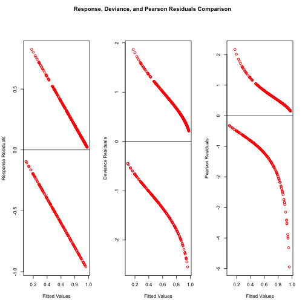
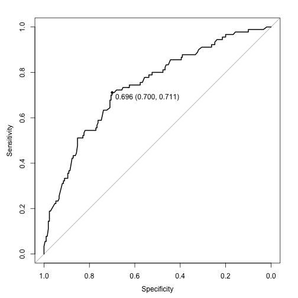
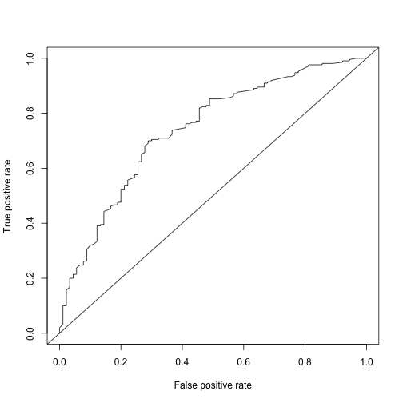

 
> ## 학습목표 {.objectives}
>
> * 독일신용 데이터를 기준으로 통계예측모형을 개발한다.
> * 신용카드발급의 기준이 될 수 있는 컷오프를 산출한다.

### 1. 환경설정 및 데이터 가져오기

[R Statistical Application Development by Example](https://www.packtpub.com/big-data-and-business-intelligence/r-statistical-application-development-example-beginners-guide) 책에 부록으로 딸려있는 팩키지 "RSADBE"에 독일신용데이터가 들어 있다. 이를 바로 활용한다. 활용되는 팩키지의 각 기능은 다음과 같다.

* `pscl` &rarr; 이항회귀모형에 사용되는 $R^2$ 결정계수
* `ROCR`, `pROC` &rarr; ROC 곡선 및 AUC 면적
* `dplyr` &rarr; 데이터 작업
* `caret` &rarr; 예측모형 기본 팩키지

~~~{.r}
##==============================================================================
## 00. 환경설정
##==============================================================================
# R Statistical Application Development by Example
suppressMessages(library(RSADBE)) # 독일신용데이터 포함됨
suppressMessages(library(pscl)) # 이항회귀분석 R^2
suppressMessages(library(ROCR)) # 모형성능평가
suppressMessages(library(pROC))  # 모형성능평가
suppressMessages(library(caret)) # 기본예측모형
suppressMessages(library(dplyr)) # 데이터 작업

##==============================================================================
## 01. 데이터 가져오기
##==============================================================================
data(GC)
GC <- as.tbl(GC)
head(GC)
~~~

~~~{.output}
Source: local data frame [6 x 21]

  checking duration history purpose amount savings employed installp
     (int)    (int)   (int)  (fctr)  (dbl)   (int)    (int)    (int)
1        1        6       4       3   1169       5        5        4
2        2       48       2       3   5951       1        3        2
3        4       12       4       6   2096       1        4        2
4        1       42       2       2   7882       1        4        2
5        1       24       3       0   4870       1        3        3
6        4       36       2       6   9055       5        3        2
Variables not shown: marital (int), coapp (int), resident (int), property
  (fctr), age (dbl), other (int), housing (int), existcr (int), job (int),
  depends (int), telephon (int), foreign (int), good_bad (fctr)

~~~

### 2. 데이터정제

이미 데이터가 정제되어 이항회귀모형을 적합시킬 수 있기 때문에 데이터 정제 작업은 생략하고, 바로 모형개발작업에 들어간다.

### 3. 모형개발

`createDataPartition` 함수로 훈련데이터와 검증데이터로 구분한다.

`logit.full.m` 포화모형(모든 변수가 들어간 모형)과 `logit.null.m` 상수항만 들어간 모형을 각각 이항모형에 적합시키고 나서, **BIC** 기준으로 변수를 선정하여 절약성의 원칙을 준수한 이항회귀모형을 적합시킨다.

1. *Hosmer-Lemeshow 적합성 검증(Goodness of Fit, GOF)* 검정을 통해 모형 자체 적합성을 검정한다.
1. 적합한 모형의 잔차를 분석하여 뽑아내지 못한 패턴이 있는지 점검한다.
1. 이상점, 영향점, 지렛대 관측점이 있는지를 잔차분석, 쿡거리, 지렛대점 거리계산을 통해 확인한다.

모형의 적합성은 차치하고 잔차분석을 통해 모형에 이상징후는 찾아보기 힘들다는 것을 확인할 수 있다.

~~~{.r}
##==============================================================================
## 03. 모형개발
##==============================================================================

#---------------------------------------------------------
# 3.1. 훈련데이터와 검증데이터 분리

train.id <- createDataPartition(GC$good_bad, p = 0.7)[[1]] 
gc.train.df <- GC[ train.id,] 
gc.test.df <- GC[-train.id,]

#---------------------------------------------------------
# 3.2. 모형접합 및 최적변수 선정

logit.full.m <- glm(good_bad~., data=gc.train.df, family=binomial())
logit.null.m <- glm(good_bad~1, data=gc.train.df, family=binomial())

logit.bic.m <- step(logit.null.m, scope=formula(logit.full.m), direction="both", criterion="BIC", k=log(nrow(gc.train.df)))
~~~

~~~{.output}
Start:  AIC=861.76
good_bad ~ 1

           Df Deviance    AIC
+ checking  1   751.74 764.84
+ history   1   802.46 815.57
+ duration  1   820.24 833.34
+ amount    1   830.95 844.05
+ savings   1   834.12 847.22
+ employed  1   847.32 860.42
+ property  3   834.84 861.04
+ other     1   847.96 861.06
<none>          855.21 861.76
+ marital   1   849.43 862.53
+ age       1   851.27 864.37
+ foreign   1   851.70 864.81
+ installp  1   854.21 867.32
+ existcr   1   854.55 867.65
+ job       1   855.03 868.13
+ telephon  1   855.06 868.16
+ resident  1   855.13 868.23
+ depends   1   855.18 868.28
+ housing   1   855.20 868.30
+ coapp     1   855.21 868.31
+ purpose   9   825.74 891.25

Step:  AIC=764.84
good_bad ~ checking

           Df Deviance    AIC
+ duration  1   721.24 740.89
+ history   1   723.48 743.13
+ amount    1   730.62 750.27
+ savings   1   744.92 764.57
<none>          751.74 764.84
+ foreign   1   746.16 765.82
+ marital   1   746.96 766.61
+ employed  1   747.70 767.35
+ other     1   747.86 767.51
+ property  3   735.37 768.12
+ coapp     1   749.70 769.36
+ age       1   750.03 769.68
+ job       1   750.52 770.18
+ installp  1   750.86 770.51
+ existcr   1   751.65 771.31
+ resident  1   751.66 771.31
+ telephon  1   751.72 771.38
+ housing   1   751.73 771.39
+ depends   1   751.74 771.39
+ purpose   9   731.63 803.70
- checking  1   855.21 861.76

Step:  AIC=740.89
good_bad ~ checking + duration

           Df Deviance    AIC
+ history   1   698.45 724.65
+ savings   1   712.26 738.47
<none>          721.24 740.89
+ employed  1   715.33 741.54
+ marital   1   715.61 741.81
+ other     1   718.01 744.22
+ foreign   1   718.17 744.38
+ amount    1   718.48 744.69
+ coapp     1   719.37 745.58
+ age       1   720.35 746.55
+ housing   1   720.37 746.58
+ installp  1   720.46 746.67
+ telephon  1   720.68 746.89
+ resident  1   721.14 747.34
+ existcr   1   721.23 747.44
+ depends   1   721.24 747.44
+ job       1   721.24 747.44
+ property  3   714.59 753.89
- duration  1   751.74 764.84
+ purpose   9   694.18 772.79
- checking  1   820.24 833.34

Step:  AIC=724.65
good_bad ~ checking + duration + history

           Df Deviance    AIC
+ savings   1   688.46 721.22
<none>          698.45 724.65
+ marital   1   694.36 727.12
+ existcr   1   695.08 727.84
+ employed  1   695.60 728.35
+ foreign   1   695.74 728.50
+ amount    1   696.35 729.11
+ coapp     1   696.76 729.51
+ installp  1   696.78 729.54
+ other     1   697.02 729.78
+ housing   1   698.07 730.83
+ telephon  1   698.17 730.93
+ age       1   698.36 731.11
+ job       1   698.40 731.15
+ resident  1   698.43 731.18
+ depends   1   698.44 731.20
+ property  3   692.65 738.50
- history   1   721.24 740.89
- duration  1   723.48 743.13
+ purpose   9   667.73 752.89
- checking  1   774.46 794.11

Step:  AIC=721.22
good_bad ~ checking + duration + history + savings

           Df Deviance    AIC
<none>          688.46 721.22
+ marital   1   684.50 723.81
- savings   1   698.45 724.65
+ existcr   1   685.63 724.93
+ foreign   1   685.63 724.93
+ coapp     1   685.71 725.01
+ amount    1   686.30 725.60
+ installp  1   686.39 725.70
+ other     1   686.45 725.75
+ employed  1   686.48 725.79
+ housing   1   688.02 727.33
+ telephon  1   688.26 727.57
+ resident  1   688.29 727.60
+ depends   1   688.40 727.70
+ age       1   688.46 727.76
+ job       1   688.46 727.76
+ property  3   682.41 734.82
- history   1   712.26 738.47
- duration  1   715.43 741.64
+ purpose   9   657.50 749.22
- checking  1   750.03 776.24

~~~

~~~{.r}
summary(logit.bic.m)
~~~

~~~{.output}

Call:
glm(formula = good_bad ~ checking + duration + history + savings, 
    family = binomial(), data = gc.train.df)

Deviance Residuals: 
    Min       1Q   Median       3Q      Max  
-2.5451  -0.8521   0.4532   0.7727   1.8646  

Coefficients:
             Estimate Std. Error z value Pr(>|z|)    
(Intercept) -1.186392   0.337684  -3.513 0.000443 ***
checking     0.625372   0.084408   7.409 1.27e-13 ***
duration    -0.039466   0.007763  -5.084 3.69e-07 ***
history      0.428010   0.090784   4.715 2.42e-06 ***
savings      0.200097   0.064928   3.082 0.002057 ** 
---
Signif. codes:  0 '***' 0.001 '**' 0.01 '*' 0.05 '.' 0.1 ' ' 1

(Dispersion parameter for binomial family taken to be 1)

    Null deviance: 855.21  on 699  degrees of freedom
Residual deviance: 688.46  on 695  degrees of freedom
AIC: 698.46

Number of Fisher Scoring iterations: 4

~~~

~~~{.r}
#---------------------------------------------------------
# 3.3. 모형 진단 및 검증

# 3.3.1. Hosmer-Lemeshow 적합성 검증(Goodness of Fit, GOF)
# Source: https://github.com/psolymos/ResourceSelection/blob/master/R/hoslem.test.R

hoslem.test <- function(x, y, g=10) {
    DNAME <- paste(deparse(substitute(x)), deparse(substitute(y)), sep=", ")
    METHOD <- "Hosmer and Lemeshow goodness of fit (GOF) test"
    yhat <- y
    y <- x
    qq <- unique(quantile(yhat, probs=seq(0, 1, 1/g)))
    cutyhat <- cut(yhat,
                   breaks = qq, include.lowest = TRUE)
    observed <- xtabs(cbind("y0"=1 - y, "y1"=y) ~ cutyhat)
    expected <- xtabs(cbind("yhat0"=1 - yhat, "yhat1"=yhat) ~ cutyhat)
    chisq <- sum((observed - expected)^2 / expected)
    PVAL = 1 - pchisq(chisq, g - 2)
    PARAMETER <- g - 2
    names(chisq) <- "X-squared"
    names(PARAMETER) <- "df"
    structure(list(statistic = chisq, parameter = PARAMETER, 
                   p.value = PVAL, method = METHOD, data.name = DNAME, observed = observed, 
                   expected = expected), class = "htest")
}
logit.bic.m.hat <- fitted(logit.bic.m)
hoslem.test(as.numeric(gc.train.df$good_bad), logit.bic.m.hat)
~~~

~~~{.output}

	Hosmer and Lemeshow goodness of fit (GOF) test

data:  as.numeric(gc.train.df$good_bad), logit.bic.m.hat
X-squared = 5848.7, df = 8, p-value < 2.2e-16

~~~

~~~{.r}
# 3.3.2. 잔차 분석

# 잔차 시각화
par(mfrow=c(1,3), oma=c(0,0,3,0))
plot(fitted(logit.bic.m), residuals(logit.bic.m,"response"), col="red", xlab="Fitted Values", ylab="Response Residuals")
abline(h=0)
plot(fitted(logit.bic.m), residuals(logit.bic.m,"deviance"), col="red", xlab="Fitted Values", ylab="Deviance Residuals")
abline(h=0)
plot(fitted(logit.bic.m), residuals(logit.bic.m,"pearson"), col="red", xlab="Fitted Values", ylab="Pearson Residuals")
abline(h=0)
title(main="Response, Deviance, and Pearson Residuals Comparison",outer=TRUE)
~~~

~~~{.r}
# 지렛대점 2*(p+1)/2
logit.bic.point <- hatvalues(logit.bic.m) > 2* (length(logit.bic.m$coefficients)-1)/length(logit.bic.m$y)
# 쿡 거리
logit.bic.influence.10 <- cooks.distance(logit.bic.m) >qf(0.1,length(logit.bic.m$coefficients),
                                 length(logit.bic.m$y)-length(logit.bic.m$coefficients))
logit.bic.influence.50 <- cooks.distance(logit.bic.m) >qf(0.5,length(logit.bic.m$coefficients),
                               length(logit.bic.m$y)-length(logit.bic.m$coefficients))

par(mfrow=c(1,3))
plot(dfbetas(logit.bic.m)[,1],ylab="DFBETAS - INTERCEPT")
plot(dfbetas(logit.bic.m)[,2],ylab="DFBETAS - SAT")
plot(dffits(logit.bic.m),ylab="DFFITS")
~~~

### 4. 모형 성능평가 및 활용

이항회귀모형을 신용평가모형으로 개발한 후, 이를 실무에 적용하기 위해서 신용카드를 발급할 것인지 거절할 것인지에 대해 컷오프를 결정해야 한다. 신용카드 발급 뿐만 아니라, 마케팅 행사에 할인쿠폰을 제시할 것인지, 신규 고객으로 유치를 적극 추진할 것인지 말 것이지 다양한 상황에 결정에 도움이 되는 것이다. 여러가지 기준이 존재하고, 다음 세가지 경우에 대해 살펴본다.

1. 정확도 기준으로 컷오프 결정
1. 민감도 + 특이성의 합이 최대가 되는 지점에서 컷오프 결정
1. 1종 오류와 2종 오류 비용이 다른 경우, 비용을 고려해서 컷오프 결정

전반적인 모형에 대한 성능에 대한 ROC 곡선 및 AUC 면적 계산등을 통해 마무리 한다.

~~~{.r}
##==============================================================================
## 04. 모형성능평가
##==============================================================================
# 검증데이터 예측 시전준비

gc.logit.bic.pred <- predict(logit.bic.m, newdata=gc.test.df, type="response")
gc.logit.bic.pr <- prediction(gc.logit.bic.pred, gc.test.df$good_bad)
gc.logit.bic.prf <- performance(gc.logit.bic.pr, measure = "acc") ## 정확도 기준 최적성능 결정

#---------------------------------------------------------
# 4.1. 정확도를 극대화하는 컷오프 결정
# http://horicky.blogspot.kr/2012_06_01_archive.html
# http://stats.stackexchange.com/questions/37411/calculating-precision-and-recall-in-r

# 4.1.1. 정확도(Accuracy) 기준 컷오프 결정
bestAccInd <- which.max(gc.logit.bic.prf@"y.values"[[1]])
bestMsg <- paste("best accuracy=", gc.logit.bic.prf@"y.values"[[1]][bestAccInd], 
                 " at cutoff=", round(gc.logit.bic.prf@"x.values"[[1]][bestAccInd], 4))

plot(gc.logit.bic.prf, sub=bestMsg)
~~~

~~~{.r}
# 4.1.2. 민감도 + 특이성 최적기준 컷오프 결정
library(pROC)
rocCurve   <- roc(response = gc.test.df$good_bad,
                  predictor = gc.logit.bic.pred,
                  levels = rev(levels(gc.test.df$good_bad)), direction=">", smooth=FALSE)

plot(rocCurve, print.thres = "best", print.thres.best.method = "youden")
~~~

~~~{.output}

Call:
roc.default(response = gc.test.df$good_bad, predictor = gc.logit.bic.pred,     levels = rev(levels(gc.test.df$good_bad)), direction = ">",     smooth = FALSE)

Data: gc.logit.bic.pred in 210 controls (gc.test.df$good_bad good) > 90 cases (gc.test.df$good_bad bad).
Area under the curve: 0.7396

~~~

~~~{.r}
# 4.1.3. "최소비용" 고려한 최적 결정
gc.logit.cost.prf <- performance(gc.logit.bic.pr, "cost", cost.fp=1, cost.fn=1)

bestCostInd <- which.min(gc.logit.cost.prf@"y.values"[[1]])
costMsg <- paste("Min. Cost=", gc.logit.cost.prf@"y.values"[[1]][bestCostInd], 
                 " at cutoff=", round(gc.logit.cost.prf@"x.values"[[1]][bestCostInd], 4))

plot(gc.logit.cost.prf,sub=costMsg)
~~~

~~~{.r}
#---------------------------------------------------------
# 4.2. ROC 곡선
gc.logit.bic.prf <- performance(gc.logit.bic.pr, measure = "tpr", x.measure = "fpr") ## 정확도 기준 최적성능 결정
plot(gc.logit.bic.prf)
abline(a=0, b=1)
~~~

~~~{.r}
# ROC 면적
gc.logit.bic.auc <- performance(gc.logit.bic.pr, measure = "auc")
gc.logit.bic.auc <- gc.logit.bic.auc@y.values[[1]]
gc.logit.bic.auc
~~~

~~~{.output}
[1] 0.7396032

~~~

