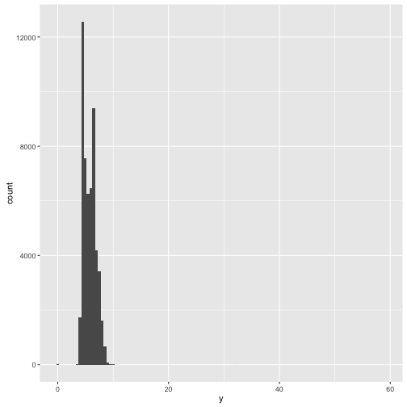
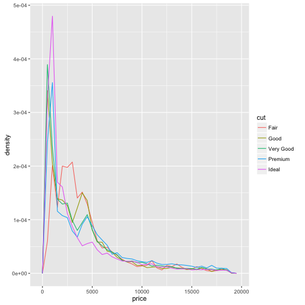
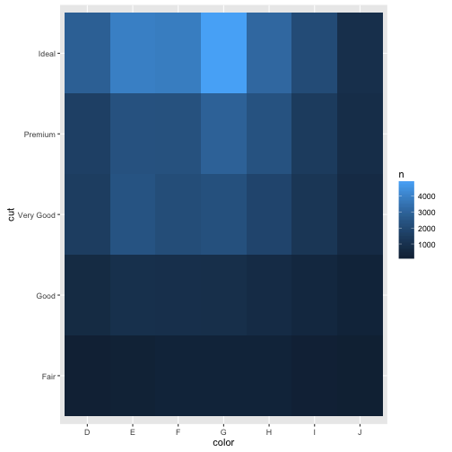
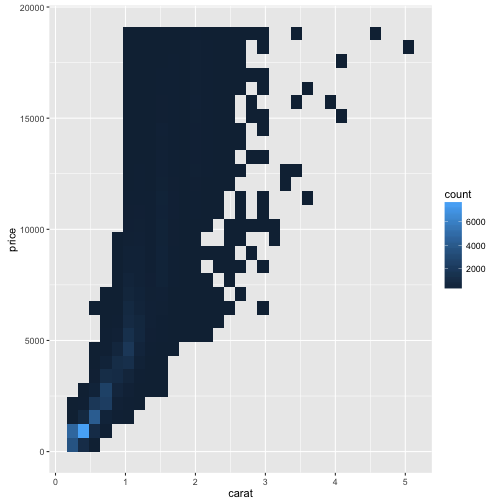
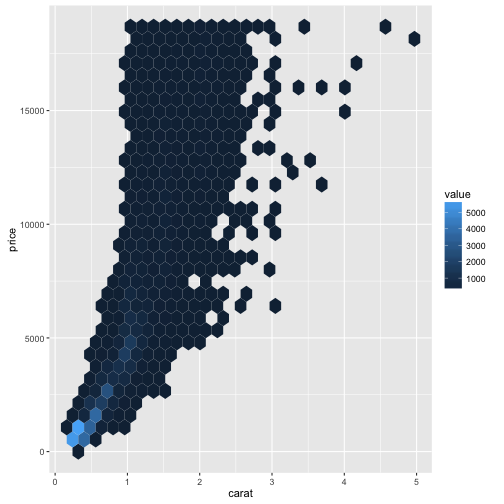
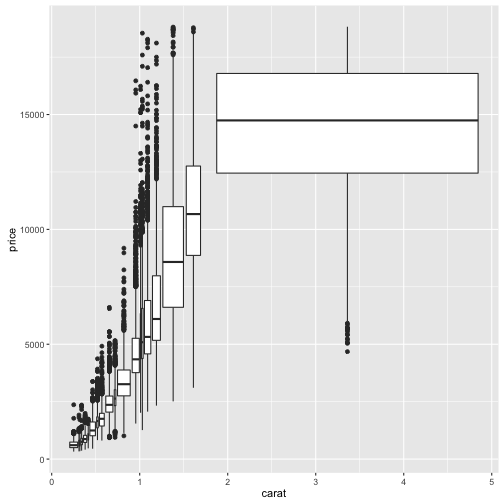

 
> ## 학습목표 {.objectives}
>
> * 기계학습 모형구축에 적용될 데이터를 이해한다.
> * 탐색적 데이터 분석(EDA)을 적용한다.

## 1. [탐색적 데이터 분석](https://en.wikipedia.org/wiki/Exploratory_data_analysis) [^r-marketing]

[^r-marketing]: [ Chapman, Christopher N., McDonnell Feit, Elea (2005), R for Marketing Research and Analytics, Springer Press](http://www.springer.com/us/book/9783319144351)

기계학습 알고리즘이 학습을 얼마나 잘 하느냐는 전적으로 데이터의 품질과 데이터에 담긴 정보량에 달려있다. 
따라서, 가능하면 정보를 잃지 않으면서 기계학습 알고리즘이 학습할 환경을 구비하는 것이 매우 중요하다.

데이터 과학 프로세스는 현실세계에서 데이터를 수집하고, 데이터를 전처리하고, 정제된 데이터셋을 만든 뒤에 모형과 
알고리듬을 개발하여 데이터 과학 결과물을 사람을 위한 의사결정에 사용하는 것이 하나고, 
데이터제품을 통해 알고리듬으로 현실세계에 영향을 주는 것이 또 하나다.
특히, 정제된 데이터셋과 모형, 알고리즘을 개발하는 과정에서 탐색적 자료분석 과정이 꼭 수반된다.

탐색적 자료 분석과정은 미국의 튜키박사에 의해 창안되었고, 
가설검증이나 모형을 적용하기 전에 데이터가 스스로에 대해 사람에게 정보를 전달하도록 만드는 방법으로 
시각적인 기법을 사용도 하고 5-숫자요약(5-number summary) 등 다양한 방법을 적용한다.

> ### 탐색적 데이터 분석의 목적 {.callout}
>
> 탐색적 데이터 분석의 목적은 데이터를 이해하는 것이다. 목적 달성을 위한 가장 쉬운 방법은
> 질문을 잘 만들어 이를 탐색과정을 거쳐 결국 데이터를 표현하는 적절한 모형, 시각화 산출물, 다음 과정을 위한 데이터를 
> 생성해 내는 것이다.
>
> 질문의 질은 결국 질문의 양에 비례한다. 데이터에 대해 아는 것이 없기 때문에 질문의 질을 최대한 빨리 높이는 길은
> 한정된 시간에 가능하면 많은 질문을 생성해 내고, 탐색과정을 거쳐 최대한 빨리 좋은 질문을 생성해 내는 것이다.

## 2. 개념적 데이터 탐색과정

탐색적 데이터 분석과정은 개념적으로 다음 두가지 질문으로 귀결된다.

- 데이터에 포함된 변수에 내재된 변동성(variation) 유형은 어떻게 되나?
- 변수들 간에 공변동(covariation)은 어떻게 되나?

상기 두가지 질문을 통해 데이터에 대한 이해를 높일 수 있고, 질문에 답을 할 수 있는 구성요소를 정의해보자.

- **변수(Variable)**: 측정할 수 있는 질적 속성, 양적 수량, 속성이 된다.
- **값(Value)**: 값은 측정할 때 변수의 상태로 정의되어, 변수값은 측정시점 마다 변화하는 특징이 있다.
- **관측점(Observation)**: 동일한 시점 동일한 객체에 대해 측정된 관측정보 집합. 관측점에는 서로 다른 연관된 변수에 값들이 담겨있다.
- **표로 표현된 데이터(Tabular Data)**: 연관된 변수와 관측점을 값으로 표현한 집합. 값 각각이 본연의 위치(셀, cell)에 담겨있고,
칼럼에 변수가 위치하고, 행에 각 관측점이 위치할 때 깔끔한 데이터(tidy data)라고 정의한다.

### 2.1. 변수 하나 변동(Variation)

변수 값은 측정시점마다 변동하거나 다르게 측정되는 특성이 있는데 이를 **변동(Variation)**이라고 부른다. 
변동은 연속형 변수나 범주형 변수 모두 관찰되는데 변수값을 시각화하면 쉽게 패턴을 탐지할 수 있다.

~~~{.r}
ggplot(data = diamonds) +
  geom_bar(mapping = aes(x = cut))
~~~

막대그래프에 나타난 범주내 수준별 높이가 변동을 표현하고 있는데, 이를 기술통계량을 통해서도 확인된다.

~~~{.r}
diamonds %>% 
  group_by(cut) %>% tally
~~~

~~~{.output}
# A tibble: 5 × 2
        cut     n
      <ord> <int>
1      Fair  1610
2      Good  4906
3 Very Good 12082
4   Premium 13791
5     Ideal 21551

~~~

연속형 변수는 순서가 있는 값을 무한히 많이 갖게 되는데 숫자, 날짜가 대표적인 사례다. 
연속형 변수는 히스토그램을 통한 시각화로 변동을 이해하게 된다.

~~~{.r}
ggplot(data = diamonds) +
  geom_histogram(mapping = aes(x = carat), binwidth = 0.5)
~~~

연속형 변수를 범주화하는 것도 가능한데 `dplyr::count()`와 `ggplot2::cut_width()` 를 조합해서 사용하면 된다.

~~~{.r}
diamonds %>% 
  count(cut_width(carat, 0.5))
~~~

~~~{.output}
# A tibble: 11 × 2
   `cut_width(carat, 0.5)`     n
                    <fctr> <int>
1             [-0.25,0.25]   785
2              (0.25,0.75] 29498
3              (0.75,1.25] 15977
4              (1.25,1.75]  5313
5              (1.75,2.25]  2002
6              (2.25,2.75]   322
7              (2.75,3.25]    32
8              (3.25,3.75]     5
9              (3.75,4.25]     4
10             (4.25,4.75]     1
11             (4.75,5.25]     1

~~~

만약, 그래프 하나로 히스토그램을 다수 겹쳐 시각화할 경우 `geom_freqpoly()`을 권장한다.
`geom_histogram()`과 동일한 연산과정을 거치지만, `geom_freqpoly()`은 직선을 사용해서 시각적으로 이해하기 좋다.

~~~{.r}
ggplot(data = diamonds, mapping = aes(x = carat, colour = cut)) +
  geom_freqpoly(binwidth = 0.1)
~~~

### 2.2. 이상점

연속형 혹은 범주형 변수를 시각화를 통해 확인할 수 있는 사실은 **이상점(Outlier)**을 식별하기 
용이하다는 점이다.

~~~{.r}
ggplot(diamonds) + 
  geom_histogram(mapping = aes(x = y), binwidth = 0.5)
~~~

~~~{.r}
#  coord_cartesian(ylim = c(0, 50))
~~~

`y` 변수값 대부분이 한곳에 몰려있지만, 보이지 않지만 `60`까지 쭉 뻗은 펼쳐진 것이 확인된다. 
이런 경우 정보량이 많은 관측점인지 아니면 관측점 자체에 입력 오류가 있는지 파악한다.

~~~{.r}
unusual <- diamonds %>% 
  dplyr::filter(y < 3 | y > 20) %>% 
  arrange(y)
unusual
~~~

~~~{.output}
# A tibble: 9 × 10
  carat       cut color clarity depth table price     x     y     z
  <dbl>     <ord> <ord>   <ord> <dbl> <dbl> <int> <dbl> <dbl> <dbl>
1  1.00 Very Good     H     VS2  63.3    53  5139  0.00   0.0  0.00
2  1.14      Fair     G     VS1  57.5    67  6381  0.00   0.0  0.00
3  1.56     Ideal     G     VS2  62.2    54 12800  0.00   0.0  0.00
4  1.20   Premium     D    VVS1  62.1    59 15686  0.00   0.0  0.00
5  2.25   Premium     H     SI2  62.8    59 18034  0.00   0.0  0.00
6  0.71      Good     F     SI2  64.1    60  2130  0.00   0.0  0.00
7  0.71      Good     F     SI2  64.1    60  2130  0.00   0.0  0.00
8  0.51     Ideal     E     VS1  61.8    55  2075  5.15  31.8  5.12
9  2.00   Premium     H     SI2  58.9    57 12210  8.09  58.9  8.06

~~~

`y` 값이 3 이하 이거나 20 이상되는 것은 정상적인 상황이 아니기 때문에 이를 따로 추려 면밀히 조사한다.

이와 같이 심심찮게 데이터셋에서 흔히 마주하는 이슈가 이와 같은 이상값이다. 이상값을 제거하는 것도 한방법이 될 수 있으나 이상값 하나로 인해
나머지 변수의 정보도 모두 날려버리는 것은 그닥 권장되지 않는다.

~~~{.r}
# 결측값을 제거하는 방법 
diamonds2 <- diamonds %>% 
  filter(between(y, 3, 20))
~~~

다른 방법은 이상값을 결측값으로 치환하는 것이다. `ifelse` 함수를 자주 사용하는데,
첫번째 인자로 조건식이 들어가고, 두번째 인자에 첫번째 조건식이 참일 때 수행되는 표현식 혹은 값, 
세번째 인자에 첫번째 조건식이 거짓일 때 수행되는 표현식 혹은 값이 정의된다. 

~~~{.r}
diamonds2 <- diamonds %>% 
  mutate(y = ifelse(y < 3 | y > 20, NA, y))
~~~

### 2.2. 두변수 이상 공변동(Covariation)

변동이 변수내 변동이라면, 공변동은 변수간 변동이다.
**공변동(Covariation)**은 변수 2개 혹은 그이상 변수가 관련되어 함께 변화하는 경향성으로 볼 수 있다.
공변동을 식별하는 가장 최선의 방식은 두 변수 혹은 그 이상의 변수를 시각화해본다.

두변수 사이 공변동 관계를 파악하는 방법은 변수 $x$가 범주형이냐 연속형이냐, $y$가 범주형이냐 연속형이냐에 따라
세가지 조합이 가능하다.

|       | 연속형  | 범주형  |
|-------|---------|---------|
|연속형 | 산점도  | 상자그림|
|범주형 | 상자그림| 타일(히트맵) |

#### 2.2.1. 연속형 $\times$ 범주형 

범주형과 연속형을 시각화해서 공변동을 확인할 경우 밀도그래프(density plot)와 더불어 상자그림(boxplot)이 많이 사용된다.
특히 범주에 순서가 있는 경우 순서형 범주값을 반영하여 시각화를 할 경우 도움이 많이 된다.

~~~{.r}
ggplot(data = diamonds, mapping = aes(x = price, y = ..density..)) + 
  geom_freqpoly(mapping = aes(colour = cut), binwidth = 500)
~~~

`reorder()` 함수와 관련된 사항은 요인 자료형을 참조한다.
`coord_flip()` 함수를 사용하면 좌표를 90도 회전시킬 수 있다.

~~~{.r}
ggplot(data = mpg) +
  geom_boxplot(mapping = aes(x = reorder(class, hwy, FUN = median), y = hwy))
~~~

~~~{.r}
# coord_flip()  
~~~

#### 2.2.2. 범주형 $\times$ 범주형

두변수가 모두 범주형일 경우 `geom_count()` 함수를 사용해서 빈도수를 시각화한다.

~~~{.r}
ggplot(data = diamonds) +
  geom_count(mapping = aes(x = cut, y = color))
~~~

혹은, `dplyr` 팩키지 `count()` 함수를 사용해서 먼저 두 범주형 변수간에 빈도를 구하고 나서,
이를 `geom_tile()` 함수를 사용해서 시각화한다.

~~~{.r}
diamonds %>% 
  count(color, cut)
~~~

~~~{.output}
Source: local data frame [35 x 3]
Groups: color [?]

   color       cut     n
   <ord>     <ord> <int>
1      D      Fair   163
2      D      Good   662
3      D Very Good  1513
4      D   Premium  1603
5      D     Ideal  2834
6      E      Fair   224
7      E      Good   933
8      E Very Good  2400
9      E   Premium  2337
10     E     Ideal  3903
# ... with 25 more rows

~~~

~~~{.r}
diamonds %>% 
  count(color, cut) %>%  
  ggplot(mapping = aes(x = color, y = cut)) +
    geom_tile(mapping = aes(fill = n))
~~~

범주가 많은 경우 `seriation` 팩키지를 사용하거나, `d3heatmap` 혹은 `heatmaply` 팩키지를 사용해서 인터랙티브한 분석작업을 
수행한다.

#### 2.2.2. 연속형 $\times$ 연속형

두 연속형 변수를 시각화하여 공변동을 확인하는 대표적인 방법이 산점도다. 하지만 데이터가 많아지는 경우 
이를 시각화하게 되면 점을 서로 겹쳐찍게 되어 산점도를 통해 많은 정보를 파악하기가 더 어렵다.

이를 극복하는 한 방법이 투명도($\alpha$)를 넣어 처리하는 방법과 연속형 변수를 구간으로 나누어 빈도를 산출하고
여기에 색상을 먹여 농도를 달리하는 방식이 있다. `geom_bin2d()`과 `geom_hex()`이 있는데 `geom_bin2d()`은 직사각형, 
`geom_hex()`은 6각형으로 구역을 달리하여 처리한다.

~~~{.r}
ggplot(data = diamonds) +
  geom_point(mapping = aes(x = carat, y = price))
~~~

~~~{.r}
# 투명도 도입
ggplot(data = diamonds) + 
  geom_point(mapping = aes(x = carat, y = price), alpha = 1 / 100)
~~~

~~~{.r}
# 직사각형 구간 
ggplot(data = diamonds) +
  geom_bin2d(mapping = aes(x = carat, y = price))
~~~

~~~{.r}
# 육각형 구간
# install.packages("hexbin")
ggplot(data = diamonds) +
  geom_hex(mapping = aes(x = carat, y = price))  
~~~

~~~{.output}
Loading required package: methods

~~~

연속형 변수를 범주화하여 상자그림으로 시각화하는 방법도 많이 사용된다.

~~~{.r}
ggplot(data = diamonds, mapping = aes(x = carat, y = price)) + 
  geom_boxplot(mapping = aes(group = cut_number(carat, 20)))
~~~

## 2. 데이터 탐색과정

수십년에 걸쳐 개발된 R언어는 수많은 통계학자를 비롯한 다양한 연구자와 실무담당자가 만들어 낸 팩키지와 
그들만의 사용법이 존재한다는 사실을 인정하고, 나름대로 효율적이고 효과적인 나만의 방법론을 만들어 나갈 것을 추천한다. 
다음에 제시되는 데이터 탐색과정은 그 과정 중 하나일 뿐이니 참고로 활용한다.

1. `readr` 팩키지의 `read_csv` 함수를 사용해서 데이터를 불러오고, 이는 자동으로 `tlb_df` 데이터프레임으로 가져온다. 
1. `tlb_df` 자료형은 기존 전통적인 R을 활용한 자료분석과정을 많이 단축할 수 있다.
    * `dim()` 함수를 사용하여 차원정보, 즉 행과 열 정보를 불러온다.
    * `head()`, `tail()` 함수를 사용해서 데이터프레임 처음과 끝을 살펴본다.
    * `car` 팩키지의 `some()` 함수를 사용해서 임의 행을 추출하여 살펴볼 수 있다.
    * `str()` 함수를 사용해서 데이터프레임 자료구조를 파악한다. 특히, `factor` 요인 범주형 자료를 문자열 자료구조대신 필요하면 변환한다.
1. `summary()` 함수를 사용해서 전체적으로 데이터프레임에 들어있는 데이터셋에 대한 정보를 한번에 확인한다.
    * 동일한 기능이지만, `psych` 라이브러리에 있는 `describe()` 함수를 사용해 기초통계량을 한번에 뽑아낸다.

`store.df` 데이터는 "R for Marketing Research and Analytics" 책에 소개된 데이터를 예제로 사용한다.

~~~{.r}
# tbl_df 자료구조를 데이터프레임 대신 사용한 사례 
library(readr)
store.df <- read_csv("http://r-marketing.r-forge.r-project.org/data/rintro-chapter3.csv")
~~~

~~~{.output}
Parsed with column specification:
cols(
  storeNum = col_integer(),
  Year = col_integer(),
  Week = col_integer(),
  p1sales = col_integer(),
  p2sales = col_integer(),
  p1price = col_double(),
  p2price = col_double(),
  p1prom = col_integer(),
  p2prom = col_integer(),
  country = col_character()
)

~~~

~~~{.r}
head(store.df)
~~~

~~~{.output}
# A tibble: 6 × 10
  storeNum  Year  Week p1sales p2sales p1price p2price p1prom p2prom
     <int> <int> <int>   <int>   <int>   <dbl>   <dbl>  <int>  <int>
1      101     1     1     127     106    2.29    2.29      0      0
2      101     1     2     137     105    2.49    2.49      0      0
3      101     1     3     156      97    2.99    2.99      1      0
4      101     1     4     117     106    2.99    3.19      0      0
5      101     1     5     138     100    2.49    2.59      0      1
6      101     1     6     115     127    2.79    2.49      0      0
# ... with 1 more variables: country <chr>

~~~

~~~{.r}
# 전체적인 데이터프레임 자료 이해
library("psych")
~~~

~~~{.output}

Attaching package: 'psych'

~~~

~~~{.output}
The following objects are masked from 'package:ggplot2':

    %+%, alpha

~~~

~~~{.r}
psych::describe(store.df)
~~~

~~~{.output}
         vars    n   mean    sd median trimmed   mad    min    max range
storeNum    1 2080 110.50  5.77 110.50  110.50  7.41 101.00 120.00  19.0
Year        2 2080   1.50  0.50   1.50    1.50  0.74   1.00   2.00   1.0
Week        3 2080  26.50 15.01  26.50   26.50 19.27   1.00  52.00  51.0
p1sales     4 2080 133.05 28.37 129.00  131.08 26.69  73.00 263.00 190.0
p2sales     5 2080 100.16 24.42  96.00   98.05 22.24  51.00 225.00 174.0
p1price     6 2080   2.54  0.29   2.49    2.53  0.44   2.19   2.99   0.8
p2price     7 2080   2.70  0.33   2.59    2.69  0.44   2.29   3.19   0.9
p1prom      8 2080   0.10  0.30   0.00    0.00  0.00   0.00   1.00   1.0
p2prom      9 2080   0.14  0.35   0.00    0.05  0.00   0.00   1.00   1.0
country*   10 2080    NaN    NA     NA     NaN    NA    Inf   -Inf  -Inf
         skew kurtosis   se
storeNum 0.00    -1.21 0.13
Year     0.00    -2.00 0.01
Week     0.00    -1.20 0.33
p1sales  0.74     0.66 0.62
p2sales  0.99     1.51 0.54
p1price  0.28    -1.44 0.01
p2price  0.32    -1.40 0.01
p1prom   2.66     5.10 0.01
p2prom   2.09     2.38 0.01
country*   NA       NA   NA

~~~

> ### 마케팅에서 활용되는 일반적인 변환 {.callout}
> 
> 박스-코스 변환(Box-Cox transformation)을 통해 $\lambda$ 변수에 값을 설정해서 정규분포에 대한
> 최적변환을 파악할 수 있는데, `car` 팩키지 `powerTransform()`와 짝궁 함수 `bcPower()`를 사용해도 되지만,
> 일반적으로 마케팅에서 자주 목도되는 일반적인 변환은 다음과 같다.
> 
> |   변수   | 일반적인 변환 |
> |-----------------|--------------------|
> | 매출, 판매수량, 가격, 가구소득 | $log(x)$  |
> | 지리적 거리 | $\frac{1}{x}$, $\frac{1}{x^2}$, $log(x)$ |
> | 효용에 근거한 시장점유율, 선호점유율 | $\frac {e^x}{1+e^x}$ |
> | 우측으로 꼬리가 긴 분포 | $\sqrt{x}, log(x)$ |
> | 좌측으로 꼬리가 긴 분포 | $x^2$ |

