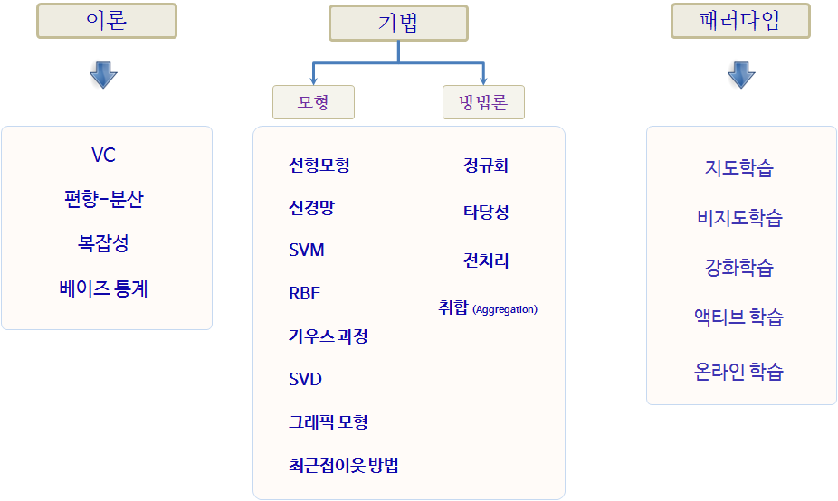
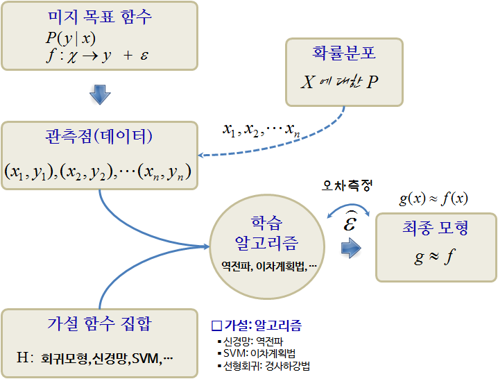

> ## 학습목표 {.objectives}
>
> * 기계학습 지도를 이해한다.

## 기계학습 지도 [^ml-map]

[^ml-map]: [The Map of Machine Learning](https://work.caltech.edu/library/181.pdf)

## 기계학습 본질

1. 패턴이 존재한다.
1. 수학적으로 명시적으로 명세할 수 없다.
1. 데이터를 갖고 있다.

## 기계학습 구성요소

1. 입력 : $x$
1. 출력 : $y$
1. 목적함수 : $f: x \rightarrow y$
1. 데이터: $(x_1 , y_1 ), (x_2 , y_2 ), \dots, (x_n , y_n )$
1. 가설: : $g: x \rightarrow y$

