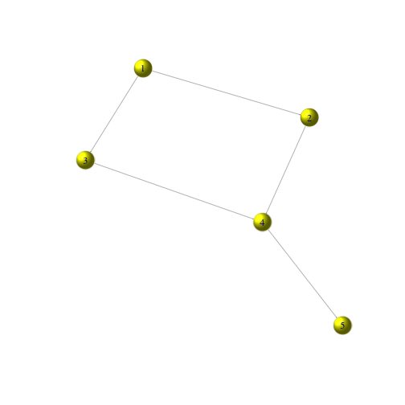
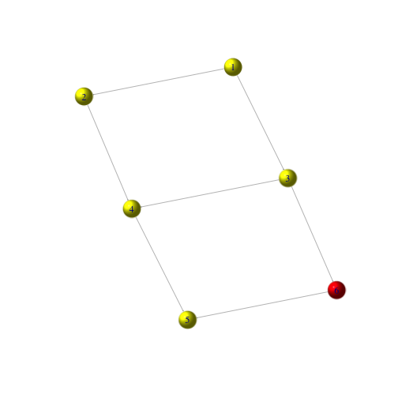
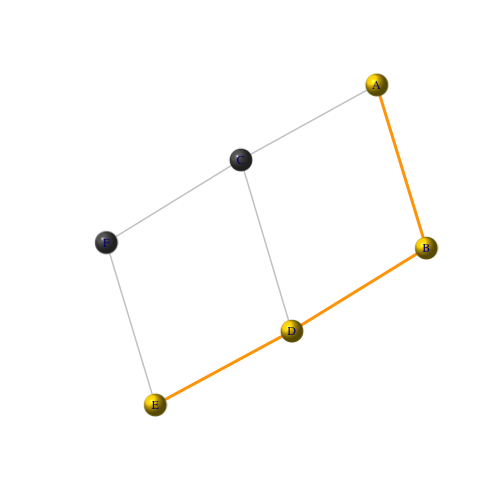
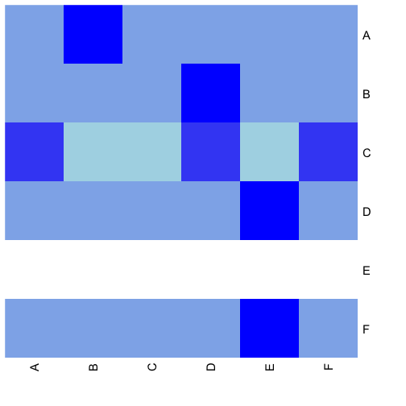
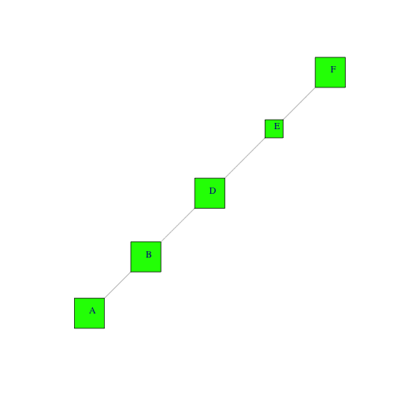

 

### 네드워크 데이터 연습문제 [^r-network-ex] [^r-network-sol]

~~~{.r}
#---------------------------------------------------------------------------------------------
# 1. 연결되지 않은 5개 노드를 갖는 그래프를 생성하시오. 모든 노드는 노랑색이며, 형태는 구형태를 갖도록 한다.
#---------------------------------------------------------------------------------------------
library(igraph)
g <- make_empty_graph(n=5, directed=TRUE)
V(g)$color = "yellow"
V(g)$shape = "sphere"

plot(g)
~~~

~~~{.r}
#---------------------------------------------------------------------------------------------
# 2. 1->2, 1->3, 2->4, 3->4, 4->5 엣지연결을 갖는 그래프를 추가하시오.
#---------------------------------------------------------------------------------------------
g <- add_edges(g, c(1,2, 1,3, 2,4, 3,4, 4,5))

plot(g, edge.arrow.size=.05)
~~~

~~~{.r}
#---------------------------------------------------------------------------------------------
# 3. 노드를 추가하고 색상은 빨강, 형태는 구형태를 갖고, 해당 노드는 3->6, 6->5 엣지 연결을 시키시오.
#---------------------------------------------------------------------------------------------

g <- add_vertices(g, 1, color="red", shape="sphere")
g <- add_edges(g, c(3,6, 6,5))
plot(g, edge.arrow.size=.05)
~~~

~~~{.r}
#---------------------------------------------------------------------------------------------
# 4. 엣지 연결 1->3을 3->1로 교체하시오.
#---------------------------------------------------------------------------------------------

E(g)
~~~

~~~{.output}
+ 7/7 edges:
[1] 1->2 1->3 2->4 3->4 4->5 3->6 6->5

~~~

~~~{.r}
g <- delete_edges(g, c(2))
g <- add_edges(g, c(3,1))

plot(g, edge.arrow.size=.05)
~~~

~~~{.r}
#---------------------------------------------------------------------------------------------
# 5. 노드에 A-F 라벨을 붙이시오. 모든 노드와 엣지를 목록으로 출력하시오.
#---------------------------------------------------------------------------------------------

V(g)$name <- LETTERS[1:6]

V(g)
~~~

~~~{.output}
+ 6/6 vertices, named:
[1] A B C D E F

~~~

~~~{.r}
E(g)
~~~

~~~{.output}
+ 7/7 edges (vertex names):
[1] A->B B->D C->D D->E C->F F->E C->A

~~~

~~~{.r}
plot(g, edge.arrow.size=.05)
~~~

~~~{.r}
#---------------------------------------------------------------------------------------------
# 6. 노드 A에서 노드 E로 최단거리를 구하시오.
#---------------------------------------------------------------------------------------------

shortest_paths(g, "A", "E", output="epath")$epath[1]
~~~

~~~{.output}
[[1]]
+ 3/7 edges (vertex names):
[1] A->B B->D D->E

~~~

~~~{.r}
## 시각화
short.path <- get.shortest.paths(g, V(g)["A"], V(g)["E"], mode="all", output="both")

# 엣지 변수 색상 생성:
ecol <- rep("gray80", ecount(g))
ecol[unlist(short.path$epath)] <- "orange"

# 엣지 변수 선폭 생성:
ew <- rep(2, ecount(g))
ew[unlist(short.path$epath)] <- 4

# 노드 색상변수 생성:
vcol <- rep("gray40", vcount(g))
vcol[unlist(short.path$vpath)] <- "gold"

plot(g, vertex.color=vcol, edge.color=ecol, 
     edge.width=ew, edge.arrow.mode=0)
~~~

~~~{.r}
#---------------------------------------------------------------------------------------------
# 7. 지금까지 작성한 네트워크를 시각화하시오. 노드 크기는 인입되는 엣지연결 숫자에 따라 크기를 반영하시오.
#---------------------------------------------------------------------------------------------

plot(g, layout=layout_nicely, vertex.size=degree(g, V(g), "in")*15+15,
     vertex.label.dist=0.5, edge.arrow.size=0.05)
~~~

~~~{.output}
Error in FUN(X[[i]], ...): as.edgelist.sna input must be an adjacency matrix/array, edgelist matrix, network, or sparse matrix, or list thereof.

~~~

~~~{.r}
#---------------------------------------------------------------------------------------------
# 8. 노드 연결분포를 플롯으로 그리시오.
#---------------------------------------------------------------------------------------------

dd <- degree_distribution(g)
plot(dd, main="Degree distribution", xlab="Degree", ylab="Frequency")
~~~

~~~{.r}
#---------------------------------------------------------------------------------------------
# 9. 적외선 열지도 그래프(Heatmap)을 생성하시오.
#---------------------------------------------------------------------------------------------

pal <- colorRampPalette(c("lightblue", "blue"))
a <- as.matrix(get.adjacency(g))
heatmap(a, Rowv=NA, Colv="Rowv", col=pal(100))
~~~

~~~{.r}
#---------------------------------------------------------------------------------------------
# 10. 인입 엣지가 1개 이상되는 노드를 갖는 그래프를 생성하고 이를 도식화한다. 노드 크기는 나가는 
#     링크 연결갯수를 반영해야 한다.
#---------------------------------------------------------------------------------------------
sg <- induced_subgraph(g, V(g)[igraph::degree(g, V(g), "in") >= 1])
plot(sg, layout=layout_nicely, vertex.size=igraph::degree(sg, V(sg), "out")*10+15,
     vertex.color="green", vertex.shape="square", vertex.label.dist=0.5, edge.arrow.size=0.05)
~~~

[^r-network-ex]: [Network Analysis Part 1 Exercises](http://r-exercises.com/2016/09/15/network-analysis-part-1-exercises/)
[^r-network-sol]: [Network Analysis Part 1 Solutions](http://r-exercises.com/2016/09/15/network-analysis-part-1-solutions/)

