 

### 1. 네트워크 데이터 시각화

`plot(net)` 명령어를 통해 시각화를 할 경우, 중복되는 엣지도 많고 해서 간략화할 필요가 있다.
이때 사용되는 명령어가 `simplify()` 함수다.

~~~{.r}
# plot(net)
net <- simplify(net, remove.multiple = FALSE, remove.loops = TRUE) 
# net <- simplify(net, edge.attr.comb=list(Weight="sum","ignore"))
plot(net, edge.arrow.size=.01,vertex.label=NA)
~~~

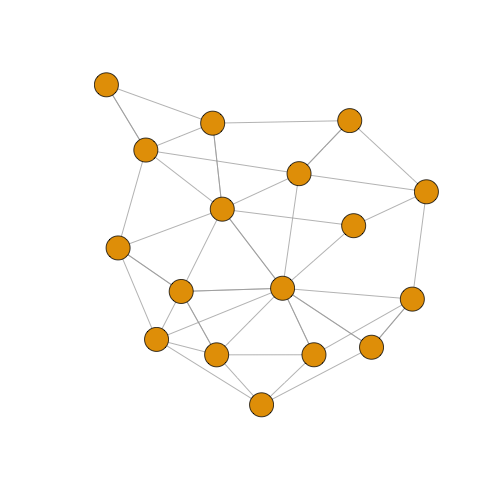

`dev.off()`로 장치를 초기화하고, `vertex.label.family` 인자를 통해 글꼴도 설정한다.

~~~{.r}
dev.off()
~~~

~~~{.output}
null device 
          1 

~~~

~~~{.r}
par(mfrow=c(1,2))
plot(net, edge.arrow.size=.01,vertex.label=NA)
plot(net, edge.arrow.size=.01, vertex.label.family="NanumMyeongjo")
~~~

#### 1.1. `igraph` 주요 설정 매개변수

| 노드(Node)            |   노드 매개변수 설명                                                |
|-----------------------|---------------------------------------------------------------------|
| vertex.color	 		| Node color |
| vertex.frame.color 	| Node border color |
| vertex.shape	 		| One of “none”, “circle”, “square”, “csquare”, “rectangle”, “crectangle”, “vrectangle”, “pie”, “raster”, or “sphere” |
| vertex.size	 		| Size of the node (default is 15) |
| vertex.size2	 		| The second size of the node (e.g. for a rectangle) |
| vertex.label	 		| Character vector used to label the nodes |
| vertex.label.family   | 	Font family of the label (e.g.“Times”, “Helvetica”) |
| vertex.label.font	 	| Font: 1 plain, 2 bold, 3, italic, 4 bold italic, 5 symbol |
| vertex.label.cex	 	| Font size (multiplication factor, device-dependent) |
| vertex.label.dist	 	| Distance between the label and the vertex |
| vertex.label.degree   | 	The position of the label in relation to the vertex, where 0 right, “pi” is left, “pi/2” is below, and “-pi/2” is above |

| 엣지(Edge)            | 엣지 매개변수 설명                                                  |
|-----------------------|---------------------------------------------------------------------|
|edge.color	 			| Edge color |
|edge.width	 			| Edge width, defaults to 1 |
|edge.arrow.size		| Arrow size, defaults to 1 |
|edge.arrow.width	 	| Arrow width, defaults to 1 |
|edge.lty	 			| Line type, could be 0 or “blank”, 1 or “solid”, 2 or “dashed”, 3 or “dotted”, 4 or “dotdash”, 5 or “longdash”, 6 or “twodash” |
|edge.label	 			| Character vector used to label edges |
|edge.label.family	 	| Font family of the label (e.g.“Times”, “Helvetica”) |
|edge.label.font		| Font: 1 plain, 2 bold, 3, italic, 4 bold italic, 5 symbol |
|edge.label.cex	 		| Font size for edge labels |
|edge.curved	 		| Edge curvature, range 0-1 (FALSE sets it to 0, TRUE to 0.5) |
|arrow.mode	 			| Vector specifying whether edges should have arrows, possible values: 0 no arrow, 1 back, 2 forward, 3 both |

| 기타                  | 기타 매개변수 설명                                                  |    	 
|-----------------------|---------------------------------------------------------------------|
| margin	   |  Empty space margins around the plot, vector with length 4   |
| frame	 	   |  if TRUE, the plot will be framed   |
| main	 	   |  If set, adds a title to the plot   |
| sub	 	   |  If set, adds a subtitle to the plot   |

#### 1.2. 노드와 엣지에 매개변수 반영 

노드와 엣지를 네트워크 시각화에 매개변수를 통해 반영하는 방식은 두가지가 있다.
먼저 `plot()` 함수에 노드와 엣지 매개변수를 적어 넣는다.

`edge.arrow.size=.4` 엣지 화살표 크기를 .4로 설정하고, 엣지에 곡선을 .3으로 반영한다.

~~~{.r}
plot(net, edge.arrow.size=.4, edge.curved=.3)
~~~

엣지 색상은 오렌지색상으로, 노드는 회색으로, 노드 외곽 색상은 흰색으로 설정한다.
노드 라벨을 `V(net)$media` 변수를 사용하고 노드 라벨 색상은 검정색으로 설정한다.

~~~{.r}
plot(net, edge.arrow.size=.2, edge.color="orange",
     vertex.color="dark gray", vertex.frame.color="#ffffff",
     vertex.label=V(net)$media, vertex.label.color="black") 
~~~

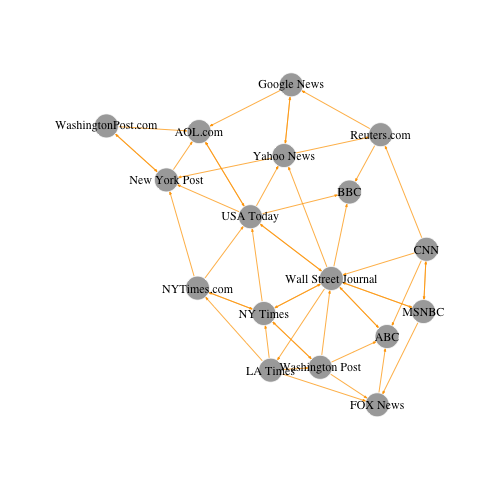

두번째 방식은 igraph 객체에 속성으로 추가하는 것이다.
예를 들어, 미디어 유형에 따라 네트워크 노드에 색상을 추가하고, 
연결 중앙성(Degree Centrality, 링크가 많으면 더 큰 노드)에 따라 크기를 조정한다.
가중치(weight)에 따라 엣지 선폭도 설정한다.

~~~{.r}
#------------------------------------------------------------------------
# 03.02. 첫번째 방식: igraph 객체에 속성으로 적용

# 미디어 유형에 따른 색상 생성:
colrs <- c("gray50", "tomato", "gold")
V(net)$color <- colrs[V(net)$media.type]

# 노드 연결 중앙성에 따른 노드 크기 설정:
deg <- igraph::degree(net, V(net), mode="all")
V(net)$size <- deg*3

# audience size 값을 사용해서 노드 크기 설정:
V(net)$size <- V(net)$audience.size*0.6

# 노드 ID로 현재 라벨이 설정되어 있는데, 라벨이 표시되지 않도록 설정:
V(net)$label <- NA

# 엣지 선폭을 가중치(weight)에 따라 설정:
E(net)$width <- E(net)$weight/2

# 화살표 크기와 엣지 색상을 변경:
E(net)$arrow.size <- .2
E(net)$edge.color <- "gray80"
E(net)$width <- 1+E(net)$weight/12

plot(net) 
colrs <- c("gray50", "tomato", "gold")
legend(x=-1.5, y=-1.1, c("Newspaper","Television", "Online News"), pch=21,
       col="#777777", pt.bg=colrs, pt.cex=2, cex=.8, bty="n", ncol=1)
~~~

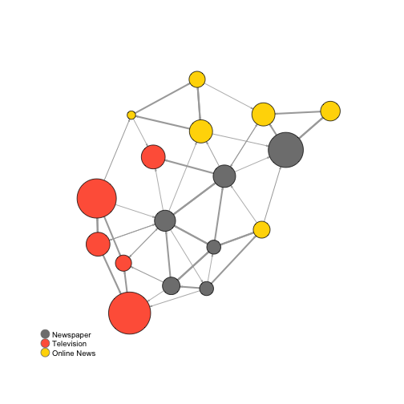

노드 라벨을 적용하는 것이 의미론적인 면에서 더 의미가 있을 수 있다.

~~~{.r}
#------------------------------------------------------------------------
# 03.03. 노드 라벨를 활용한 네트워크 시각화

par(mfrow=c(1,1))
plot(net, vertex.shape="none", vertex.label=V(net)$media, 
     vertex.label.font=2, vertex.label.color="gray40", edge.arrow.size=.1,
     vertex.label.cex=.7, edge.color="gray85", edge.width	= 1+E(net)$weight/12)
~~~

엣지 색상을 노드와 맞춰 시각화를 함으로써 노드와 엣지를 함께 이해하는 것도 가능하다.

~~~{.r}
#------------------------------------------------------------------------
# 03.04. 엣지를 노드에 맞춰 색상을 맞춤

edge.start <- ends(net, es=E(net), names=F)[,1] # get the "from" node
edge.col <- V(net)$color[edge.start]

plot(net, edge.color=edge.col, edge.curved=.1)
~~~

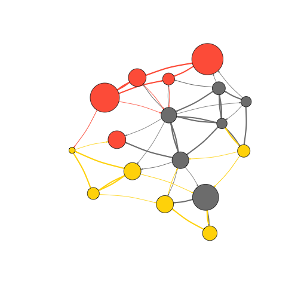

### 2. 네트워크 배치(Layout)

네트워크 배치(Layout)는 네트워크 노드에 대한 좌표를 반환하는 단순히 알고리즘이라고 볼 수 있다.

`barabasi.game` 함수를 사용해서 80개 노드를 갖는 그래프를 통해 네트워크 배치에 대한
탐색을 시작해 본다. 선호적 연결원리(Preferential attachment)를 따라 노드 하나에서 
시작해서 체계적으로 증가시켜 나간다.

~~~{.r}
##=======================================================================
## 01. 네트워크 배치
##=======================================================================
source("02.code/01-clean.R")
~~~

~~~{.output}
Error in file(filename, "r", encoding = encoding): 커넥션을 열 수 없습니다

~~~

~~~{.r}
source("02.code/04-network-viz.R")
~~~

~~~{.output}
Error in file(filename, "r", encoding = encoding): 커넥션을 열 수 없습니다

~~~

~~~{.r}
# 바라바시 게임 (Preferential attachment)
library(igraph)

net.bg <- barabasi.game(80) 
V(net.bg)$frame.color <- "white"
V(net.bg)$color <- "orange"
V(net.bg)$label <- "" 
V(net.bg)$size <- 10
E(net.bg)$arrow.mode <- 0
plot(net.bg)
~~~

~~~{.r}
# layout 설정
plot(net.bg, layout=layout.random)
~~~

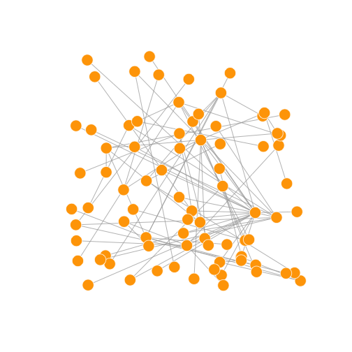

사전에 네트워크 배치에 대해 설정하고 이를 적용하는 것도 가능하다.
내장된 네트워크 배치 기능은 다음과 같다.

* `layout.random()` : 임의 네트워크 배치
* `layout.circle()` : 원형태 네트워크 배치
* `layout.sphere()` : 구형태  네트워크 배치

~~~{.r}
# 사전에 노드좌표를 설정
l <- layout.circle(net.bg)
plot(net.bg, layout=l)
~~~

~~~{.r}
# 개발자가 직접 설정
l <- matrix(c(1:vcount(net.bg), c(1, vcount(net.bg):2)), vcount(net.bg), 2)
plot(net.bg, layout=l)
~~~

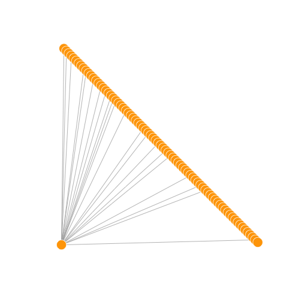

~~~{.r}
# 노드 배치 내장함수: 무작위
l <- layout.random(net.bg)
plot(net.bg, layout=l)
~~~

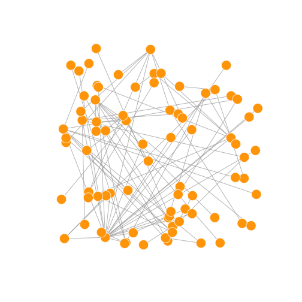

~~~{.r}
# 노드 배치 내장함수: 원
l <- layout.circle(net.bg)
plot(net.bg, layout=l)
~~~

~~~{.r}
# 노드 배치 내장함수: 구
l <- layout.sphere(net.bg)
plot(net.bg, layout=l)
~~~

#### 2.1. 네트워크 배치 알고리즘

심미적으로 보기 좋은 네트워크 그래프를 얻기 위해 많은 알고리즘이 제안되었고,
Fruchterman-Reingold 알고리즘을 비롯한 다양한 알고리즘이 존재한다.
물리학에서 가져온 스프링, 힘 등의 개념을 노드와 엣지에 적용하여 컴퓨터의 도움을 
얻어 데이터가 크지 않은 경우 빠른 시간내에 시각화가 가능하다.

> #### Force-directed graph drawing [^wiki-force-directed-graph]{.callout}
> 
> Force-directed graph drawing algorithms are a class of algorithms for 
> drawing graphs in an aesthetically pleasing way. 
> Their purpose is to position the nodes of a graph in two-dimensional or 
> three-dimensional space so that all the edges are of more or less equal length 
> and there are as few crossing edges as possible, 
> by assigning forces among the set of edges and the set of nodes, 
> based on their relative positions, and then using these forces either to 
> simulate the motion of the edges and nodes or to minimize their energy.

[^wiki-force-directed-graph]: [Force-directed graph drawing](https://en.wikipedia.org/wiki/Force-directed_graph_drawing)

Force-directed 네트워크 배치 알고리즘은 엣지 길이가 유사하게 하고 엣지가 가능하면
서로 겹치지 않도록 그래프를 생성하는데 물리시스템으로 모의시험을 수행한다.
노드는 서로 가까워지면 서로 밀어내는 성질을 갖는 전기적 입자이며, 엣지는 스피링처럼
동작해서 서로 연결된 노드를 잡아댕긴다. 

결과적으로 노드는 시각화 평면에 넓게 고르게 분산되어 퍼지게 되고, 더 많은 연결점을 
갖는 노드는 서로 더 가까이 모이게 되어 직관적으로 이해가 된다. 이런 유형의 알고리즘이 갖는
단점은 수렴에 시간이 오래 걸리고, ~ 1,000 개보다 큰 노드를 갖는 그래프에는 잘 사용되지 않는다.
일부 모수를 조정해서 네트워크 그래프를 조정하는 것도 가능하다.

* `area` : 기본 설정값으로 노드 제곱
* `repulserad` : 밀어내는 반경
* `weight` : 노드 사이 끌림을 증대

`fruchterman.reingold.grid`는 `fruchterman.reingold`와 유사하지만 속도가 더 빠르다.

**Kamada Kawai** 알고리즘도 많이 사용되는 Force-directed 네트워크 알고리즘으로
스프링 시스템에 에너지를 최소화하는 방향으로 그래프를 생성시킨다. 이와 연관된 
`igraph` 팩키지에 포함된 알고리듬이 `layout.spring()`이다.

LGL 배치 알고리즘은 대형 연결 그래프를 시각화하는데 개발되었다. 
루트 뿌리를 설정해야 하는데 배치 중앙에 위치한 노드가 그것이다.

기본 디폴트 설정으로, 그래프 좌표는 `x`, `y` 모두 **[-1,1]** 사이 위치한다.
좌표를 변경할 경우 `rescale=FALSE` 설정하고 수작업으로 좌표를 변경하는 것도 가능하다.
`layout.norm` 으로 그래프 가장자리를 정규화할 수도 있다.

~~~{.r}
# 1. Fruchterman-Reingold: Force-directed 배치 알고리즘
l <- layout.fruchterman.reingold(net.bg, repulserad=vcount(net.bg)^3, 
                                 area=vcount(net.bg)^2.4)
par(mfrow=c(1,2),  mar=c(0,0,0,0))
plot(net.bg, layout=layout.fruchterman.reingold)
plot(net.bg, layout=l)
~~~

~~~{.r}
# 2. Kamada Kawai 배치 알고리즘
l <- layout.kamada.kawai(net.bg)
plot(net.bg, layout=l)

l <- layout.spring(net.bg, mass=.5)
plot(net.bg, layout=l)
~~~

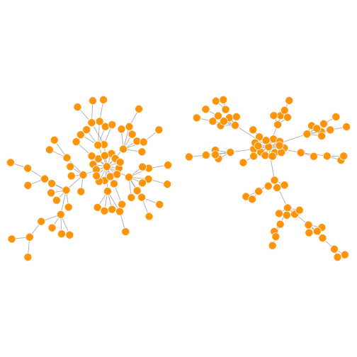

~~~{.r}
# 3. LGL 배치 알고리즘
plot(net.bg, layout=layout.lgl)

# 4. Fruchterman-Reingold: 수동 설정

l <- layout.fruchterman.reingold(net.bg)
l <- layout.norm(l, ymin=-1, ymax=1, xmin=-1, xmax=1)

par(mfrow=c(2,2), mar=c(0,0,0,0))
~~~

~~~{.r}
plot(net.bg, rescale=F, layout=l*0.4)
plot(net.bg, rescale=F, layout=l*0.6)
plot(net.bg, rescale=F, layout=l*0.8)
plot(net.bg, rescale=F, layout=l*1.0)
~~~

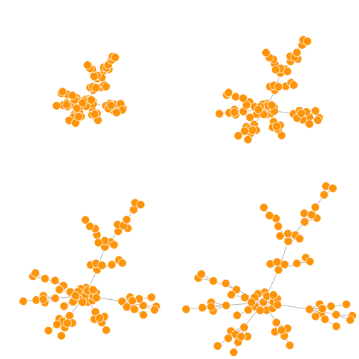

`igraph` 팩키지에 적용된 네트워크 배치 알고리즘은 `layout.auto`를 사용한다.
자동으로 적절한 배치 알고리즘이 자동 선정되는데 네트워크 크기와 연결강도를 
고려한다. 

`igraph` 팩키지에 내장된 네트워크 배치 알고리즘은 다음과 같다.

~~~{.r}
# igraph 내장 배치 알고리즘

layouts <- grep("^layout\\.", ls("package:igraph"), value=TRUE) 
layouts <- layouts[!grepl("bipartite|merge|norm|sugiyama|gem", layouts)]

par(mfrow=c(3,6), mar=c(0,0,0,0))
for(layout in layouts) {
  print(layout)
  l <- do.call(layout, list(net))
  plot(net, edge.arrow.mode=0, layout=l, main=layout) }
~~~

~~~{.output}
[1] "layout.auto"

~~~

~~~{.output}
[1] "layout.circle"

~~~

~~~{.output}
[1] "layout.davidson.harel"

~~~

~~~{.output}
[1] "layout.drl"

~~~

~~~{.output}
[1] "layout.fruchterman.reingold"

~~~

~~~{.output}
[1] "layout.fruchterman.reingold.grid"

~~~

~~~{.output}
[1] "layout.graphopt"

~~~

~~~{.output}
[1] "layout.grid"

~~~

~~~{.output}
[1] "layout.grid.3d"

~~~

~~~{.output}
[1] "layout.kamada.kawai"

~~~

~~~{.output}
[1] "layout.lgl"

~~~

~~~{.output}
[1] "layout.mds"

~~~

~~~{.output}
[1] "layout.random"

~~~

~~~{.output}
[1] "layout.reingold.tilford"

~~~

~~~{.output}
[1] "layout.sphere"

~~~

~~~{.output}
[1] "layout.spring"

~~~

~~~{.output}
[1] "layout.star"

~~~

~~~{.output}
[1] "layout.svd"

~~~

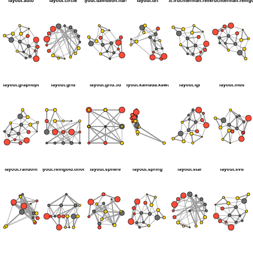

### 3. 네트워크 하이라이트(Highlight)

네트워크 배치 및 매개변수를 변경하여 다양하게 네트워크 시각화가 가능하지만, 
다소 부족한 점이 있다. 노드 유형과 크기를 식별할 수 있지만,
엣지 링크가 조밀해서 전체적인 구조를 파악하기에 부족한 점이 있다.

이에 대한 해법은 가장 중요한 연결만 묶고 나머지는 제거해서, 네트워크를 성기게 
만들면 구조를 보는 것이 더 낫게 된다.

~~~{.r}
plot(net)
~~~

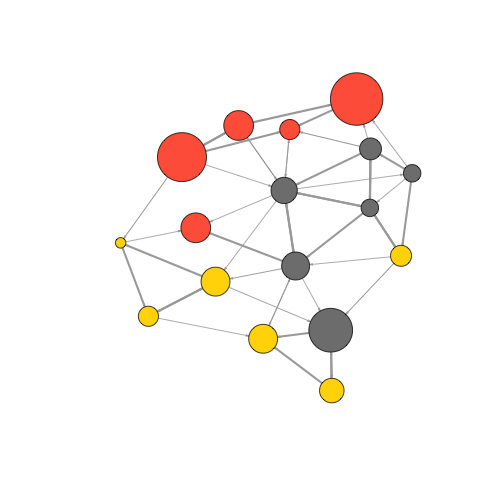

중요 엣지 연결을 추출하는 정교한 방식이 있지만, 가장 단순하게 네트워크 평균적
연결보다 큰 것만 연결을 정의하고, 나머지는 `delete.edges(net, edges)`를 사용해서 연결을 
제거한다.

~~~{.r}
#------------------------------------------------------------------------
# 01.01. 엣지 제거

# 엣지 연결 현황 파악
hist(links$weight)
~~~

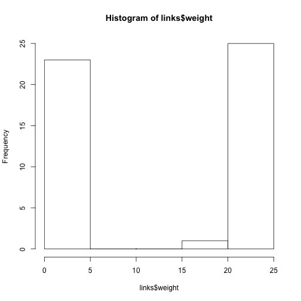

~~~{.r}
mean(links$weight)
~~~

~~~{.output}
[1] 12.40816

~~~

~~~{.r}
sd(links$weight)
~~~

~~~{.output}
[1] 9.905635

~~~

~~~{.r}
# 중요 엣지 연결 추출
cut.off <- mean(links$weight) 
net.sp <- igraph::delete.edges(net, E(net)[weight<cut.off])
l <- layout.fruchterman.reingold(net.sp, repulserad=vcount(net)^2.1)
plot(net.sp, layout=l) 
~~~

#### 3.1. 엣지 제거 또다른 방법 

엣지를 제거하는 다른 방법으로 하이퍼링크(hyperlink) 네트워크와 
언급(mention) 네트워크를 별도로 설정하여 이를 네트워크 배치 알고리즘에 넣어
시각화를 하는 것도 가능한 방법이다.

~~~{.r}
#------------------------------------------------------------------------
# 02. 원배치 : 하이퍼링크, 언급

# 원배치 하이퍼링크
E(net)$width <- 1.5
plot(net, edge.color=c("dark red", "slategrey")[(E(net)$type=="hyperlink")+1],
     vertex.color="gray40", layout=layout.circle)
~~~

~~~{.r}
# 하이퍼링크, 언급
net.m <- net - E(net)[E(net)$type=="hyperlink"] # 엣지를 제거하는 또다른 방법
net.h <- net - E(net)[E(net)$type=="mention"]

par(mfrow=c(1,2))
plot(net.h, vertex.color="orange", main="Tie: Hyperlink")
plot(net.m, vertex.color="lightsteelblue2", main="Tie: Mention")
~~~

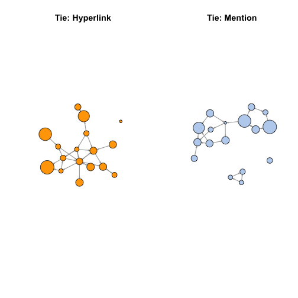

~~~{.r}
# Fruchterman.Reingold 배치 알고리즘
l <- layout.fruchterman.reingold(net)
plot(net.h, vertex.color="orange", layout=l, main="Tie: Hyperlink")
plot(net.m, vertex.color="lightsteelblue2", layout=l, main="Tie: Mention")
~~~

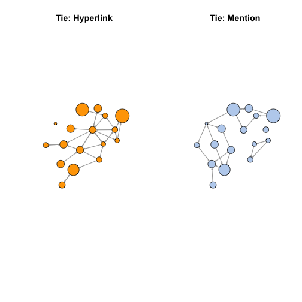

~~~{.r}
# 커뮤니티 반영
V(net)$community <- optimal.community(net)$membership
colrs <- adjustcolor( c("gray50", "tomato", "gold", "yellowgreen"), alpha=.6)
plot(net, vertex.color=colrs[V(net)$community])
~~~

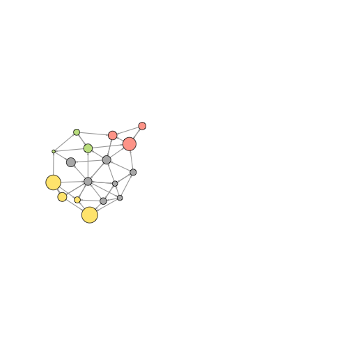

#### 3.2. 특정 노드 혹은 엣지 하이라이트 강조

`shortest.paths` 함수는 해당 네트워크 노드 간에 최단경로 행렬정보를 처리하여 반환한다.
예를 들어, NYT와 다른 언론기관간에 거리를 시각화보자.

~~~{.r}
#------------------------------------------------------------------------
# 01. 최단거리

dist.from.NYT <- shortest.paths(net, algorithm="unweighted")[1,]
oranges <- colorRampPalette(c("dark red", "gold"))
col <- oranges(max(dist.from.NYT)+1)[dist.from.NYT+1]

plot(net, vertex.color=col, vertex.label=dist.from.NYT, edge.arrow.size=.6, 
     vertex.label.color="white")
~~~

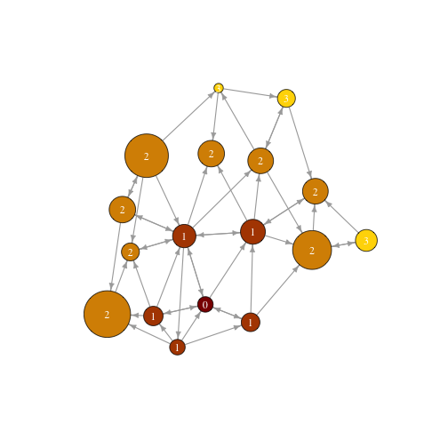

WSJ 주변을 시각화할 수도 있다. `neighbors` 함수를 통해 특정 언론사와 한 단계 더 걸친
언론사를 찾아내기 좋다. 특정 노드와 연결된 모든 엣지링크를 찾는 함수로 `incident`가 있다.

~~~{.r}
#------------------------------------------------------------------------
# 02. WSJ 인접 노드

col <- rep("grey40", vcount(net))
col[V(net)$media=="Wall Street Journal"] <- "#ff5100"

neigh.nodes <- neighbors(net, V(net)[media=="Wall Street Journal"], mode="out")

col[neigh.nodes] <- "#ff9d00"
plot(net, vertex.color=col)
~~~

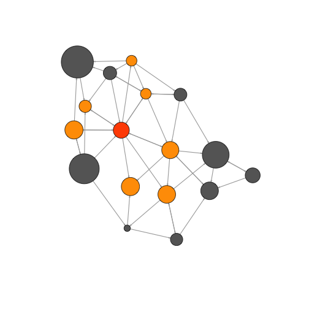

또다른 방법은 특정 노드 집단을 `mark`를 통해 표식하는 것이다.

~~~{.r}
#------------------------------------------------------------------------
# 03. 표식 Mark

# 표식 Mark : 1 집단
plot(net, mark.groups=c(1,4,5,8), mark.col="#C5E5E7", mark.border=NA)
~~~

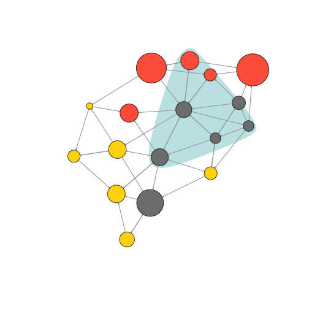

~~~{.r}
# 표식 Mark : 2 집단
plot(net, mark.groups=list(c(1,4,5,8), c(15:17)), 
     mark.col=c("#C5E5E7","#ECD89A"), mark.border=NA)
~~~

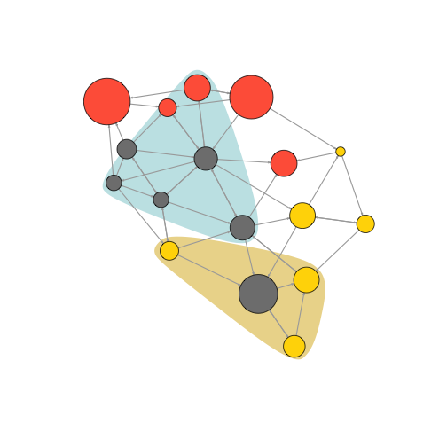

네트워크 특정 경로를 하이라이트하는 것도 가능하다.

~~~{.r}
#------------------------------------------------------------------------
# 04. 경로 표시

news.path <- get.shortest.paths(net, V(net)[media=="MSNBC"], 
                                V(net)[media=="New York Post"],
                                mode="all", output="both")

# 엣지 변수 색상 생성:
ecol <- rep("gray80", ecount(net))
ecol[unlist(news.path$epath)] <- "orange"

# 엣지 변수 선폭 생성:
ew <- rep(2, ecount(net))
ew[unlist(news.path$epath)] <- 4

# 노드 색상변수 생성:
vcol <- rep("gray40", vcount(net))
vcol[unlist(news.path$vpath)] <- "gold"

plot(net, vertex.color=vcol, edge.color=ecol, 
     edge.width=ew, edge.arrow.mode=0)
~~~

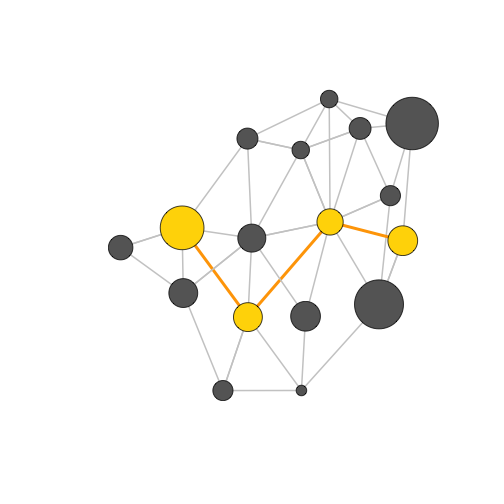

