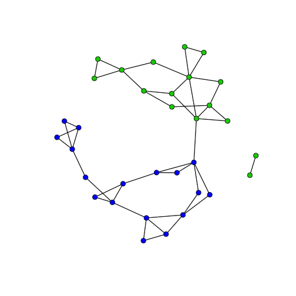

 

 
### 1. 네트워크 과학 [^network-user-guide]

[^network-user-guide]: [Luke, Douglas A. A Users Guide to Network Analysis in R. Springer, 2015.](http://link.springer.com/book/10.1007/978-3-319-23883-8)

네트워크 과학자들이 사용하는 네트워크 과학 도구에는 세가지가 있다.

1. 네트워크 시각화
1. 전반적인 네트워크 구조 뿐만 아니라 네트워크 구성요소(노드, 하위 네트워크)를 기술
1. 네트워크 구조와 동적인 면을 수학적 통계학 모형으로 구현

1930년대 `Jacob Moreno` 의 작업이 근대적인 네트워크 분석 시초로 알려졌고, 
[Sociogram](https://en.wikipedia.org/wiki/Sociogram)을 통해 네트워크 구조를 시각화하는 방안을 제시했다.

### 2. R 네트워크 분석 툴체인

`network`, `igraph` 팩키지를 통해 R 객체로 저장이되고, `intergraph` 팩키지를 통해
다른 소프트웨어와 네트워크 데이터를 주고 받는다.

기본적인 네트워크 분석과 시각화는 `sna` 팩키지가 담당하는데, `statnet`, `igraph`의 
일부로 역할을 수행한다. 

고급 네트워크 모형개발은 `ergm`이 담당하고, 동적 네트워크 모형은 `RSiena` 팩키지,
`ndtv` 팩키지가 있다. "dynamic actor-based network models" 모형은 `RSiena`, 
시간에 따른 중소규모 네트워크 시각화에는 `ndtv`가 권장된다.

[A Users Guide to Network Analysis in R. Springer, 2015.](http://link.springer.com/book/10.1007/978-3-319-23883-8) 책에 소개된
각각의 장에 나타난 중요개념과 팩키지, 데이터셋이 예제로 잘 나와 있다. 
이를 중요개념으로 삼아 학습을 해나가면 도움이 많이 될 것으로 보인다.

| 네트워크 분석 분야   |      관련 팩키지                             | 데이터셋 |
|----------------------|----------------------------------------------|--------------------|
|        소개          |                                              | FIFA Nether, Krebs |
| 다섯 숫자 요약       | statnet, sna                                 | Moreno |
| 네트워크 데이터      | statnet, network, igraph                     | DHHS, ICTS |
| 시각화 기초          | statnet, sna                                 | Moreno, Bali |
| 그래픽 디자인 설계   | statnet, sna, igraph                         | Bali |
| 고급 그래픽          | arcdiagram, circlize, visNetwork, networkD3  | Simpsons, Bali |
| 유명함(Prominence)   | statnet, sna                                 | DHHS, Bali |
| 하위그룹(Subgroups)  | igraph                                       | DHHS, Moreno, Bali |
| 소속(Affiliation)네트워크 | igraph                                       | hwd |
|     수학 모형        | igraph                                       | lhds |
|     확률적 모형      | ergm                                         | TCnetworks |
|     동적 모형        | RSiena                                       | Coevolve |
|   모의 시험          | igraph                                       |   |

### 2. 네트워크 기술 통계

네트워크 분석를 분석하는데 가장 효과적인 방법이 시각화다. 
하지만, 네트워크가 커지게 되면 시각화하는데 한계가 있다.
이런 제약사항에 관계없이 사용할 수 있는 기법이 기술통계다.

마치 평균, 분산, 표준편차처럼 데이터를 숫자로 요약하여 전체적인 데이터 이해를 돕듯이,
네트워크 분석에도 이런 기술통계가 존재한다.

[Social network analysis and visualization: Moreno’s Sociograms revisited](http://www.martingrandjean.ch/social-network-analysis-visualization-morenos-sociograms-revisited/)
4학년 네트워크 연결을 오래전에 Moreno가 수행한 연구에 따르면 고립된 집단과 남자와 여자로 확연히 구별된다.

이를 네트워크 시각화를 통해 확인하면 다음과 같다.

~~~{.r}
# devtools::install_github("DougLuke/UserNetR")
suppressWarnings(suppressMessages(library(statnet)))
suppressWarnings(suppressMessages(library(UserNetR)))

data(Moreno)

gender <- Moreno %v% "gender"
plot(Moreno, vertex.col = gender + 2, vertex.cex = 1.2)
~~~

네트워크 기술통계량에는 네크워크 크기, 전체 네트워크 요약, 네트워크 밀도, 
네트워크 구성요소 및 반경, 네트워크 군집 계수등이 포함된다.

~~~{.r}
# 네트워크 크기 및 요약
network.size(Moreno)
~~~

~~~{.output}
[1] 33

~~~

~~~{.r}
summary(Moreno, print.adj = FALSE)
~~~

~~~{.output}
Network attributes:
  vertices = 33
  directed = FALSE
  hyper = FALSE
  loops = FALSE
  multiple = FALSE
  bipartite = FALSE
 total edges = 46 
   missing edges = 0 
   non-missing edges = 46 
 density = 0.08712121 

Vertex attributes:

 gender:
   numeric valued attribute
   attribute summary:
   Min. 1st Qu.  Median    Mean 3rd Qu.    Max. 
  1.000   1.000   2.000   1.515   2.000   2.000 
  vertex.names:
   character valued attribute
   33 valid vertex names

No edge attributes

~~~

~~~{.r}
# 네트워크 밀도
gden(Moreno)
~~~

~~~{.output}
[1] 0.08712121

~~~

~~~{.r}
# 네트워크 구성요소(Component)
components(Moreno)
~~~

~~~{.output}
Node 1, Reach 31, Total 31
Node 2, Reach 31, Total 62
Node 3, Reach 31, Total 93
Node 4, Reach 31, Total 124
Node 5, Reach 31, Total 155
Node 6, Reach 31, Total 186
Node 7, Reach 31, Total 217
Node 8, Reach 31, Total 248
Node 9, Reach 31, Total 279
Node 10, Reach 31, Total 310
Node 11, Reach 31, Total 341
Node 12, Reach 31, Total 372
Node 13, Reach 31, Total 403
Node 14, Reach 31, Total 434
Node 15, Reach 31, Total 465
Node 16, Reach 31, Total 496
Node 17, Reach 31, Total 527
Node 18, Reach 31, Total 558
Node 19, Reach 31, Total 589
Node 20, Reach 31, Total 620
Node 21, Reach 31, Total 651
Node 22, Reach 31, Total 682
Node 23, Reach 31, Total 713
Node 24, Reach 31, Total 744
Node 25, Reach 31, Total 775
Node 26, Reach 31, Total 806
Node 27, Reach 31, Total 837
Node 28, Reach 31, Total 868
Node 29, Reach 31, Total 899
Node 30, Reach 31, Total 930
Node 31, Reach 31, Total 961
Node 32, Reach 2, Total 963
Node 33, Reach 2, Total 965

~~~

~~~{.output}
[1] 2

~~~

~~~{.r}
# 네트워크 반경(Diameter)
lgc <- component.largest(Moreno, result="graph")
~~~

~~~{.output}
Node 1, Reach 31, Total 31
Node 2, Reach 31, Total 62
Node 3, Reach 31, Total 93
Node 4, Reach 31, Total 124
Node 5, Reach 31, Total 155
Node 6, Reach 31, Total 186
Node 7, Reach 31, Total 217
Node 8, Reach 31, Total 248
Node 9, Reach 31, Total 279
Node 10, Reach 31, Total 310
Node 11, Reach 31, Total 341
Node 12, Reach 31, Total 372
Node 13, Reach 31, Total 403
Node 14, Reach 31, Total 434
Node 15, Reach 31, Total 465
Node 16, Reach 31, Total 496
Node 17, Reach 31, Total 527
Node 18, Reach 31, Total 558
Node 19, Reach 31, Total 589
Node 20, Reach 31, Total 620
Node 21, Reach 31, Total 651
Node 22, Reach 31, Total 682
Node 23, Reach 31, Total 713
Node 24, Reach 31, Total 744
Node 25, Reach 31, Total 775
Node 26, Reach 31, Total 806
Node 27, Reach 31, Total 837
Node 28, Reach 31, Total 868
Node 29, Reach 31, Total 899
Node 30, Reach 31, Total 930
Node 31, Reach 31, Total 961
Node 32, Reach 2, Total 963
Node 33, Reach 2, Total 965

~~~

~~~{.r}
gd <- geodist(lgc)
max(gd$gdist)
~~~

~~~{.output}
[1] 11

~~~

~~~{.r}
# 군집 계수(Clustering Coefficient)
gtrans(Moreno,mode="graph")
~~~

~~~{.output}
[1] 0.2857143

~~~

