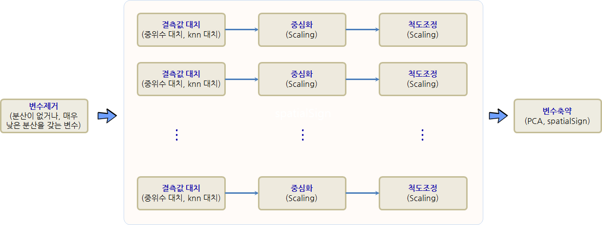

 
> ## 학습목표 {.objectives}
>
> * 예측모형을 위한 데이터 전처리 과정에 대해 이해한다.
> * 데이터 전처리가 필요한 이유를 살펴본다.
> * 예측모형 개발을 위한 데이터 전처리 파이프라인을 실습한다.

### 1. 예측모형을 위한 데이터 전처리 과정

예측모형 개발 과정에 빠지지 않고 등장하는 것이 데이터 전처리(Data Preprocessing) 과정이다.
`readr` 등을 통해 데이터를 R이나 모형개발 환경을 가져오게 되면 `tidy` 깔끔화과정을 거치게 되는데,
데이터를 가져온 다음 혹은 깔끔화 과정이 완료된 후에 **데이터 전처리(Data Preprocessing)** 과정을 수행한다.

각 변수별 전처리 과정을 살펴보면, 결측값 대체를 통해 빠진 결측값을 채워넣는 과정과 중심화와 척도조정을 통해 
통계모형에 예측력을 향상시키기 위한 과정이 필요하다.

또한, 분산이 없거나 매우 낮은 분산을 갖는 변수를 제거하고 변수간 상관관계가 높은 변수를 추출하는 과정도 변수간 전처리 과정에 포함된다.

- 분산이 없거나, 매우 낮은 분산을 갖는 변수 제거
    - 결측값 대체: 중위수 대체법, knn 대체
    - 중심화(Centering)
    - 척도조정(Scaling) 
- 분산이 낮거나 상관변수를 추출: PCA

### 2. 예측모형 개발 전 데이터 전처리 과정이 필요한 이유 

예측모형 대부분은 숫자만을 입력값으로 받아야 하는데, 결측값이 입력값으로 전달되는 경우 이를 처리할 수 없다. 
이런 문제를 해결하기 위해 결측값을 제거하는데 이런 경우 데이터에 편향이 발생하여 모형신뢰성이 떨어진다.

#### 2.1. 결측값 대체 

데이터에 결측값이 존재하는 경우 결측값이 **임의결측(Missing at Random, MAR)**인 경우 중위수 대체법(Median Imputation)을 사용하고,
그렇지 않은 경우, 근처 값을 결측점에 채워넣는 knn 대체법(knn Imputation)을 사용한다.

### 3. 결측값 대체 사례 [^Boston]

[^Boston]: Harrison, D. and Rubinfeld, D.L. (1978) Hedonic prices and the demand for clean air. J. Environ. Economics and Management 5, 81–102.

회귀분석 사례로 많이 사용되는 보스터 집값 사례를 살펴보자. 데이터를 불러와서 `glimpse`, `summary` 함수로 일별한다.

~~~{.r}
##==========================================================================================
## 00. 환경설정
##==========================================================================================
# Classification and Regression Training 팩키지
# install.packages("caret")
suppressWarnings(suppressMessages(library(caret)))
suppressWarnings(suppressMessages(library(dplyr)))

##==========================================================================================
## 01. 데이터 가져오기
##==========================================================================================
# 보스톤 주택가격
# install.packages("mlbench")
suppressWarnings(suppressMessages(library(mlbench)))
data("BostonHousing")

# 데이터 살펴보기
glimpse(BostonHousing)
~~~

~~~{.output}
Observations: 506
Variables: 14
$ crim    <dbl> 0.00632, 0.02731, 0.02729, 0.03237, 0.06905, 0.02985, ...
$ zn      <dbl> 18.0, 0.0, 0.0, 0.0, 0.0, 0.0, 12.5, 12.5, 12.5, 12.5,...
$ indus   <dbl> 2.31, 7.07, 7.07, 2.18, 2.18, 2.18, 7.87, 7.87, 7.87, ...
$ chas    <fctr> 0, 0, 0, 0, 0, 0, 0, 0, 0, 0, 0, 0, 0, 0, 0, 0, 0, 0,...
$ nox     <dbl> 0.538, 0.469, 0.469, 0.458, 0.458, 0.458, 0.524, 0.524...
$ rm      <dbl> 6.575, 6.421, 7.185, 6.998, 7.147, 6.430, 6.012, 6.172...
$ age     <dbl> 65.2, 78.9, 61.1, 45.8, 54.2, 58.7, 66.6, 96.1, 100.0,...
$ dis     <dbl> 4.0900, 4.9671, 4.9671, 6.0622, 6.0622, 6.0622, 5.5605...
$ rad     <dbl> 1, 2, 2, 3, 3, 3, 5, 5, 5, 5, 5, 5, 5, 4, 4, 4, 4, 4, ...
$ tax     <dbl> 296, 242, 242, 222, 222, 222, 311, 311, 311, 311, 311,...
$ ptratio <dbl> 15.3, 17.8, 17.8, 18.7, 18.7, 18.7, 15.2, 15.2, 15.2, ...
$ b       <dbl> 396.90, 396.90, 392.83, 394.63, 396.90, 394.12, 395.60...
$ lstat   <dbl> 4.98, 9.14, 4.03, 2.94, 5.33, 5.21, 12.43, 19.15, 29.9...
$ medv    <dbl> 24.0, 21.6, 34.7, 33.4, 36.2, 28.7, 22.9, 27.1, 16.5, ...

~~~

~~~{.r}
summary(BostonHousing)
~~~

~~~{.output}
      crim                zn             indus       chas   
 Min.   : 0.00632   Min.   :  0.00   Min.   : 0.46   0:471  
 1st Qu.: 0.08204   1st Qu.:  0.00   1st Qu.: 5.19   1: 35  
 Median : 0.25651   Median :  0.00   Median : 9.69          
 Mean   : 3.61352   Mean   : 11.36   Mean   :11.14          
 3rd Qu.: 3.67708   3rd Qu.: 12.50   3rd Qu.:18.10          
 Max.   :88.97620   Max.   :100.00   Max.   :27.74          
      nox               rm             age              dis        
 Min.   :0.3850   Min.   :3.561   Min.   :  2.90   Min.   : 1.130  
 1st Qu.:0.4490   1st Qu.:5.886   1st Qu.: 45.02   1st Qu.: 2.100  
 Median :0.5380   Median :6.208   Median : 77.50   Median : 3.207  
 Mean   :0.5547   Mean   :6.285   Mean   : 68.57   Mean   : 3.795  
 3rd Qu.:0.6240   3rd Qu.:6.623   3rd Qu.: 94.08   3rd Qu.: 5.188  
 Max.   :0.8710   Max.   :8.780   Max.   :100.00   Max.   :12.127  
      rad              tax           ptratio            b         
 Min.   : 1.000   Min.   :187.0   Min.   :12.60   Min.   :  0.32  
 1st Qu.: 4.000   1st Qu.:279.0   1st Qu.:17.40   1st Qu.:375.38  
 Median : 5.000   Median :330.0   Median :19.05   Median :391.44  
 Mean   : 9.549   Mean   :408.2   Mean   :18.46   Mean   :356.67  
 3rd Qu.:24.000   3rd Qu.:666.0   3rd Qu.:20.20   3rd Qu.:396.23  
 Max.   :24.000   Max.   :711.0   Max.   :22.00   Max.   :396.90  
     lstat            medv      
 Min.   : 1.73   Min.   : 5.00  
 1st Qu.: 6.95   1st Qu.:17.02  
 Median :11.36   Median :21.20  
 Mean   :12.65   Mean   :22.53  
 3rd Qu.:16.95   3rd Qu.:25.00  
 Max.   :37.97   Max.   :50.00  

~~~

#### 3.1. 임의 결측값 대체 전략 - 중위수 대체

`sample` 함수를 사용해서 임의 결측값을 생성하여 `crim` 변수에 10개 넣는다. `caret` 팩키지 
`train` 함수를 사용해서 randomForest 모형을 적합시킨다. 하지만 결측값이 학습시킬 데이터에 포함되어 더이상
학습이 되지 않고 오류가 나오게 된다.

`preProcess = "medianImpute"` 인자를 `train` 함수에 넣어 중위수 대체를 하게 되면 결측값에 따른 문제가 해소된다.

~~~{.r}
##==========================================================================================
## 02. 데이터 전처리
##==========================================================================================

#-------------------------------------------------------------------------------------------
# 02.01. 중위수 대체
#-------------------------------------------------------------------------------------------
# 임의 결측값 채워넣기
suppressWarnings(suppressMessages(library(randomForest)))
set.seed(777)
BostonHousing[sample(1:nrow(BostonHousing), 10), "crim"] <- NA
# 예측모형: 설명변수와 종속변수 분리
Y <- BostonHousing$medv
X <- BostonHousing[, 1:5]
# caret 예측모형 적합
model <- train(x = X, y = Y, method="rf")
~~~

~~~{.output}
Something is wrong; all the RMSE metric values are missing:
      RMSE        Rsquared  
 Min.   : NA   Min.   : NA  
 1st Qu.: NA   1st Qu.: NA  
 Median : NA   Median : NA  
 Mean   :NaN   Mean   :NaN  
 3rd Qu.: NA   3rd Qu.: NA  
 Max.   : NA   Max.   : NA  
 NA's   :3     NA's   :3    

~~~

~~~{.output}
Error in train.default(x = X, y = Y, method = "rf"): Stopping

~~~

~~~{.r}
  # Something is wrong; all the RMSE metric values are missing:
  #   RMSE        Rsquared  
  # Min.   : NA   Min.   : NA  
  # 1st Qu.: NA   1st Qu.: NA  
  # Median : NA   Median : NA  
  # Mean   :NaN   Mean   :NaN  
  # 3rd Qu.: NA   3rd Qu.: NA  
  # Max.   : NA   Max.   : NA  
  # NA's   :3     NA's   :3    
  # Error in train.default(x = X, y = Y, method = "rf") : Stopping
  # In addition: There were 50 or more warnings (use warnings() to see the first 50)

# 해결책 : 중위수 대체
model <- caret::train(x = X, y = Y, method="rf", preProcess = "medianImpute")
model
~~~

~~~{.output}
Random Forest 

506 samples
  5 predictor

Pre-processing: median imputation (4), ignore (1) 
Resampling: Bootstrapped (25 reps) 
Summary of sample sizes: 506, 506, 506, 506, 506, 506, ... 
Resampling results across tuning parameters:

  mtry  RMSE      Rsquared 
  2     6.241130  0.5666617
  3     6.303959  0.5586426
  5     6.536000  0.5299183

RMSE was used to select the optimal model using  the smallest value.
The final value used for the model was mtry = 2. 

~~~

#### 3.2. 임의 랜덤이 아닌 결측값 - knn 대체

데이터에 결측값이 랜덤으로 임의적으로 만들어진 것이 아닌 경우, 예를 들어 법죄가 0.5 이상인 경우 모드 결측값이 된 경우가 존재한다.
이런 경우 `preProcess = "knnImpute"` 인자는 다른 설명변수를 이용하여 결측값을 추정하여 채워넣게 된다. RMSE 값을 비교하면 더 향상된 것(RMSE 오차가 축소)이 확인된다.

~~~{.r}
#-------------------------------------------------------------------------------------------
# 02.02. knn 대체 : 결측값이 임의가 아님
#-------------------------------------------------------------------------------------------
# 범죄가 0.5 이상 결측값 채워넣기
set.seed(777) 
data("BostonHousing")
BostonHousing[BostonHousing$crim > 0.5, "crim"] <- NA
# 예측모형: 설명변수와 종속변수 분리
Y <- BostonHousing$medv
X <- BostonHousing[, c(1:3,5)]

model_median <- caret::train(x = X, y = Y, method = "glm", preProcess = "medianImpute")
print(min(model_median$results$RMSE))
~~~

~~~{.output}
[1] 8.250787

~~~

~~~{.r}
# install.packages("RANN")
model_knn <- caret::train(x = X, y = Y, method = "glm", preProcess = "knnImpute")
print(min(model_knn$results$RMSE))
~~~

~~~{.output}
[1] 7.775939

~~~

### 4. 변수 전처리 파이프라인

각 변수별로 결측값이 존재하는 경우 중위수 대체와 knn 대체 방법을 통해 가능하면 많은 변수를 모형에 활용할 수 있다.
결측값 처리 외에도 중심화, 척도조정 등 일련의 전처리 과정을 통해 예측모형 성능을 개선시켜 나간다.

이와 같은 결측값 처리, 중심화, 척도조정 작업이 `caret` 팩키지 `preProcess` 인자를 순차적으로 연결하여 자동화한다.
이런 경우 작업 순서가 매우 중요하다. 

1. 분산이 없거나, 매우 낮은 분산을 갖는 변수 제거 &rarr; `zv`, `nzv` 
1. 결측값 대체, 중위수 대체법, knn 대체 &rarr; `medianImpute`, `knnImpute`
1. 중심화(Centering) &rarr; `center`
1. 척도조정(Scaling) &rarr; `scale`
1. 분산이 낮거나 상관변수를 추출, PCA &rarr; `pca`, `spatialSign`

임의 결측값을 보스턴집값 데이터셋에 10개 넣은 후에 중위수 대체만 적용시켜 전처리하여 예측모형에 적합시킨 결과,
중위수 대체+중심화+척도조정 전처리하여 예측모형에 적합시킨 결과,
중위수 대체+중심화+척도조정+PCA 전처리하여 예측모형에 적합시킨 결과 RMSE 값을 비교하여 가장 적합한 전처리 방법을 
선정한다.

~~~{.r}
##==========================================================================================
## 03. 데이터 전처리 파이프라인
##==========================================================================================

#-------------------------------------------------------------------------------------------
# 03.01. 전처리 파이프라인
#-------------------------------------------------------------------------------------------
# 임의 결측값 채워넣기
set.seed(777)
data("BostonHousing")
BostonHousing[sample(1:nrow(BostonHousing), 10), "crim"] <- NA
# 예측모형: 설명변수와 종속변수 분리
Y <- BostonHousing$medv
X <- BostonHousing[, 1:13]

# caret 예측모형 적합: 기준
model <- train(x = X, y = Y, method="glm", preProcess = c("medianImpute"))
print(min(model$results$RMSE))
~~~

~~~{.output}
[1] 4.957745

~~~

~~~{.r}
# caret 예측모형 적합: 전처리 기본 파이프라인 적용
model <- train(x = X, y = Y, method="glm", preProcess = c("medianImpute", "center", "scale"))
print(min(model$results$RMSE))
~~~

~~~{.output}
[1] 4.919155

~~~

~~~{.r}
# caret 예측모형 적합: 전처리 전체 파이프라인 적용(PCA)
model <- train(x = X, y = Y, method="glm", preProcess = c("medianImpute", "center", "scale", "pca"))
print(min(model$results$RMSE))
~~~

~~~{.output}
[1] 5.395042

~~~

~~~{.r}
# caret 예측모형 적합: 전처리 전체 파이프라인 적용(PCA)
model <- train(x = X, y = Y, method="glm", preProcess = c("medianImpute", "center", "scale", "spatialSign"))
print(min(model$results$RMSE))
~~~

~~~{.output}
[1] 5.535754

~~~

### 5. 변수 제거와 중복 변수 제거

일부 변수에 정보가 없거나 매우 낮은 경우가 있다. 이를 기반으로 예측모형을 개발할 경우 쓸모 없는 변수가
예측모형에 포함되어 기대하지 않은 많은 문제가 야기된다.

- 상수 변수: 분산이 `0` 으로 변수의 모든 값이 동일.
- 거의 상수 변수: 분산이 매우 작아 변수의 모든 값이 특정 값에 몰려있는 경우.

`"zv"`, `"nzv"` 값을 `preProcess` 인자로 넣는 경우 상수 변수와 거의 상수 변수를 처리할 수 있다.

- `"zv"` : 상수 변수 제거
- `"nzv"` : 거의 상수 변수 제거 

#### 5.1. 상수 변수 제거

`X$variance_zero <- 7` 명령어로 임의로 상수 변수를 생성시킨다. `glm` 모형을 적합시키면 오류가 생성된다.
`preProcess`에서 `"zv"` 인자를 넣어 분산이 0 인 변수를 전처리하여 제거한 후 예측모형을 개발하면 
모형적합이 제대로 됨이 확인된다.

~~~{.r}
##==========================================================================================
## 05. 변수 전처리 - 변수제거와 차원축소
##==========================================================================================

#-------------------------------------------------------------------------------------------
# 05.01. 상수 변수: 분산이 0
#-------------------------------------------------------------------------------------------
# 임의 결측값 채워넣기
set.seed(777)
data("BostonHousing")
BostonHousing[sample(1:nrow(BostonHousing), 10), "crim"] <- NA
# 예측모형: 설명변수와 종속변수 분리
Y <- BostonHousing$medv
X <- BostonHousing[, 1:13]
# 상수값으로만 구성된 변수 추가
X$variance_zero <- 7

## 모형적합
model <- train(x = X, y = Y, method="glm", preProcess = c("medianImpute", "center", "scale", "pca"))
~~~

~~~{.output}
Something is wrong; all the RMSE metric values are missing:
      RMSE        Rsquared  
 Min.   : NA   Min.   : NA  
 1st Qu.: NA   1st Qu.: NA  
 Median : NA   Median : NA  
 Mean   :NaN   Mean   :NaN  
 3rd Qu.: NA   3rd Qu.: NA  
 Max.   : NA   Max.   : NA  
 NA's   :1     NA's   :1    

~~~

~~~{.output}
Error in train.default(x = X, y = Y, method = "glm", preProcess = c("medianImpute", : Stopping

~~~

~~~{.r}
## 모형적합: 상수 변수 제거
model <- train(x = X, y = Y, method="glm", preProcess = c("zv", "medianImpute", "center", "scale", "pca"))
print(min(model$results$RMSE))
~~~

~~~{.output}
[1] 5.24353

~~~

#### 5.2. 거의 상수 변수 제거

`"zv"` 인자 대신에 `"nzv"` 인자를 넣어도 좋지만, 명시적으로 `nearZeroVar()` 함수로 
거의 상수 변수를 추출하여 이를 예측변수에 넣어 예측모형을 개발한다. 

~~~{.r}
#-------------------------------------------------------------------------------------------
# 05.02. 거의 상수 변수: 분산이 거의 0에 가까움
#-------------------------------------------------------------------------------------------
# 임의 결측값 채워넣기
set.seed(777)
data("BostonHousing")
BostonHousing[sample(1:nrow(BostonHousing), 10), "crim"] <- NA
# 예측모형: 설명변수와 종속변수 분리
Y <- BostonHousing$medv
X <- BostonHousing[, 1:13]

## 거의 상수 변수 정의: freqCut
remove <- nearZeroVar(X, freqCut = 20/5, saveMetrics=TRUE)

X_small <- X[ , setdiff(names(X), remove)]

## 모형적합: 상수 변수 제거
model <- train(x = X_small, y = Y, method="glm", preProcess = c("medianImpute", "center", "scale", "pca"))
print(min(model$results$RMSE))
~~~

~~~{.output}
[1] 5.228813

~~~

#### 5.3. 중복변수 제거

주성분 분석(Principal Component Analysis, PCA)을 통해 서로 상관관계가 높은 변수를 제거하여 
다공선성(Collinearity) 문제를 해결하여 예측모형의 안정성을 높인다. `preProcess = c("pca")` 를 넣어주면 
변수간에 상관관계가 높은 문제에 대한 전처리를 수행하게 된다.

~~~{.r}
#-------------------------------------------------------------------------------------------
# 05.03. 중복변수 제거: PCA
#-------------------------------------------------------------------------------------------
# 임의 결측값 채워넣기
set.seed(777)
data("BostonHousing")
BostonHousing[sample(1:nrow(BostonHousing), 10), "crim"] <- NA
# 예측모형: 설명변수와 종속변수 분리
Y <- BostonHousing$medv
X <- BostonHousing[, 1:13]

## 모형적합: 상수 변수 제거
model <- train(x = X, y = Y, method="glm", preProcess = c("medianImpute", "center", "scale", "pca"))
print(min(model$results$RMSE))
~~~

~~~{.output}
[1] 5.228813

~~~
