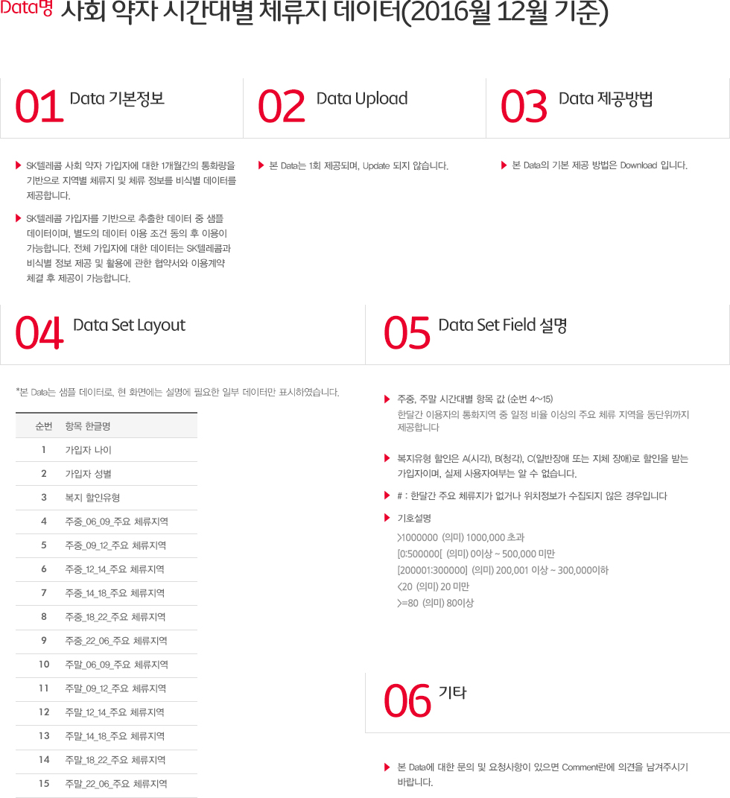

# Person with handicapped in Seoul (SKT data)

## Place they went on each times  Weekdays, Weekends
 - Gu, Dong (구, 동)

## Type
 - A(Seeing)
 - B(Hearing)
 - C(General & Body)

## Value of data
 - '#' : no place or no data

