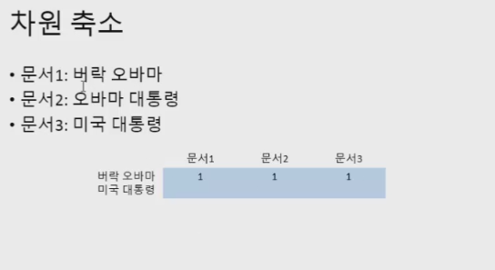
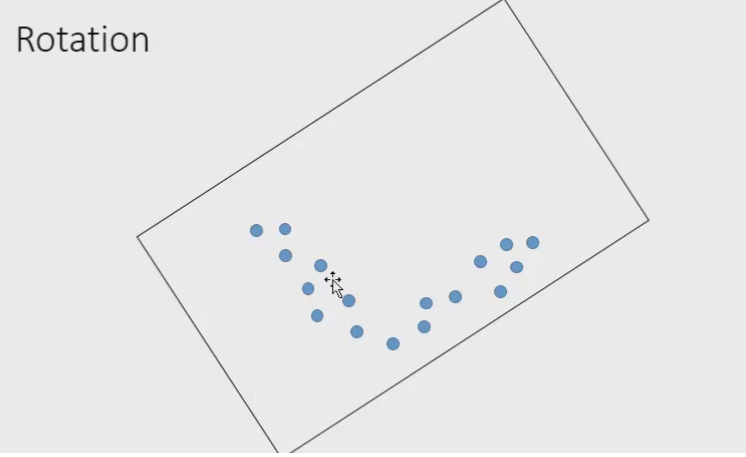

```{r}
knitr::opts_chunk$set(echo=TRUE,message =TRUE)
```

### LSA (Latent Semantic Analysis)
- Latent : 잠재된
- 잠재 의미 분석.
- 심리학자들이 만든 기법.
- 잠재변수(latent variable)
- 종교 시설이 많은 도시가 범죄도 많다.
<ul>
  <li>가설 1 : 종교 -> 범죄 (난 종교를 믿으니깐 천국가겠지 범죄를 저지르더라도.)</li>
  <li>가설 2 : 범죄 -> 종교 (범죄가 많으니깐 불안해서 종교시설을 찾는다.)</li>
  <li>(제 3 의 변수) -> 종교, 범죄 둘다 영향을 준다. 관찰된적이 없다.</li>
  <li>예) 인구(도시가 커진다)</li>
</ul>
- 의미 -> 단어 

### 차원축소 
 - 분산되어있는 점들을 1차원의 (직선)으로 내릴 수가 있다. 
 - 분산된 점들이 정보를 잃어버렸다. => 조금 
 - 직선에 포함되게 되면 점을 표현하려면 숫자가 2개가 필요했던게 1개만 있으면 된다. 
 
<div>
  
</div> 
<div>

</div> 

### 차원 축소 이유 
  - 차원을 줄이더라도 가장 정보가 적게 소실 되는 방향으로 줄인다.
  <ul>
  <li>문서들이 단어가 아닌 의미상으로 재배치 </li>
  <li>동음이의어, 오탈자 등이 (어느정도) 처리됨</li>
  <li>문서에 존재하는 noise가 줄어 더 잘 분류하게 됨.</li>
  </ul>

```{r, warning=FALSE}
library(tm)
library(slam)
library(lsa)

news = read.csv('News-article-wikipedia-DFE.csv', stringsAsFactors = F)
tdm = TermDocumentMatrix(Corpus(VectorSource(news$newdescp)),
                         control = list(removeNumbers = T,
                                        removePunctuation = T,
                                        stopwords = T))

word.count = as.array(rollup(tdm, 2))
word.order = order(word.count, decreasing = T)
freq.word = word.order[1:30]
```
```{r, warning=FALSE}
row.names(tdm[freq.word,])[1:30] # 이걸 통해서는 무슨 말을 하는지 알 수가 없다.
```
```{r}
gc() # garbage collection

news.lsa = lsa(tdm,30) # 메모리 부족으로 에러가 날것이다.

```

 - 단어수가 빈도가 높은것으로 구성해서 하면된다.
 - lsa와 다르게 쓸모없는 단어수가 줄어든것이다.
 - 첫번째 차원이 어떤단어와 관계가 있는가. 
 - 이 차원에서 +가 될수록 단어가 문서에서 얼마나 증가 또는 감소 하는가? 
```{r}
freq.word = word.order[1:1000]
news.lsa = lsa(tdm[freq.word,],30)
# news.lsa # 각 차원이 어떠한 값을 가지고 있는지 나옴.
news.lsa$tk[,1][1:10]
```
 - 1차원이 +가 될수록 said는 -0.65만큼 줄어든다. 
```{r}
importance <- order(abs(news.lsa$tk[,1]),decreasing = T)
news.lsa$tk[importance[1:10],1]
```
```{r}
for(i in 1:10){
  importance <- order(abs(news.lsa$tk[,i]),decreasing = T)
  print(i)
  print(news.lsa$tk[importance[1:10],i])
}
```
### Rotation(회전)
 - 통계의 PCA 랑 LSA가 같은 방법이라 그렇다.
 - 단어들이 대각선으로 갈라져 나가는데 축소된 차원은 갈라진방향과 상관없이 나타난다.
 - LSA의 경우 어떠한 방법을 해도 비슷하다. varimax가 간편하다.

 <div>
  
</div> 
<div>

</div> 

```{r}
library(GPArotation)
tk = Varimax(news.lsa$tk)$loadings
tk
```
- 30차원 중 10차원만 보기.
```{r}
for(i in 1:10){
  print(i)
  importance = order(abs(tk[,i]), decreasing = T)
  print(tk[importance[1:10], i])
}
```


