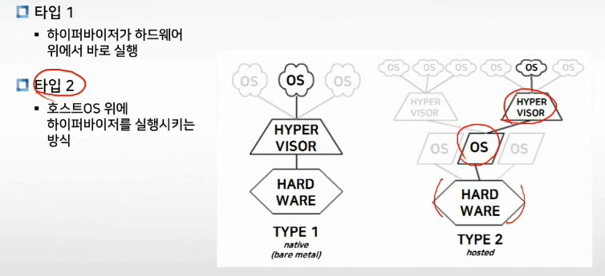
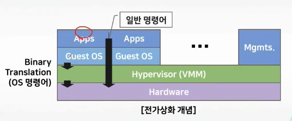
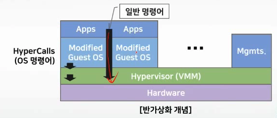

# 가상화기술의 개념(하이퍼바이저, 전/반가상화)

- 하이퍼바이저 기반 가상화의 특징
- 전가상화와 반가상화
- 하이퍼바이저의 종류

## 1. 하이퍼바이저 기반 가상화

### 기본개념

- 하이퍼바이저
  - 호스트시스템에서 다수의 게스트OS를 돌리기 위한 플랫폼 (윈도우에 리눅스를 설치하기 위해 VM, Virtualbox 등)
- 호스트 OS
  - 물리시스템에 설치된 OS
- 게스트 OS
  - 가상머신 / 컨테이너 위에 설치된 OS

### 하이퍼바이저 유형

- 타입 1 : OS와 하이퍼바이저가 통합 됐다고 생각하면 된다.

### 하이퍼바이저 기반 가상화의 특징

- 시스템 가상화로 인해 다양한 게스트 OS를 실행할 수 있음.
- 물리시스템과 게스트 OS간의 가상화 기능으로 인한 성능 저하
  - 약 10~15% 정도의 오버헤드
  - 호스트 OS와 게스트 OS 간의 기능 중복(스케줄링 등)
    - OS가 둘다 OS로 판단하고 게스트 OS의 경우 자신이 하드웨어 위에서 직접 돌아가는 OS로 판단하여 기능 하락이 일어난다.

# 2. 전가상화와 반가상화

### 전가상화 (Full Virtualization)

- 하드웨어를 완전히 가상화
- OS의 제약 없이 사용할 수 있음
- 게스트 OS는 자신이 가상머신 위에서 작동하고 있는 것 (인식 불가)
- 시스템에 물리적인 가상화 기능 필요(인텔 - VT-x, AMD-v)
- 게스트 OS에서 물리자원 직접 접근 불가
  - 반드시 하이퍼바이저를 통해 접근해야함 - 성능 저하

### 반가상화(Para Virtualization)

- 게스트 OS가 자신이 가상머신 위에서 동작하고 있다는 것을 인식
- OS 제약이 없음
  - OS의 제약, 커널을 수정해야 함(주로 리눅스만 됨)
- 게스트 OS에서 물리자원 직접 접근 가능 (Passthrough)
  - 성능 개선
- **바이너리 변환 (Binary Translation)**
- **HVM(Hardward Virtual Machine)**

# 3. 하이퍼바이저의 종류

### VMWard

- 대표적인 상용 하이퍼바이저
- ESXi (type1) / Workstation (type2) / Workstation Player

### MS Hyper-V

- 윈도우서버에 통합

### Ctrix Xen(오픈소스)

- 최초의 반가상화 하이퍼바이저
- 오픈소스

### KVM(오픈소스) : OpenStack (클라우드를 구축할 수 있는 Opensource)

- 하이퍼바이저를 커널의 서브모듈로 제공 (OS의 커널 부분에 넣어 통합형이라고 볼 수 있다)

### 패러랠즈(Paraellels)

- OSX 기반의 하이퍼바이저

### 오라클 버추얼박스(Oracle Virtualbox)

- 오라클(구 썬마이크로시스템즈)에서 만든 GPL 기반의 하피어바이저
- GPL (GPL License) - Open-source