# 컨테이너 기반 가상화 : 도커의 설치 및 활용

- 설치와 사용법을 학습

## 1. 도커 설치

- http://docker.com 
- 요구사항
  - 윈도우 64비트 버전이상
  - 도커 툴박스(윈도우 8.1 이하) / 도커 머신(윈도우 10 이상)
  - Boot2Docker vs Docker Machine 의 차이
- 도커 이미지는 OS의 파일시스템에 저장되는 것이 아니라 AUFS 자체 파일 시스템에 저장된다.

### Docker Tool box vs Docker Machine 

- Boot2docker (deprecated)
  - Tiny Core linux 기반의 경량 리눅스 배포판 사용
  - 내부적으로 버추얼박스 지원
- Docker Machine(new)
  - 가상호스트에 도커엔진을 설치하는 툴
  - 버추얼박스, VMware 지원

### 도커기반 우분투 설치

- 도커 이미지 검색(기본이 최신버전)
  - docker search ubuntu
- 우분투 이미지 다운로드
  - docker pull ubuntu
- 이미지 리스트 출력
  - docker images
- 컨테이너 생성
  - docker run —name=ubuntu ubuntu
- 컨테이너 접속
  - docker attach ubuntu
  - docker exec -it ubuntu bash
- 컨테이너 탈출
  - exit or Control-P-Q(컨테이너를 정지하지 않고 나옴)

## 2. 도커 사용법

- 도커 컨테이너 리스트
  - docker ps -a : 전체 나온다.
- 도커 컨테이너 정지 
  - docker stop ubuntu
- 재시작
  -  docker restart ubuntu
- 삭제
  - docker rm ubuntu : stop 이후 삭제 
  - docker rm -f ubuntu : 강제 삭제
  - docker kill ubuntu 
- 이미지 삭제
  - docker rmi ubuntu

### 명령어

---

- 이미지 파일 생성
  - docker save -o ubuntu_img.tar ubuntu
- 이미지 압축/해제
  - gzip ubuntu_img.tar /bzip2 ubuntu_img.tar : 압축
  - gzip -d ubuntu_img.tar.gz / bzip2 -d ubuntu_img.tar.gz2
- 이미지 삭제 
  - docker rmi ubuntu
- 파일에서 이미지 로드
  - docker load -i ubuntu_img.tar
  - docker images
    - 이미지 확인
- 이미지 태그 지정
  - docker tag 이미지ID ubuntu

### 컨테이너의 IP 주소 알아내기

- 일반 우분투 : ifconfig
- 도커의 컨테이너에서는 
  - docker inspect ubuntu | grep "IPAddress"

### Docker run options

- p(publish) : 포트 노출
- i(interactive) : 포준입력 열어두기
- t(tty) : 터미널 인터페이스
- d(detach)/ -- detach : 서버형 실행
- v(volume) : 호스트 디렉토리 연결
- w(workdir) : 작업디렉토리 설정
- l(link) /--link : 컨테이너 연결
- search(검색) ubuntu
- pull(다운로드) 
- run(이미지->컨테이너생성), exec(컨테이너 쉘명령어 수행)
- ps(프로세스 리스트) / attach(접속)
- stop/restart/kill/rm(컨테이너 삭제)/pause/unpause
- images(이미지리스트)/rmi(이미지삭제)
- commit(컨테이너 -> 이미지 생성)
- history(이미지 변경 내역)
- diff(이미지와 컨테이너 사이의 변경 내역 조회)
- inspect(컨테이너/이미지의 세부정보 조회)
- tag(이미지 새로운 태그 지정)

## 실습

- docker.com에서 운영체제에 맞는 docker를 다운받고 실행.
  - 맥이므로 docker for mac을 설치 하였음.
- 이미지 검색

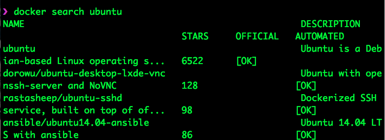

- 이미지 다운 : 버젼설정은 : 을 통해서 할 수 있다.

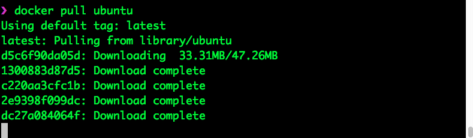

- 이미지 확인 : 사이즈 120MB -> 코어부분만 가지고 왔다고 보면 된다. 
  - nano와 같은 라이브러리가 없다. 추가가 필요하다.

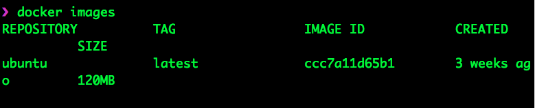

- 컨테이너 띄우기 
  - docker run -it —name=ubuntu_server ubuntu
  - 접속까지 된 상태

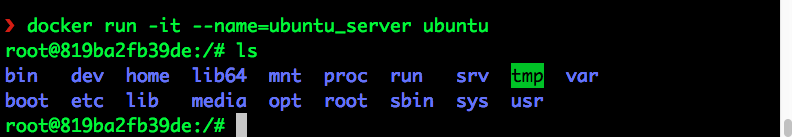

- Control + P + Q

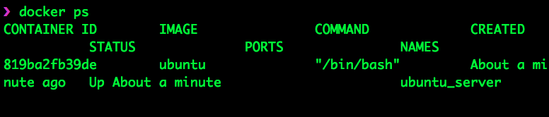

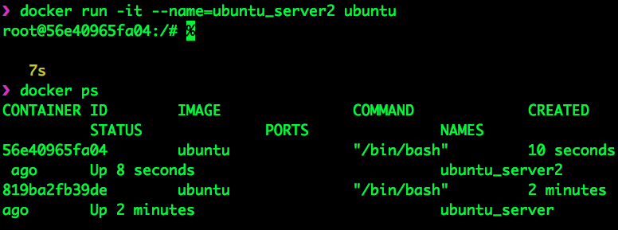

- 2개의 컨테이너를 띄워봤다.
- 접속 
  - docker exec -it ubuntu_server bash

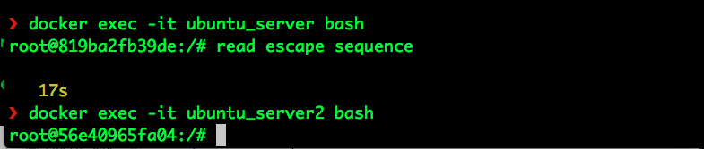

- 종료 
  - docker stop tag_name

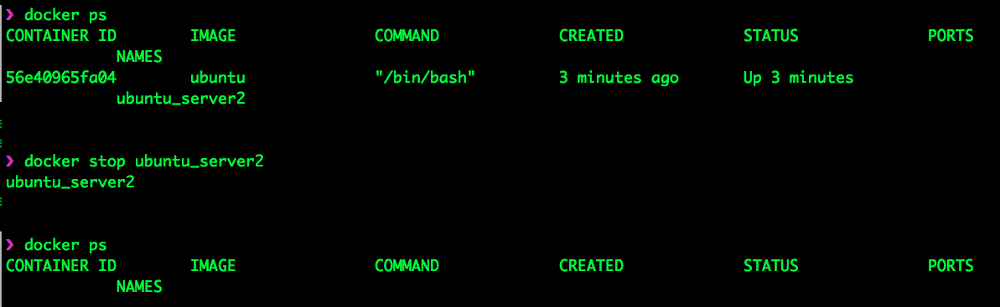

- 삭제 
  - docker rmi name
  - 베이스 되는 이미지를 사용하는 컨테이너가 있다.
  - docker ps -a 를 통해 docker rm -f name을 해서 kill 해준다 이후 rmi 수행

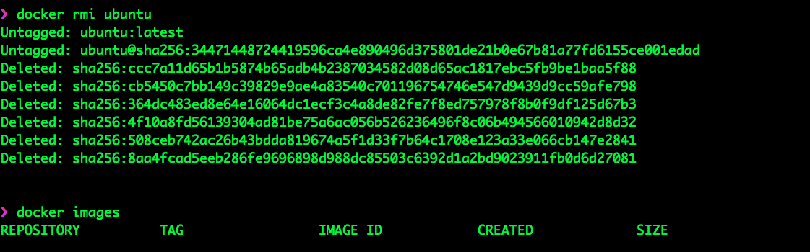

- 다운받은 이미지 자체 파일시스템에 저장.

  - docker pull ubuntu

  - docker save -o ubuntu_img.tar ubuntu
    

  - 이후 rmi 를 통해 이미지를 삭제.

  - 다시 로딩 

    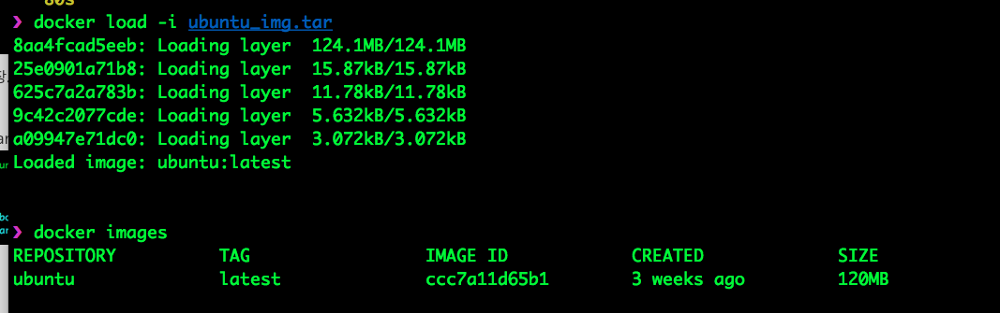

  - alias를 통해 리스트에 추가 (동일한) - 동일한 이미지ID 이기 때문에 동일한 것이다.

    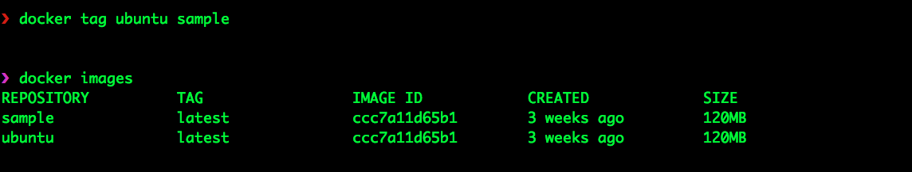

- IP 주소 확인

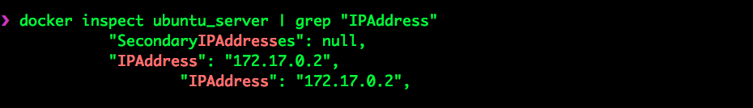

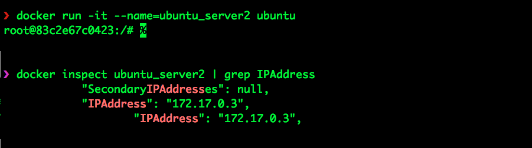

