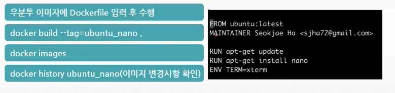

# 컨테이너기반 가상화와 자동화기술 : Dockerfile

- 커밋을 통한 이미지 생성
- Dockerfile 을 기반으로한 이미지 생성
- Dockerfile 상세


## 1. 커밋을 통한 이미지 생성 

### apt-get update & install

- 컨테이너에 접속한 상태에서 
  - apt-get update
  - 이 명령을 수행해야 apt-get install 명령어를 사용할 수 있다.
  - 바로 apt-get install 을 사용하면 에러발생
- 일반 우분투에서 기본 설치되어 있는 nano(기본 에디터)가 도커 기반 이미지에는 깔려있지 않음.
  - apt-get install nano
- 위의 작업을 다 수행한 이미지를 가지고 계속 Deployment 를 한다면 설치된 Ubuntu를 배포할 수 있다.


### 이미지 생성

-  도커 이미지 생성
  - 새로운 내용을 추가/변경 후 commit해 이미지 생성

```html
docker diff ubuntu(변경사항 확인) / Base와 Container와의 차이를 알려준다.
docker commit -m "test(메세지)" -a "dave(사용자명시)" ubuntu(기반) ubuntu_nano(생성 이미지)
docker images
```

- Apt-get update -> apt-get install nano

```html
docker commit -m 'add nano' -a dave ubuntu_server ubuntu_nano
docker diff ubuntu_server
```


## 2. 도커파일을 기반으로 한 이미지 생성

- 도커 이미지 생성방법
  - Dockerfile을 수행시켜 새로운 이미지 생성(build)



- Commit 의 경우 띄워놓은 이미지에 변경을 하고 Save 한다고 생각하면 된다.
  - 변경사항을 알고 싶을 경우 : diff
- Dockerfile의 경우 새로 이미지가 만들어진다고 생각하면 된다.
  - 변경사항을 알고 싶을 경우 : history


## 3. Dockerfile 상세

- FROM
  - 도커 이미지 생성할 떄 사용할 기본 이미지 지정
  - 만약 해당 이미지가 없으면 서버 저장소에서 다운받는다.
- MAINTAINER
  - 이미지를 생성한 사람에 대한 기본 정보 표시
- RUN
  - FROM에서 지정한 기본 이미지 위에 명령 수행해 새로운 이미지 생성
    - 우분투 최신 패치 : RUN apt-get update
    - 우분투 wget 패키지 설치 : RUN apt-get install wget
- CMD
  - 컨테이너가 수행될 때 지정된 명령어/명령/스크립트 파일 실행
  - Dockerfile에서 한번만 가능
    - CMD ["echo $PATH"]
- ENYTYPOINT
  - CMD와 거의 같으나 컨테이너 생성(run)이나 시작(start)될 떄 실행
    - ENTRYPOINT ["/sample.sh"]

#### 환경변수 설정

- 일반적인 우분투의 경우
  - 홈디렉토리의 ~./bashrc 나 ./profile 에 지정
    - export sample=/sample
    - source ~/bashrc 또는 source ~/.profile로 환경변수에 반영
  - 도커에서는 자동실행하는 방법이 없다.
    - 환경변수를 지정하려면 
      - Docker run —env sample=/sample —name=ubuntu ubuntu
    - Dockerfile
      - ENV sample=/sample 
    - 환경변수 확인 
      - echo $sample


#### 포트 노출

- 컨테이너의 포트와 호스트의 포트를 연결
- 컨테이너의 80번 포트와 호스트의 80번 포트 연결
  - 외부에서 80번 포트로 접근하면 컨테이너의 80번 보트로 연결(포트포워딩)
  - docker run -p 80:80 —name=ubuntu ubuntu
- Dockerfile
  - expose 80
  - 컨테이너의 80번 포트를 외부에 노출한다
  - -p 옵션과 같이 사용.


#### 파일을 이미지에 추가

- 호스트의 파일을 이미지 생성시 추가(복사)
- Dockerfile
  - ADD ~/sample.txt /sample.txt
    - 호스트의 파일을 컨테이너에 추가
  - 압축파일을 지정할 경우 압축을 풀어서 추가(알아서)
  - URL을 지정할 경우 압축해제 없이 추가됨.


#### 명령 수행할 사용자 / 폴더 지정

- RUN/CMD/ENTRYPOINT 수행하기전 사용자 계정 지정
  - USER sample
    - Sample 사용자료 변경
- RUN/CMD/ENTRYPOINT 수행하기 전 폴더 지정
  - WORKDIR ~/sample 로 지정
    - ~/sample 폴더로 변경해 아래 명령을 수행하라.


#### 볼륨연결

- 컨테이너와 폴더와 호스트의 물리 폴더 간의 연결 : 연결하지 않고 이미지를 삭제 할 경우 데이터가 사라진다.
- 물리 폴더 ~[홈디렉토리]/Downloads를 컨테이너의 /download 폴더로 연결
  - docker run —name=ubuntu ubuntu-v ~/Downloads(물리):/download(컨테이너)
- Dockerfile
  - VOLUME /sample (단일)
  - VOLUME ["/data","/sample"] (여러 폴더)
  - 해당 디렉토리는 컨테이너 폴더가 아닌 호스트의 물리폴더로 저장하고 수행
  - -v 옵션과 같이 수행.


#### 도커 컨테이너간 연결

- 컨테이너간 상호연결 설정
- Mysql 다운로드
  - docker pull mysql
- Mysql 컨테이너 실행(서버모드)
  - docker run -d -e MYSQL_ROOT_PASSWORD=kitri —name=mysql mysql
  - mysql -uroot -p 가 수행되지 않는다(Client가 설치가 안되서)
    - pat-get install mysql-client 설치 
    - Mysql -h mysql -uroot -p
- 우분투 컨테이너 실행(연결)
  - docker run —name=ubuntu -d --link mysql:mysql ubuntu


