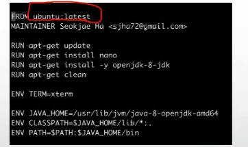
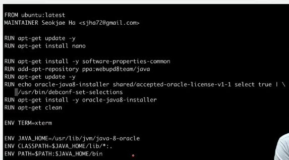
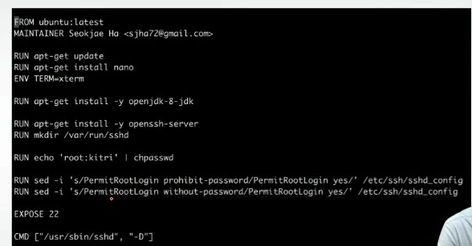

# 실전 도커 적용 실습

- Openjava, Oracle java, SSH, Mysql

## 1. 오픈자바설치(OpenJava)

- 일반적인 우분투 환경변수 설정
  - ~/.profile or ~/.bashrc 에 설정 source명령어로 반영
- 도커에서는 
  - Dockerfile에서 RUN/ENV 명령어로 설정
  - 다운 후 deb 파일을 삭제 하고 싶다면 apt-get clean을 수행.

## 2. Oracle Java 설치

-  공식적으로 Oracle 사이트에서는 Ubuntu 를 지원하지 않는다
- 써드파티에서 Repository를 만들어서 다운 받을 수 있다.
- docker build —tag=oracle_java . 

## 3. SSH(Secure Shell) 설치

- 일반적으로 openssh-server 설치
  - sudo apt-get install openssh-server
- 서버 실행 종료 
  - sudo service ssh start/restart/stop
  - /etc/init.d/ssh start/restart/stop
- 도커에서의 ssh 설정
  - 도커에서는 눅스의 service가 제대로 실행 안됨
  - 별도의 발식으로 제공해야 함
- root계정으로 원격접속하려면
  - /etc/ssh/sshd config 파일의 
    - -PermitRootLogin 설정을 prohibit-password/without-password 에서 yes로 설정
  - chpasswd를 통해 root의 비밀번호를 지정
    
  - SSH 비밀번호 지정(root/kitri)
  - EXPOSE 명령어를 사용해서 외부로 포트(22) 노출
  - CMD 명령을 사용하여 sshd 프로그램을 서버로 노출
    - 리눅스의 서비스(service)를 대체

## 4. Mysql 설치

#### 단독

- 다운로드
  - docker pull mysql
- 실행
  - docker run -e MYSQL_ROOT_PASSWORD=kitri -d --name=db mysql
- 컨테이너 접속
  - docker exec -it db bash
- mysql 접속
  - mysql -uroot -p

#### 링크

- 다운로드
  - docker pull mysql
- 실행
  - docker run -e MYSQL_ROOT_PASSWORD=kitri -d --name=db mysql
  - docker run --name=ubuntu --link=db:db ubuntu
- 컨테이너 접속
  - docker exec -it ubuntu bash
- Mysql 접속
  - apt-get install mysql-client (mysql 명령어를 사용하려면)
  - mysql -h db -uroot -p