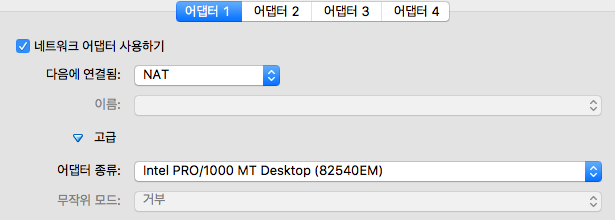
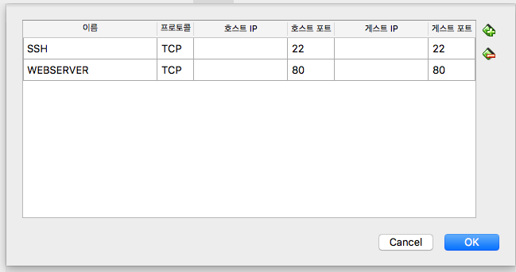
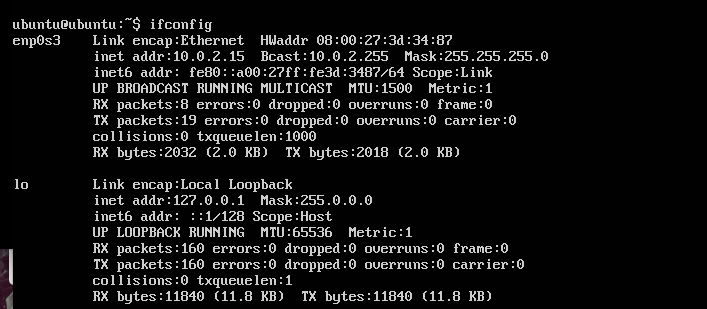
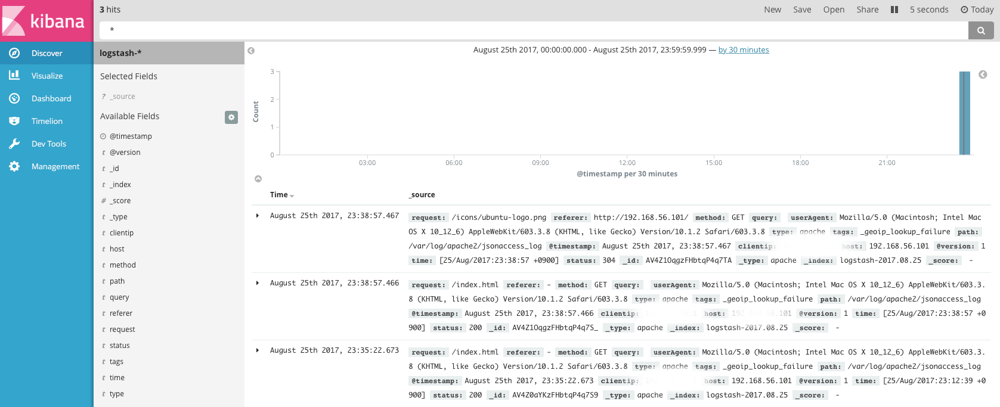

# ELK 설치

### (Elasticsearch, Logstash, Kibana)

회사에서 실시간 로그 관리 시스템 구축 프로토 타입으로 인해 설치를 수행하면서 적용했던 방법을 공유하고자 작성하였습니다.

- Apache web server -> Logstash -> Elasticsearch -> kibana

  

### ElasticSearch

------------

- JSON Format으로. RESTfull 방식의 분산 검색 엔진.
- Apache Lucene을 바탕으로 하고 있으며, 대량의 데이터보단 크지 않은 데이터를 보관하는 역방향 인덱싱 DB 시스템이라고 생각할 수 도 있다고 한다.

### Logstash

-------------

- 로그 수집기 
- Web apache server log file 또는 다양한 시스템의 LogFile을 수집하여 전송하는 수집기.

### Kibana

------------

- BI 툴
- Elasticsearch 위에서 ES에 저장된 데이터를 사용자에게 Dashboard 또는 다양한 시각화를 통해 전달해주는 솔루션.

### [실제 프로토타입 진행]

----------

- AWS EC2 : 2개 머신 (Ubuntu)
  - Webserver(t.micro)
    - Apache2
    - logstash-5.1.2
    - Java-8
  - log server (t.large (medium 으로 진행해도 무방할 듯))
    - Elasticsearch-5.1.2
    - Kibana-5.1.2
    - Java-8

### [설명 방법 : Virtualbox 를 활용하여 2개의 머신을 생성하여 진행 예정]

---------

- 이유는 AWS로 다시 하기 귀찮아서….. (돈도 조금 나가구요...)

- 우선 Ubuntu Machine 2개를 만들어주세요.

  - Ubuntu-16.04.3-server-amd64 를 사용하였습니다. (TZ 만 asia korea로 설정하였습니다.)

  - 네트워크

    - 1번 : NAT 
    - 2번 : host-only-networks

  - 1개 Machine 에 JAVA를 설치하고 복사를 하면 불편함을 덜 수 있습니다. 

  - VirtualMachine - Network 설정 

    

    

    

- 처음 로그인해서 보면 NAT 밖에 없는 경우가 있을 것이다. 그럴 경우 NETWORK 를 하나 더 생성 해줘야하는데 /etc/network/interface에 저는 Wifi를 이용해서 그런지 enp0s8 이 잡혀서 이걸 새로 dhcd 형태로 추가 하면 Host-only-network 용 카드가 잡히게 됩니다.

  

- sudo nano /etc/network/interface => sudo /etc/init.d/networking restart 수행 
  

  ​

- JAVA 8 설치 

  - sudo add-apt-repository ppa:webupd8team/java
  - sudo apt-get update
  - sudo apt-get install oracle-java8-installer
  - ~.profile 추가 : JAVA_HOME이 잘못될 경우 Logstash 실행에 오류가 발생한다…(많은 시간 소요… JAVA_HOME...)
    - export JAVA_HOME=/usr/lib/jvm/java-8-oracle 
    - export PATH=$PATH:$JAVA_HOME/bin 

- Mahcine 완전 복사.

### Webserver Setting [.102로 세팅]

------------

1. Apache2 설치 (재시작이 많은데 한번에 하셔도 됩니다.)

   - Sudo apt-get update

   - sudo apt-get install apache2

   - 각 파일별 위치 

     - index.html (홈디렉토리) : /var/www/html
     - Access_log : /var/log/apache2 내 access_log

   - Apache TZ이 Asia/Seoul이 아닐경우 

     - /etc/apache2/envvars 내 export TZ='Asia/Seoul' 추가 후 재시작 
     - /etc/init.d/apache2 restart

   - logfile 또는 Home directory를 변경하고 싶은 경우 

     - logfile 위치 
       - sudo nano /etc/apache2/sites-enabled/000-default.conf 파일 내에서 log위치를 변경하면된다.
     - Home_directory 위치 
       - sudo nano /etc/apache2/apache2.conf 파일 내 <Directory /var/www> 라는 부분을 해당 위치로 변경.
       - sudo nano /etc/apache2/sites-enabled/000-default.conf 파일 내 DocumentRoot /var/www/html 을 해당 위치로 변경.
     - 재시작 

   - Elasticsearch의 경우 JSON 형식으로 API를 사용하므로 log-format을 JSON으로 변경하여야 한다. 

     - Log-format 변경

       - sudo nano /etc/apache2/apache2.conf 내 log format이 있는 부분에 추가로 작성한다. 여러형태의 로그로 만들 수 있다.
       - LogFormat "{ \"time\":\"%t\", \"clientip\":\"%a\",\"host\":\"%V\", \"request\":\"%U\", \"query\":\"%q\", \"method\":\"%m\", \"status\":\"%>s\", \"userAgent\":\"%{User-agent}i\", \"referer\":\"%{Referer}i\" }" json_format   추가
       - sudo nano /etc/apache2/sites-enabled/000-default.conf 에 Customlog “jsonaccess_log” json_format 추가 

     - 재시작

     - apache가 제대로 되는지 작동 확인.

       - 192.168.56.101 브라우저 접속 

         

2. logstash-5.1.2 설치 

   1. wget <https://artifacts.elastic.co/downloads/logstash/logstash-5.1.2.tar.gz>
   2. Mkdir /logstash/conf, touch apache.conf
   3. nano conf/apache.conf
   4. ​
      input{
      ​        file{
      ​                path=>"/var/log/apache2/jsonaccess_log"
      ​                type=>apache
      ​                codec=>json
      ​                start_position => beginning
      ​        }
      }
      filter{
      ​        geoip{source=>"clientip"}
      }
      output{
      ​        elasticsearch{
      ​                hosts=>"192.168.56.102:9200"
      ​        }
      ​        stdout { codec => rubydebug }
      }
   5. 우선 elasticsearch를 설치 하지 않았기 때문에 주석처리 또는 삭제 하고 저장.
   6. 테스트 : bin/logstash -f conf/logstash -t   > result OK
   7. 수행 : bin/logstash -f conf/logstash
      수행 결과가 쭉 나오면 성공적이다 웹브라우저에 아까 웹페이지를 리플레쉬 또는 재 접속해보면 자동적으로 로그가 추출되는 것을 알 수 있다.
   8. 우선 종료 Ctrl-C

### Logserver Setting[.101로 세팅]

----------

1. Elasticsearch-5.1.2 설치
   1. tar -xf elasticsearch-2.4.6.tar.gz
   2. mv elasticsearch-2.4.6/ elasticsearch
   3. echo 'bin/elasticsearch -d -p es.pid' > start.sh
      echo 'kill `cat es.pid`' > stop.sh
      chmod 755 start.sh stop.sh
   4. ./start.sh
   5. ps -ef | grep elasticsearch 수행 후 Process가 있다면 수행된 것이다.
   6. curl -XGET localhost:9200/_cluster/health?pretty=true
      - Status 가 Green 또는 OK 가 수행되야 성공.
   7. 웹으로도 확인 가능 http://192.168.56.101:9200 으로 수행 하면 Status가 포함된 Json이 결과로 나와야한다. 
      - 안된다면 외부 접근이 금지 된 것인데 config/elasticsearch.yml 파일 내 network.host를 0.0.0.0 으로 변경
   8. 수행이 되지 않을 경우 log폴더의 elasticsearch.log 를 확인한 후 vm.max_map_count 와 같은 에러가 발생한다면
      - sudo sysctl -w vm.max_map_count=262144 를 수행.
2. Kibana-5.1.2 설치
   1. tar -xf kibana-5.1.2-linux-x86_64.tar.gz
   2. mv kibana-5.1.2-linux-x86_64/ kibana
   3. kibana/config/kibana.yml 내 server.host=0.0.0.0 으로 변경하여야 외부에서 접근이 가능하다. (웹에서)
   4. 실행파일 생성 
      echo "/home/ubuntu/kibana/bin/kibana > /dev/null 2>&1&" > /home/ubuntu/kibana/bin/kibana_start.sh.  << 폴더명은 하고 싶은 것으로 변경 가능.
   5. chmod 700 kibana_start.sh
   6. ps -ef | grep kibana 확인 후 웹으로 5601 포트로 접속
   7. 화면이 나온다면 무사이 설치 완료 

### Log 전송 

--------------

- Log를 logstash 를 통해 Elasticsearch로 전송 

- Webserver 의 nano ./logstash/conf/apache.conf 내 output 부분에 아래를 추가. (주석처리를 해놓거나 했다면 주석을 풀면된다.)

  - elasticsearch{
    ​                hosts=>"192.168.56.102:9200"  // IP부분에 원하는 IP를 설정하면 된다.
    ​        }
  - 다시 logstash를 실행 (실행 방법은 아까와 동일)
  - 실행이 된다면 로그가 출력이 되고 마지막 부분에 
    [logstash.agent           ] Successfully started Logstash API endpoint {:port=>9600}
    이와 같은 출력이 나올 것이다. 

- Kibana를 통해 로그가 들어왔는지 확인해보자.

  - 아래 와 같이 Create 버튼이 활성화가 된다면 로그가 입력이 된 것이다.

  

  - 생성 후 웹서버의 Index 페이지를 리플레쉬 또는 재접속을 하는 방식으로 데이터 입력을 확인 할 수 있다. 
  - Row 데이터는 Discover 부분에서 확인가능하다.
    

## 마치며

- 간단히 설치가 가능한 부분이지만… 이 부분을 진행하기까지 이틀 정도 삽질을 했더니 … 어질어질합니다… 
- 처음 시작하시는 분들에게 도움이 되길 바라며 ^^ 